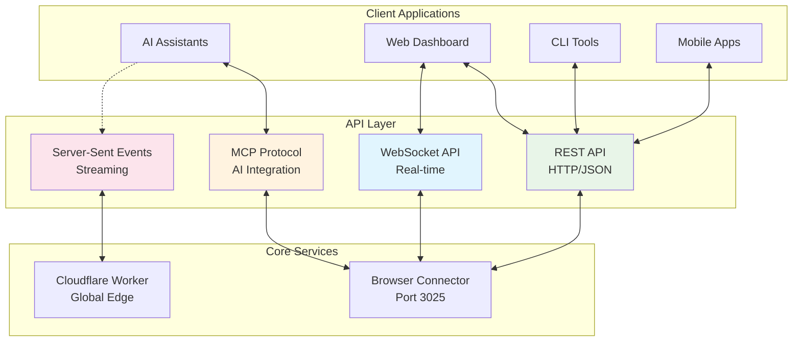

# API Reference

RapidTriageME provides multiple APIs for different use cases, from direct HTTP access to AI assistant integration. This section covers all available APIs with examples and best practices.

## API Overview



## Available APIs

### 1. MCP Protocol (AI Integration)
**Purpose**: Standardized AI assistant integration  
**Transport**: stdio, HTTP, Server-Sent Events  
**Format**: JSON-RPC 2.0  
**Use Case**: IDE plugins, AI assistants, automation tools

### 2. REST API (HTTP/JSON)
**Purpose**: Direct programmatic access  
**Transport**: HTTP/HTTPS  
**Format**: JSON  
**Use Case**: Web apps, dashboards, third-party integrations

### 3. WebSocket API (Real-time)
**Purpose**: Live data streaming  
**Transport**: WebSocket  
**Format**: JSON messages  
**Use Case**: Real-time monitoring, live dashboards

### 4. Server-Sent Events (Cloud Streaming)
**Purpose**: One-way server-to-client streaming  
**Transport**: HTTP with SSE  
**Format**: Event-stream  
**Use Case**: Cloud deployments, remote monitoring

## Quick Start Examples

### REST API Example

```bash
# Get server identity
curl http://localhost:3025/.identity

# Response:
{
  "name": "RapidTriageME Browser Connector",
  "version": "1.0.0",
  "status": "healthy",
  "timestamp": "2024-01-01T00:00:00.000Z",
  "connections": 1
}
```

### MCP Tool Call

```json
{
  "jsonrpc": "2.0",
  "method": "tools/call",
  "params": {
    "name": "screenshot_capture",
    "arguments": {
      "fullPage": true,
      "quality": 85
    }
  },
  "id": 1
}
```

### WebSocket Connection

```javascript
const ws = new WebSocket('ws://localhost:3025/ws');

ws.onmessage = (event) => {
  const data = JSON.parse(event.data);
  console.log('Received:', data.type, data.message);
};
```

## Base URLs and Endpoints

### Local Development
```
Base URL: http://localhost:3025
WebSocket: ws://localhost:3025/ws
```

### Production (Cloudflare)
```
Base URL: https://rapidtriage.me/api
SSE Stream: https://rapidtriage.me/mcp/sse
```

## Authentication

### Local (No Auth Required)
```bash
# Direct access to localhost
curl http://localhost:3025/console-logs
```

### Production (JWT Required)
```bash
# Include JWT token
curl -H "Authorization: Bearer your-jwt-token" \
     https://rapidtriage.me/api/console-logs
```

### API Key Authentication
```bash
# Use API key header
curl -H "X-API-Key: rt_your-api-key-here" \
     https://rapidtriage.me/api/console-logs
```

## Response Formats

### Success Response
```json
{
  "status": "success",
  "data": {
    "logs": [...],
    "total": 42
  },
  "timestamp": "2024-01-01T00:00:00.000Z",
  "requestId": "req_abc123"
}
```

### Error Response
```json
{
  "status": "error",
  "error": {
    "code": "INVALID_PARAMETER",
    "message": "Invalid log level specified",
    "details": {
      "parameter": "level",
      "validValues": ["error", "warn", "info", "debug"]
    }
  },
  "timestamp": "2024-01-01T00:00:00.000Z",
  "requestId": "req_def456"
}
```

## Core Endpoints

### System Information

#### GET `/.identity`
Retrieve server information and status

**Response:**
```json
{
  "name": "RapidTriageME Browser Connector",
  "version": "1.0.0",
  "status": "healthy",
  "uptime": 3600000,
  "connections": 2,
  "features": {
    "screenshots": true,
    "lighthouse": true,
    "websocket": true
  }
}
```

#### GET `/health`
Detailed health check with metrics

**Response:**
```json
{
  "status": "healthy",
  "checks": {
    "websocket": "ok",
    "chrome": "ok",
    "lighthouse": "ok"
  },
  "metrics": {
    "memoryUsage": "45.2MB",
    "cpuUsage": "2.1%",
    "activeConnections": 2
  }
}
```

### Browser Data

#### GET `/console-logs`
Retrieve console logs with filtering

**Parameters:**
- `level` (string, optional): Filter by log level (`error`, `warn`, `info`, `debug`)
- `limit` (integer, optional): Maximum number of logs (default: 100, max: 1000)
- `since` (string, optional): ISO 8601 timestamp to filter logs since
- `format` (string, optional): Response format (`json`, `text`)

**Example:**
```bash
curl "http://localhost:3025/console-logs?level=error&limit=50"
```

**Response:**
```json
{
  "logs": [
    {
      "id": "log_abc123",
      "level": "error",
      "message": "TypeError: Cannot read property 'foo' of undefined",
      "timestamp": 1704067200000,
      "url": "https://example.com/page",
      "source": "main.js:42:15",
      "stack": [
        "TypeError: Cannot read property 'foo' of undefined",
        "    at main.js:42:15",
        "    at HTMLButtonElement.<anonymous> (main.js:38:9)"
      ]
    }
  ],
  "total": 1,
  "filtered": 1,
  "timestamp": "2024-01-01T00:00:00.000Z"
}
```

#### GET `/network-requests`
Retrieve network requests with filtering

**Parameters:**
- `status` (string, optional): Filter by HTTP status code
- `method` (string, optional): Filter by HTTP method
- `limit` (integer, optional): Maximum number of requests (default: 100)
- `failed` (boolean, optional): Only return failed requests (4xx, 5xx)

**Example:**
```bash
curl "http://localhost:3025/network-requests?failed=true&limit=25"
```

**Response:**
```json
{
  "requests": [
    {
      "id": "req_def456",
      "url": "https://api.example.com/data",
      "method": "GET",
      "status": 500,
      "statusText": "Internal Server Error",
      "timestamp": 1704067200000,
      "duration": 2500,
      "size": {
        "request": 1024,
        "response": 256
      },
      "timing": {
        "dns": 50,
        "connect": 100,
        "send": 10,
        "wait": 2000,
        "receive": 340
      }
    }
  ],
  "total": 1
}
```

### Screenshot Capture

#### POST `/capture-screenshot`
Capture a screenshot of the current browser tab

**Request Body:**
```json
{
  "options": {
    "fullPage": true,
    "quality": 80,
    "format": "png",
    "selector": ".main-content",
    "removeElements": [".ads", ".popup"],
    "waitFor": 1000
  }
}
```

**Response:**
```json
{
  "screenshot": "data:image/png;base64,iVBORw0KGgoAAAANSUhEUgAA...",
  "format": "png",
  "dimensions": {
    "width": 1920,
    "height": 1080
  },
  "timestamp": "2024-01-01T00:00:00.000Z"
}
```

### Lighthouse Audits

#### POST `/lighthouse-audit`
Run a comprehensive Lighthouse audit

**Request Body:**
```json
{
  "url": "https://example.com",
  "categories": ["performance", "accessibility", "best-practices", "seo"],
  "device": "desktop",
  "throttling": {
    "cpuSlowdownMultiplier": 4,
    "requestLatencyMs": 150,
    "downloadThroughputKbps": 1638.4
  }
}
```

**Response:**
```json
{
  "audit": {
    "url": "https://example.com",
    "timestamp": 1704067200000,
    "scores": {
      "performance": 85,
      "accessibility": 92,
      "bestPractices": 88,
      "seo": 95
    },
    "metrics": {
      "firstContentfulPaint": 1200,
      "largestContentfulPaint": 2100,
      "cumulativeLayoutShift": 0.08,
      "totalBlockingTime": 150
    },
    "opportunities": [
      {
        "id": "unused-css-rules",
        "title": "Remove unused CSS",
        "description": "Remove dead rules from stylesheets and defer the loading of CSS not used for above-the-fold content to reduce unnecessary bytes consumed by network activity.",
        "score": 0.45,
        "numericValue": 45000,
        "displayValue": "45 KB"
      }
    ]
  }
}
```

## WebSocket API Events

### Connection Events

#### `connection-established`
```json
{
  "type": "connection-established",
  "connectionId": "conn_abc123",
  "timestamp": 1704067200000
}
```

#### `heartbeat`
```json
{
  "type": "heartbeat",
  "timestamp": 1704067200000,
  "uptime": 3600000
}
```

### Data Events

#### `console-log`
```json
{
  "type": "console-log",
  "level": "error",
  "message": "API request failed",
  "timestamp": 1704067200000,
  "url": "https://example.com",
  "source": "app.js:125:8"
}
```

#### `network-request`
```json
{
  "type": "network-request",
  "method": "POST",
  "url": "https://api.example.com/users",
  "status": 201,
  "timestamp": 1704067200000,
  "duration": 450
}
```

#### `screenshot-captured`
```json
{
  "type": "screenshot-captured",
  "screenshot": "data:image/png;base64,...",
  "timestamp": 1704067200000,
  "requestId": "req_screenshot_123"
}
```

## MCP Tools Reference

### Available Tools

| Tool Name | Description | Input Schema |
|-----------|-------------|--------------|
| `screenshot_capture` | Capture browser screenshot | `{fullPage, quality, format, selector}` |
| `get_console_logs` | Retrieve console logs | `{level, limit, since}` |
| `get_network_requests` | Get network requests | `{status, method, limit, failed}` |
| `run_lighthouse_audit` | Run Lighthouse audit | `{url, categories, device}` |
| `execute_javascript` | Execute JavaScript in browser | `{code, returnResult}` |
| `get_selected_element` | Get currently selected DOM element | `{}` |
| `navigate_to_url` | Navigate browser to URL | `{url, waitUntil}` |
| `clear_logs` | Clear all cached logs | `{}` |

### Tool Input Schemas

#### `screenshot_capture`
```json
{
  "type": "object",
  "properties": {
    "options": {
      "type": "object",
      "properties": {
        "fullPage": {"type": "boolean", "default": true},
        "quality": {"type": "number", "minimum": 1, "maximum": 100, "default": 80},
        "format": {"type": "string", "enum": ["png", "jpeg"], "default": "png"},
        "selector": {"type": "string", "description": "CSS selector for element capture"},
        "removeElements": {"type": "array", "items": {"type": "string"}},
        "waitFor": {"type": "number", "description": "Milliseconds to wait before capture"}
      }
    }
  }
}
```

#### `get_console_logs`
```json
{
  "type": "object",
  "properties": {
    "level": {"type": "string", "enum": ["error", "warn", "info", "debug"]},
    "limit": {"type": "number", "minimum": 1, "maximum": 1000, "default": 100},
    "since": {"type": "string", "format": "date-time"}
  }
}
```

## Error Codes

| Code | HTTP Status | Description |
|------|-------------|-------------|
| `SUCCESS` | 200 | Request completed successfully |
| `BAD_REQUEST` | 400 | Invalid request parameters |
| `UNAUTHORIZED` | 401 | Authentication required |
| `FORBIDDEN` | 403 | Access denied |
| `NOT_FOUND` | 404 | Resource not found |
| `METHOD_NOT_ALLOWED` | 405 | HTTP method not supported |
| `RATE_LIMITED` | 429 | Too many requests |
| `INTERNAL_ERROR` | 500 | Server internal error |
| `SERVICE_UNAVAILABLE` | 503 | Service temporarily unavailable |
| `BROWSER_NOT_CONNECTED` | 502 | No browser connection |
| `SCREENSHOT_FAILED` | 500 | Screenshot capture failed |
| `LIGHTHOUSE_FAILED` | 500 | Lighthouse audit failed |

## Rate Limiting

### Local Development
- No rate limiting applied
- Unlimited requests to localhost

### Production
- **Free Tier**: 100 requests/minute
- **Pro Tier**: 1000 requests/minute
- **Enterprise**: Custom limits

### Headers
```
X-RateLimit-Limit: 100
X-RateLimit-Remaining: 95
X-RateLimit-Reset: 1704067260
X-RateLimit-Window: 60
```

## SDK and Client Libraries

### JavaScript/Node.js
```bash
npm install @yarlisai/rapidtriage-client
```

```javascript
import { RapidTriageClient } from '@yarlisai/rapidtriage-client';

const client = new RapidTriageClient({
  baseUrl: 'http://localhost:3025',
  apiKey: 'your-api-key' // for production
});

// Get console logs
const logs = await client.getConsoleLogs({ level: 'error' });

// Capture screenshot
const screenshot = await client.captureScreenshot({ fullPage: true });
```

### Python
```bash
pip install rapidtriage-python
```

```python
from rapidtriage import RapidTriageClient

client = RapidTriageClient(
    base_url='http://localhost:3025',
    api_key='your-api-key'  # for production
)

# Get console logs
logs = client.get_console_logs(level='error')

# Capture screenshot
screenshot = client.capture_screenshot(full_page=True)
```

## API Versioning

### Current Version
- **Version**: `v1`
- **Stability**: Stable
- **Support**: Long-term support

### Version Headers
```bash
curl -H "Accept: application/vnd.rapidtriage.v1+json" \
     http://localhost:3025/console-logs
```

### Deprecation Policy
- 6 months notice for breaking changes
- Parallel version support during transition
- Clear migration guides provided

## API Reference Sections

<div class="grid cards" markdown>

-   🔌 **WebSocket API**
    
    ---
    
    Real-time data streaming and live updates
    
    [:octicons-arrow-right-24: WebSocket Reference](websocket.md)

-   🤖 **MCP Protocol**
    
    ---
    
    AI assistant integration and tool definitions
    
    [:octicons-arrow-right-24: MCP Reference](mcp.md)

-   📡 **REST Endpoints**
    
    ---
    
    Complete HTTP API documentation
    
    [:octicons-arrow-right-24: REST Reference](rest.md)

</div>

---

These APIs provide comprehensive access to RapidTriageME's browser debugging capabilities, from simple REST calls to advanced AI integration.