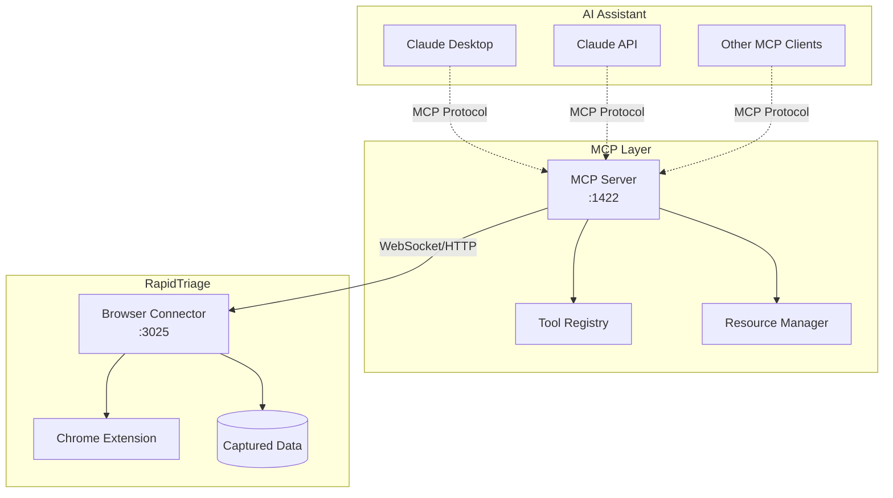

# MCP Protocol Integration

The Model Context Protocol (MCP) integration enables seamless communication between RapidTriageME and AI assistants like Claude, ChatGPT, and other language models. This provides intelligent debugging assistance and automated problem analysis.

## Overview

MCP (Model Context Protocol) is an open standard for connecting AI assistants to external tools and data sources. RapidTriageME implements MCP to provide:

- **Direct AI Integration** - Native support in Claude Desktop and other MCP clients
- **Real-time Context** - Live browser data fed directly to AI assistants  
- **Tool Invocation** - AI can trigger browser actions like screenshots
- **Structured Data** - Formatted debugging information for optimal AI understanding

## MCP Architecture



## MCP Server Configuration

### Installation

```bash
# Install RapidTriage MCP server
npm install -g @yarlisai/rapidtriage-mcp

# Or install locally
npm install @yarlisai/rapidtriage-mcp

# Verify installation
rapidtriage-mcp --version
```

### Configuration File

Create `mcp-config.json`:

```json
{
  "server": {
    "name": "rapidtriage-mcp",
    "version": "1.0.0",
    "description": "RapidTriage MCP Server for browser debugging",
    "port": 1422
  },
  "browserConnector": {
    "host": "localhost",
    "port": 3025,
    "protocol": "http",
    "websocketPath": "/mcp-ws",
    "timeout": 30000,
    "retryAttempts": 3
  },
  "resources": {
    "maxLogEntries": 1000,
    "maxNetworkEntries": 500,
    "screenshotFormat": "png",
    "screenshotQuality": 90
  },
  "tools": {
    "enableScreenshots": true,
    "enableElementSelection": true,
    "enableLogClearing": true,
    "enablePerformanceAudit": true
  },
  "ai": {
    "contextWindow": 200000,
    "summaryLength": "concise",
    "includeStackTraces": true,
    "redactSensitiveData": true
  }
}
```

### Claude Desktop Integration

Add to Claude Desktop's `claude_desktop_config.json`:

```json
{
  "mcpServers": {
    "rapidtriage": {
      "command": "rapidtriage-mcp",
      "args": ["--config", "/path/to/mcp-config.json"],
      "env": {
        "DEBUG": "false",
        "LOG_LEVEL": "info"
      }
    }
  }
}
```

### Programmatic MCP Server

```javascript
// Custom MCP server implementation
const { MCPServer } = require('@modelcontextprotocol/server');
const WebSocket = require('ws');

class RapidTriageMCPServer extends MCPServer {
  constructor(options = {}) {
    super({
      name: 'rapidtriage-mcp',
      version: '1.0.0',
      ...options
    });
    
    this.browserConnector = null;
    this.wsConnection = null;
    this.setupTools();
    this.setupResources();
  }
  
  async initialize() {
    // Connect to browser connector
    await this.connectToBrowserConnector();
    
    // Register with MCP client
    await super.initialize();
    
    console.log('RapidTriage MCP Server initialized');
  }
  
  async connectToBrowserConnector() {
    const wsUrl = 'ws://localhost:3025/mcp-ws';
    
    try {
      this.wsConnection = new WebSocket(wsUrl);
      
      this.wsConnection.on('open', () => {
        console.log('Connected to browser connector');
        this.sendMessage({
          type: 'mcp-init',
          data: {
            clientType: 'mcp-server',
            version: '1.0.0'
          }
        });
      });
      
      this.wsConnection.on('message', (data) => {
        try {
          const message = JSON.parse(data.toString());
          this.handleBrowserMessage(message);
        } catch (error) {
          console.error('Failed to parse browser message:', error);
        }
      });
      
      this.wsConnection.on('error', (error) => {
        console.error('Browser connector connection error:', error);
      });
      
    } catch (error) {
      console.error('Failed to connect to browser connector:', error);
    }
  }
  
  setupTools() {
    // Capture screenshot tool
    this.registerTool({
      name: 'capture_screenshot',
      description: 'Capture a screenshot of the current browser tab',
      parameters: {
        type: 'object',
        properties: {
          fullPage: {
            type: 'boolean',
            description: 'Capture full page or just viewport',
            default: false
          },
          format: {
            type: 'string',
            enum: ['png', 'jpeg'],
            default: 'png'
          },
          quality: {
            type: 'number',
            minimum: 10,
            maximum: 100,
            default: 90
          }
        }
      }
    }, this.captureScreenshot.bind(this));
    
    // Clear logs tool
    this.registerTool({
      name: 'clear_logs',
      description: 'Clear all captured console logs and network requests',
      parameters: {
        type: 'object',
        properties: {}
      }
    }, this.clearLogs.bind(this));
    
    // Performance audit tool
    this.registerTool({
      name: 'performance_audit',
      description: 'Run Lighthouse performance audit on current page',
      parameters: {
        type: 'object',
        properties: {
          formFactor: {
            type: 'string',
            enum: ['mobile', 'desktop'],
            default: 'desktop'
          },
          categories: {
            type: 'array',
            items: {
              type: 'string',
              enum: ['performance', 'accessibility', 'best-practices', 'seo']
            },
            default: ['performance']
          }
        }
      }
    }, this.performanceAudit.bind(this));
    
    // Element inspection tool
    this.registerTool({
      name: 'inspect_element',
      description: 'Get detailed information about selected element in DevTools',
      parameters: {
        type: 'object',
        properties: {
          selector: {
            type: 'string',
            description: 'CSS selector to find element (optional)'
          }
        }
      }
    }, this.inspectElement.bind(this));
  }
  
  setupResources() {
    // Console logs resource
    this.registerResource({
      uri: 'rapidtriage://console-logs',
      name: 'Console Logs',
      description: 'Recent console logs from browser',
      mimeType: 'application/json'
    }, this.getConsoleLogs.bind(this));
    
    // Network requests resource
    this.registerResource({
      uri: 'rapidtriage://network-requests',
      name: 'Network Requests',
      description: 'Recent network requests and responses',
      mimeType: 'application/json'
    }, this.getNetworkRequests.bind(this));
    
    // Error logs resource
    this.registerResource({
      uri: 'rapidtriage://errors',
      name: 'JavaScript Errors',
      description: 'JavaScript errors and exceptions',
      mimeType: 'application/json'
    }, this.getErrors.bind(this));
    
    // Page information resource
    this.registerResource({
      uri: 'rapidtriage://page-info',
      name: 'Page Information',
      description: 'Current page URL, title, and metadata',
      mimeType: 'application/json'
    }, this.getPageInfo.bind(this));
  }
  
  // Tool implementations
  async captureScreenshot(params) {
    return new Promise((resolve) => {
      const requestId = this.generateId();
      
      // Store promise resolver for response
      this.pendingRequests.set(requestId, resolve);
      
      this.sendMessage({
        id: requestId,
        type: 'screenshot-request',
        data: {
          format: params.format || 'png',
          quality: params.quality || 90,
          fullPage: params.fullPage || false
        }
      });
    });
  }
  
  async clearLogs() {
    return new Promise((resolve) => {
      const requestId = this.generateId();
      this.pendingRequests.set(requestId, resolve);
      
      this.sendMessage({
        id: requestId,
        type: 'clear-logs'
      });
    });
  }
  
  async performanceAudit(params) {
    return new Promise((resolve) => {
      const requestId = this.generateId();
      this.pendingRequests.set(requestId, resolve);
      
      this.sendMessage({
        id: requestId,
        type: 'performance-audit',
        data: {
          formFactor: params.formFactor || 'desktop',
          categories: params.categories || ['performance']
        }
      });
    });
  }
  
  async inspectElement(params) {
    return new Promise((resolve) => {
      const requestId = this.generateId();
      this.pendingRequests.set(requestId, resolve);
      
      this.sendMessage({
        id: requestId,
        type: 'element-inspect',
        data: {
          selector: params.selector || null
        }
      });
    });
  }
  
  // Resource implementations
  async getConsoleLogs() {
    const response = await fetch('http://localhost:3025/console-logs');
    const data = await response.json();
    
    return {
      contents: [{
        uri: 'rapidtriage://console-logs',
        mimeType: 'application/json',
        text: JSON.stringify(data, null, 2)
      }]
    };
  }
  
  async getNetworkRequests() {
    const response = await fetch('http://localhost:3025/network-success');
    const data = await response.json();
    
    return {
      contents: [{
        uri: 'rapidtriage://network-requests',
        mimeType: 'application/json', 
        text: JSON.stringify(data, null, 2)
      }]
    };
  }
  
  async getErrors() {
    const response = await fetch('http://localhost:3025/console-errors');
    const data = await response.json();
    
    return {
      contents: [{
        uri: 'rapidtriage://errors',
        mimeType: 'application/json',
        text: JSON.stringify(data, null, 2)
      }]
    };
  }
  
  async getPageInfo() {
    // Get page info from browser connector
    const response = await fetch('http://localhost:3025/page-info');
    const data = await response.json();
    
    return {
      contents: [{
        uri: 'rapidtriage://page-info',
        mimeType: 'application/json',
        text: JSON.stringify(data, null, 2)
      }]
    };
  }
  
  sendMessage(message) {
    if (this.wsConnection && this.wsConnection.readyState === WebSocket.OPEN) {
      this.wsConnection.send(JSON.stringify(message));
    }
  }
  
  handleBrowserMessage(message) {
    // Handle responses to tool requests
    if (message.id && this.pendingRequests.has(message.id)) {
      const resolver = this.pendingRequests.get(message.id);
      resolver(message.data);
      this.pendingRequests.delete(message.id);
    }
    
    // Handle real-time updates
    this.notifyResourceUpdate(message);
  }
  
  generateId() {
    return `mcp_${Date.now()}_${Math.random().toString(36).substr(2, 9)}`;
  }
}

// Start MCP server
const server = new RapidTriageMCPServer();
server.initialize();
```

## AI Assistant Integration

### Claude Desktop Usage

Once configured, Claude can access RapidTriage data and tools:

```
User: What errors are currently showing in the browser console?

Claude: I'll check the current console errors for you.

*Uses rapidtriage://errors resource*

I can see there are 2 JavaScript errors currently in the console:

1. **TypeError: Cannot read property 'innerHTML' of null**
   - Location: app.js:45:12
   - Timestamp: 2024-01-01 12:30:15
   
2. **Uncaught ReferenceError: $ is not defined**
   - Location: main.js:12:5
   - Timestamp: 2024-01-01 12:30:16

The first error suggests you're trying to access the innerHTML property of an element that doesn't exist. The second indicates jQuery ($) isn't loaded when main.js tries to use it.

Would you like me to take a screenshot to see the current state of the page?
```

### Tool Usage Examples

```
User: Take a screenshot of the current page

Claude: I'll capture a screenshot of the current page for you.

*Uses capture_screenshot tool*

I've successfully captured a screenshot of the current page. The image shows the main dashboard with a navigation bar at the top and a data table in the center. I can see there's a JavaScript error dialog visible in the top-right corner, which corresponds to the TypeError we discussed earlier.

The screenshot has been saved to your Downloads folder. Would you like me to analyze any specific elements or issues visible in the screenshot?
```

### Performance Analysis

```
User: Check the performance of this page

Claude: I'll run a performance audit on the current page.

*Uses performance_audit tool*

Here's the performance analysis:

**Performance Score: 67/100** (Needs Improvement)

**Core Web Vitals:**
- First Contentful Paint: 2.1s (Needs Improvement)
- Largest Contentful Paint: 4.2s (Poor)
- Cumulative Layout Shift: 0.15 (Needs Improvement)

**Main Issues:**
1. **Unused CSS (1.2MB)** - Remove unused stylesheets
2. **Large Images (850KB)** - Optimize and compress images
3. **Render-blocking JavaScript** - Defer non-critical scripts

**Recommendations:**
1. Implement lazy loading for images
2. Use CSS minification and purging
3. Enable text compression (gzip/brotli)
4. Consider using a CDN for static assets

Would you like me to provide specific implementation guidance for any of these optimizations?
```

## Custom MCP Resources

### Dynamic Resource Registration

```javascript
class DynamicResourceManager {
  constructor(mcpServer) {
    this.mcpServer = mcpServer;
    this.dynamicResources = new Map();
  }
  
  // Register session-specific resources
  registerSessionResource(sessionId, data) {
    const uri = `rapidtriage://session/${sessionId}`;
    
    this.dynamicResources.set(uri, {
      name: `Session ${sessionId}`,
      description: `Browser session data for ${sessionId}`,
      data: data,
      timestamp: Date.now()
    });
    
    this.mcpServer.registerResource({
      uri: uri,
      name: `Session ${sessionId}`,
      description: `Browser session data for ${sessionId}`,
      mimeType: 'application/json'
    }, () => this.getSessionResource(sessionId));
  }
  
  async getSessionResource(sessionId) {
    const uri = `rapidtriage://session/${sessionId}`;
    const resource = this.dynamicResources.get(uri);
    
    if (!resource) {
      throw new Error(`Session ${sessionId} not found`);
    }
    
    return {
      contents: [{
        uri: uri,
        mimeType: 'application/json',
        text: JSON.stringify(resource.data, null, 2)
      }]
    };
  }
  
  // Register error-specific resources
  registerErrorResource(errorId, errorData) {
    const uri = `rapidtriage://error/${errorId}`;
    
    this.mcpServer.registerResource({
      uri: uri,
      name: `Error ${errorId}`,
      description: `Detailed error information and context`,
      mimeType: 'application/json'
    }, () => ({
      contents: [{
        uri: uri,
        mimeType: 'application/json',
        text: JSON.stringify({
          error: errorData,
          context: this.getErrorContext(errorData),
          suggestions: this.generateErrorSuggestions(errorData)
        }, null, 2)
      }]
    }));
  }
  
  getErrorContext(errorData) {
    // Gather contextual information about the error
    return {
      stackTrace: errorData.stack,
      sourceCode: this.getSourceCodeSnippet(errorData.source),
      browserInfo: this.getBrowserInfo(),
      pageState: this.getPageState()
    };
  }
  
  generateErrorSuggestions(errorData) {
    // AI-assisted error suggestions based on error type
    const suggestions = [];
    
    if (errorData.message.includes('undefined')) {
      suggestions.push({
        type: 'null-check',
        description: 'Add null/undefined checks before accessing properties',
        example: 'if (element && element.innerHTML) { ... }'
      });
    }
    
    if (errorData.message.includes('is not defined')) {
      suggestions.push({
        type: 'dependency',
        description: 'Ensure required libraries are loaded before use',
        example: 'Check if jQuery is loaded before using $ functions'
      });
    }
    
    return suggestions;
  }
}
```

### Resource Templating

```javascript
class ResourceTemplate {
  static createDebugReport(data) {
    return {
      summary: ResourceTemplate.createSummary(data),
      errors: ResourceTemplate.formatErrors(data.errors),
      network: ResourceTemplate.formatNetworkRequests(data.network),
      performance: ResourceTemplate.formatPerformanceMetrics(data.performance),
      recommendations: ResourceTemplate.generateRecommendations(data)
    };
  }
  
  static createSummary(data) {
    return {
      timestamp: new Date().toISOString(),
      totalErrors: data.errors?.length || 0,
      totalNetworkRequests: data.network?.length || 0,
      pageLoadTime: data.performance?.loadTime || 'N/A',
      criticalIssues: data.errors?.filter(e => e.level === 'error').length || 0
    };
  }
  
  static formatErrors(errors = []) {
    return errors.map(error => ({
      type: ResourceTemplate.categorizeError(error),
      message: error.message,
      location: error.source || 'Unknown',
      impact: ResourceTemplate.assessErrorImpact(error),
      suggestedFix: ResourceTemplate.suggestErrorFix(error)
    }));
  }
  
  static categorizeError(error) {
    if (error.message.includes('TypeError')) return 'Type Error';
    if (error.message.includes('ReferenceError')) return 'Reference Error';
    if (error.message.includes('SyntaxError')) return 'Syntax Error';
    if (error.message.includes('NetworkError')) return 'Network Error';
    return 'Generic Error';
  }
  
  static assessErrorImpact(error) {
    // Assess error impact based on context
    if (error.source?.includes('critical')) return 'High';
    if (error.message.includes('blocking')) return 'High';
    if (error.level === 'error') return 'Medium';
    return 'Low';
  }
  
  static suggestErrorFix(error) {
    const fixes = {
      'TypeError': 'Check for null/undefined values before accessing properties',
      'ReferenceError': 'Ensure variables and functions are declared before use',
      'SyntaxError': 'Review code syntax for typos and missing brackets',
      'NetworkError': 'Check network connectivity and API endpoint availability'
    };
    
    const errorType = ResourceTemplate.categorizeError(error);
    return fixes[errorType] || 'Review error context and stack trace';
  }
}
```

## Advanced MCP Features

### Context-Aware Resources

```javascript
class ContextAwareResource {
  constructor(mcpServer) {
    this.mcpServer = mcpServer;
    this.contextHistory = [];
    this.maxContextEntries = 50;
  }
  
  // Add context from AI conversation
  addContext(context) {
    this.contextHistory.unshift({
      timestamp: Date.now(),
      ...context
    });
    
    // Keep only recent context
    if (this.contextHistory.length > this.maxContextEntries) {
      this.contextHistory.pop();
    }
    
    this.updateContextResource();
  }
  
  updateContextResource() {
    this.mcpServer.registerResource({
      uri: 'rapidtriage://context',
      name: 'Debugging Context',
      description: 'Historical context and conversation state',
      mimeType: 'application/json'
    }, () => ({
      contents: [{
        uri: 'rapidtriage://context',
        mimeType: 'application/json',
        text: JSON.stringify({
          currentContext: this.getCurrentContext(),
          history: this.contextHistory.slice(0, 10), // Last 10 entries
          summary: this.generateContextSummary()
        }, null, 2)
      }]
    }));
  }
  
  getCurrentContext() {
    const recent = this.contextHistory.slice(0, 5);
    return {
      focusArea: this.determineFocusArea(recent),
      keyIssues: this.extractKeyIssues(recent),
      progress: this.trackProgress(recent)
    };
  }
  
  generateContextSummary() {
    return {
      totalInteractions: this.contextHistory.length,
      mainTopics: this.extractMainTopics(),
      resolvedIssues: this.countResolvedIssues(),
      ongoingIssues: this.identifyOngoingIssues()
    };
  }
}
```

### Real-time Resource Updates

```javascript
class RealtimeResourceManager {
  constructor(mcpServer) {
    this.mcpServer = mcpServer;
    this.subscribers = new Map();
    this.resourceCache = new Map();
    this.updateInterval = 1000; // 1 second
    
    this.startRealtimeUpdates();
  }
  
  startRealtimeUpdates() {
    setInterval(() => {
      this.updateAllResources();
    }, this.updateInterval);
  }
  
  async updateAllResources() {
    const updates = await this.checkForUpdates();
    
    for (const [uri, newData] of updates) {
      const cached = this.resourceCache.get(uri);
      
      if (!cached || JSON.stringify(cached) !== JSON.stringify(newData)) {
        this.resourceCache.set(uri, newData);
        this.notifySubscribers(uri, newData);
      }
    }
  }
  
  async checkForUpdates() {
    const updates = new Map();
    
    try {
      // Check for new console logs
      const consoleResponse = await fetch('http://localhost:3025/console-logs?since=' + this.getLastUpdateTime('console'));
      if (consoleResponse.ok) {
        const consoleData = await consoleResponse.json();
        updates.set('rapidtriage://console-logs', consoleData);
      }
      
      // Check for new network requests
      const networkResponse = await fetch('http://localhost:3025/network-success?since=' + this.getLastUpdateTime('network'));
      if (networkResponse.ok) {
        const networkData = await networkResponse.json();
        updates.set('rapidtriage://network-requests', networkData);
      }
      
      // Check for new errors
      const errorResponse = await fetch('http://localhost:3025/console-errors?since=' + this.getLastUpdateTime('errors'));
      if (errorResponse.ok) {
        const errorData = await errorResponse.json();
        updates.set('rapidtriage://errors', errorData);
      }
      
    } catch (error) {
      console.error('Failed to check for updates:', error);
    }
    
    return updates;
  }
  
  notifySubscribers(uri, data) {
    const subscribers = this.subscribers.get(uri) || [];
    
    subscribers.forEach(callback => {
      try {
        callback(uri, data);
      } catch (error) {
        console.error('Subscriber callback error:', error);
      }
    });
    
    // Notify MCP server of resource changes
    this.mcpServer.notifyResourceChange(uri);
  }
  
  subscribe(uri, callback) {
    if (!this.subscribers.has(uri)) {
      this.subscribers.set(uri, []);
    }
    
    this.subscribers.get(uri).push(callback);
  }
  
  getLastUpdateTime(type) {
    // Track last update times for incremental updates
    return this.lastUpdateTimes?.[type] || 0;
  }
}
```

## Testing MCP Integration

### Unit Tests

```javascript
// test/mcp-server.test.js
const { RapidTriageMCPServer } = require('../src/mcp-server');
const { MockBrowserConnector } = require('./mocks/browser-connector');

describe('RapidTriage MCP Server', () => {
  let mcpServer;
  let mockConnector;
  
  beforeEach(() => {
    mockConnector = new MockBrowserConnector();
    mcpServer = new RapidTriageMCPServer({
      browserConnector: mockConnector
    });
  });
  
  afterEach(async () => {
    await mcpServer.close();
  });
  
  test('should initialize with default tools and resources', async () => {
    await mcpServer.initialize();
    
    expect(mcpServer.getTools()).toHaveLength(4);
    expect(mcpServer.getResources()).toHaveLength(4);
  });
  
  test('should capture screenshot via tool', async () => {
    await mcpServer.initialize();
    
    mockConnector.mockScreenshot({
      success: true,
      path: '/tmp/screenshot.png',
      dimensions: { width: 1920, height: 1080 }
    });
    
    const result = await mcpServer.invokeTool('capture_screenshot', {
      fullPage: true,
      format: 'png'
    });
    
    expect(result.success).toBe(true);
    expect(result.path).toBe('/tmp/screenshot.png');
  });
  
  test('should fetch console logs resource', async () => {
    await mcpServer.initialize();
    
    mockConnector.mockConsoleLogs([
      { type: 'log', message: 'Test log', timestamp: Date.now() }
    ]);
    
    const resource = await mcpServer.getResource('rapidtriage://console-logs');
    
    expect(resource.contents).toHaveLength(1);
    expect(resource.contents[0].mimeType).toBe('application/json');
  });
});
```

### Integration Tests

```javascript
// test/integration/claude-integration.test.js
const { spawn } = require('child_process');
const { MCPClient } = require('@modelcontextprotocol/client');

describe('Claude Integration', () => {
  let mcpServer;
  let mcpClient;
  
  beforeAll(async () => {
    // Start MCP server
    mcpServer = spawn('rapidtriage-mcp', ['--config', 'test-config.json']);
    
    // Wait for server to start
    await new Promise(resolve => setTimeout(resolve, 2000));
    
    // Connect MCP client
    mcpClient = new MCPClient();
    await mcpClient.connect('stdio', {
      command: 'rapidtriage-mcp',
      args: ['--config', 'test-config.json']
    });
  });
  
  afterAll(async () => {
    await mcpClient.close();
    mcpServer.kill();
  });
  
  test('should list available tools', async () => {
    const tools = await mcpClient.listTools();
    
    expect(tools.tools).toEqual(expect.arrayContaining([
      expect.objectContaining({ name: 'capture_screenshot' }),
      expect.objectContaining({ name: 'clear_logs' }),
      expect.objectContaining({ name: 'performance_audit' }),
      expect.objectContaining({ name: 'inspect_element' })
    ]));
  });
  
  test('should list available resources', async () => {
    const resources = await mcpClient.listResources();
    
    expect(resources.resources).toEqual(expect.arrayContaining([
      expect.objectContaining({ uri: 'rapidtriage://console-logs' }),
      expect.objectContaining({ uri: 'rapidtriage://network-requests' }),
      expect.objectContaining({ uri: 'rapidtriage://errors' })
    ]));
  });
  
  test('should invoke screenshot tool', async () => {
    const result = await mcpClient.callTool('capture_screenshot', {
      fullPage: true,
      format: 'png'
    });
    
    expect(result.success).toBe(true);
    expect(result.path).toMatch(/\.png$/);
  });
});
```

## Troubleshooting

### Common Issues

??? bug "MCP server not connecting to Claude"
    **Symptoms:** Tools and resources not appearing in Claude Desktop
    **Solutions:**
    - Verify claude_desktop_config.json path and syntax
    - Check MCP server is running on correct port
    - Review server logs for connection errors
    ```bash
    # Check MCP server status
    rapidtriage-mcp --status
    
    # View server logs
    rapidtriage-mcp --log-level debug
    ```

??? bug "Browser connector unreachable"
    **Symptoms:** MCP tools returning connection errors
    **Solutions:**
    - Ensure browser connector is running on port 3025
    - Check firewall settings for localhost connections
    - Verify WebSocket connection in browser connector logs

??? bug "Resource updates not reflecting in AI"
    **Symptoms:** AI sees stale data despite new browser activity
    **Solutions:**
    - Implement proper resource change notifications
    - Check WebSocket connection for real-time updates
    - Verify resource caching configuration

### Debug Commands

```bash
# Test MCP server directly
rapidtriage-mcp --test-connection

# Validate MCP configuration
rapidtriage-mcp --validate-config

# Check resource availability
curl http://localhost:1422/resources

# Test tool invocation
curl -X POST http://localhost:1422/tools/capture_screenshot \
  -H "Content-Type: application/json" \
  -d '{"fullPage": true}'
```

## Next Steps

- [WebSocket API](websocket.md) - Real-time communication protocol
- [REST API](rest.md) - HTTP endpoints for data access
- [IDE Integration](../guides/ide-integration.md) - Development environment setup
- [Security Guide](../guides/security.md) - MCP security best practices