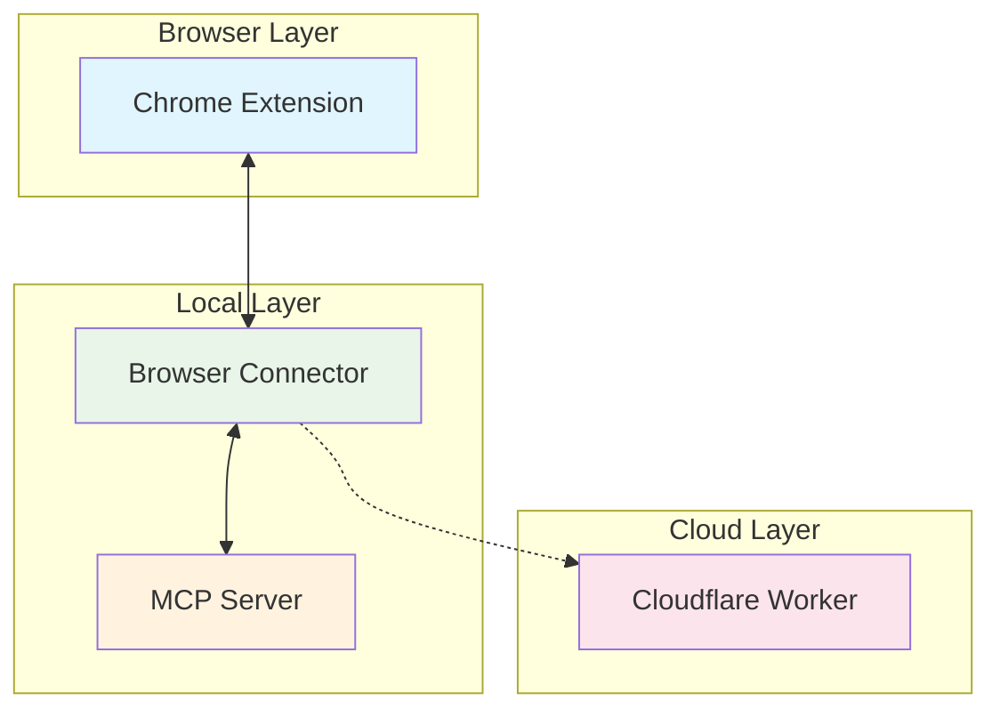
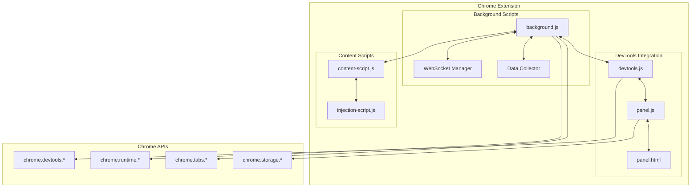
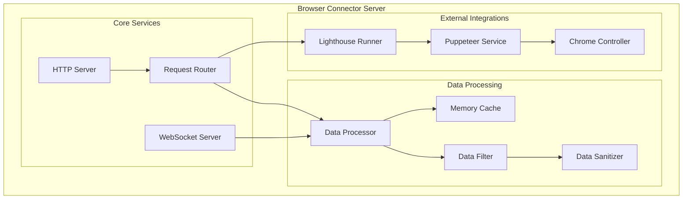
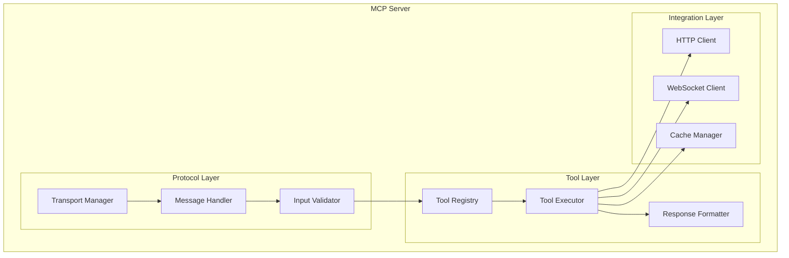
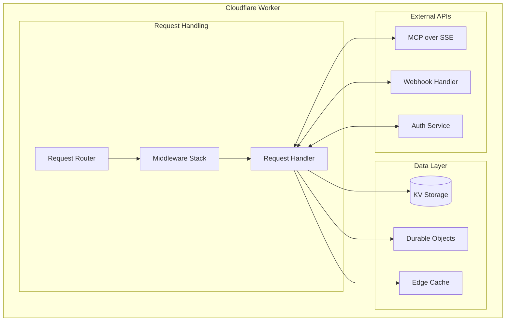
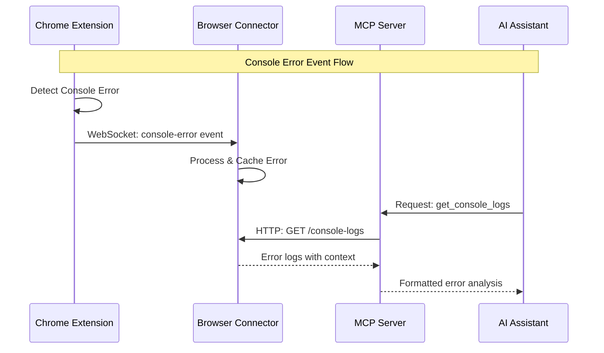
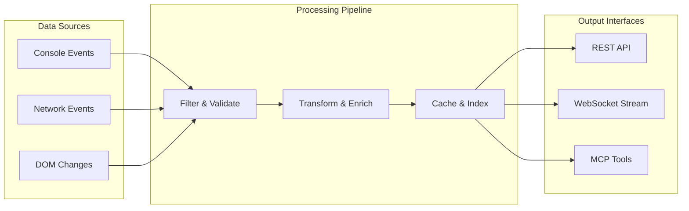

# Component Architecture

This page provides detailed technical information about each component in the RapidTriageME system, including internal architecture, key algorithms, and implementation details.

## Component Overview

RapidTriageME consists of four main components working in harmony:



Each component is designed for specific responsibilities while maintaining loose coupling through well-defined interfaces.

## Chrome Extension Component

### Architecture Overview



### Core Functionality

#### Background Script (`background.js`)
The background script serves as the central coordinator:

```javascript
// Key responsibilities of background.js
class BackgroundManager {
  constructor() {
    this.websocket = null;
    this.connectionState = 'disconnected';
    this.dataQueue = [];
    this.retryCount = 0;
    this.maxRetries = 5;
  }

  /**
   * Initialize WebSocket connection to browser connector
   * Implements exponential backoff retry logic
   */
  async initializeWebSocket() {
    const url = `ws://localhost:3025/ws`;
    
    try {
      this.websocket = new WebSocket(url);
      
      this.websocket.onopen = () => {
        this.connectionState = 'connected';
        this.retryCount = 0;
        this.flushDataQueue();
        this.notifyDevToolsPanel('connected');
      };
      
      this.websocket.onmessage = (event) => {
        this.handleServerMessage(JSON.parse(event.data));
      };
      
      this.websocket.onclose = () => {
        this.connectionState = 'disconnected';
        this.scheduleReconnect();
        this.notifyDevToolsPanel('disconnected');
      };
      
    } catch (error) {
      console.error('WebSocket connection failed:', error);
      this.scheduleReconnect();
    }
  }

  /**
   * Handle incoming messages from browser connector
   */
  handleServerMessage(message) {
    switch (message.type) {
      case 'screenshot-request':
        this.captureScreenshot(message.options);
        break;
      case 'execute-javascript':
        this.executeJavaScript(message.code);
        break;
      case 'get-selected-element':
        this.getSelectedElement();
        break;
    }
  }

  /**
   * Send data to browser connector with queuing for offline scenarios
   */
  sendData(type, data) {
    const message = {
      timestamp: Date.now(),
      type,
      data,
      tabId: this.currentTabId
    };

    if (this.connectionState === 'connected') {
      this.websocket.send(JSON.stringify(message));
    } else {
      // Queue data for when connection is restored
      this.dataQueue.push(message);
      
      // Limit queue size to prevent memory issues
      if (this.dataQueue.length > 1000) {
        this.dataQueue = this.dataQueue.slice(-500);
      }
    }
  }
}
```

#### DevTools Integration (`devtools.js`)
Manages the DevTools panel and UI interactions:

```javascript
// DevTools panel management
class DevToolsManager {
  constructor() {
    this.panelWindow = null;
    this.connectionStatus = 'disconnected';
    this.logBuffer = [];
  }

  /**
   * Create and manage the DevTools panel
   */
  createPanel() {
    chrome.devtools.panels.create(
      'RapidTriage',
      'icon16.png',
      'panel.html',
      (panel) => {
        panel.onShown.addListener((window) => {
          this.panelWindow = window;
          this.initializePanel();
        });
      }
    );
  }

  /**
   * Initialize panel with current state and event listeners
   */
  initializePanel() {
    if (!this.panelWindow) return;

    // Set up communication with panel
    this.panelWindow.addEventListener('message', (event) => {
      this.handlePanelMessage(event.data);
    });

    // Update panel with current status
    this.updatePanelStatus();
    this.sendLogBufferToPanel();
  }

  /**
   * Handle messages from panel UI
   */
  handlePanelMessage(message) {
    switch (message.action) {
      case 'clear-logs':
        this.clearLogs();
        break;
      case 'export-logs':
        this.exportLogs(message.format);
        break;
      case 'toggle-monitoring':
        this.toggleMonitoring(message.enabled);
        break;
    }
  }
}
```

### Data Collection Strategy

#### Console Log Monitoring
```javascript
// Console log interception and processing
class ConsoleMonitor {
  constructor() {
    this.logFilters = {
      levels: ['error', 'warn', 'info', 'debug'],
      maxLength: 10000,
      excludePatterns: []
    };
  }

  /**
   * Start monitoring console messages via DevTools API
   */
  startMonitoring() {
    chrome.devtools.inspectedWindow.eval(`
      // Override console methods to capture all output
      (function() {
        const originalConsole = window.console;
        const methods = ['log', 'info', 'warn', 'error', 'debug'];
        
        methods.forEach(method => {
          const original = originalConsole[method];
          window.console[method] = function(...args) {
            // Send to extension
            window.postMessage({
              type: 'console-message',
              level: method,
              message: args.map(arg => 
                typeof arg === 'object' ? JSON.stringify(arg) : String(arg)
              ).join(' '),
              timestamp: Date.now(),
              stack: new Error().stack
            }, '*');
            
            // Call original method
            return original.apply(this, args);
          };
        });
      })();
    `);
  }

  /**
   * Process and filter console messages
   */
  processConsoleMessage(message) {
    // Apply filters
    if (!this.shouldIncludeMessage(message)) {
      return null;
    }

    // Sanitize sensitive data
    const sanitizedMessage = this.sanitizeMessage(message);

    // Add metadata
    return {
      ...sanitizedMessage,
      id: this.generateMessageId(),
      url: chrome.devtools.inspectedWindow.tabId,
      userAgent: navigator.userAgent
    };
  }
}
```

#### Network Request Monitoring
```javascript
// Network request interception and analysis
class NetworkMonitor {
  constructor() {
    this.requests = new Map();
    this.filters = {
      methods: ['GET', 'POST', 'PUT', 'DELETE', 'PATCH'],
      statusCodes: [400, 401, 403, 404, 500, 502, 503, 504],
      contentTypes: ['application/json', 'text/html', 'application/javascript']
    };
  }

  /**
   * Start monitoring network requests
   */
  startMonitoring() {
    chrome.devtools.network.onRequestFinished.addListener((request) => {
      this.processNetworkRequest(request);
    });
  }

  /**
   * Process and enrich network request data
   */
  async processNetworkRequest(request) {
    const requestData = {
      id: this.generateRequestId(),
      url: request.request.url,
      method: request.request.method,
      status: request.response.status,
      statusText: request.response.statusText,
      timestamp: new Date(request.startedDateTime).getTime(),
      duration: request.time,
      size: request.response.bodySize,
      headers: this.sanitizeHeaders(request.request.headers),
      responseHeaders: this.sanitizeHeaders(request.response.headers)
    };

    // Get request/response bodies for relevant requests
    if (this.shouldCaptureBody(request)) {
      try {
        requestData.requestBody = await this.getRequestBody(request);
        requestData.responseBody = await this.getResponseBody(request);
      } catch (error) {
        console.warn('Failed to capture request/response body:', error);
      }
    }

    this.sendToBackground('network-request', requestData);
  }
}
```

### Screenshot Capture System

```javascript
// Advanced screenshot capture with multiple strategies
class ScreenshotCapture {
  constructor() {
    this.captureStrategies = ['devtools', 'tabs', 'canvas'];
    this.defaultOptions = {
      format: 'png',
      quality: 80,
      fullPage: true,
      captureBeyondViewport: true,
      optimizeForSpeed: false
    };
  }

  /**
   * Capture screenshot using best available method
   */
  async captureScreenshot(options = {}) {
    const config = { ...this.defaultOptions, ...options };
    
    for (const strategy of this.captureStrategies) {
      try {
        const result = await this.captureWithStrategy(strategy, config);
        if (result) {
          return this.processScreenshot(result, config);
        }
      } catch (error) {
        console.warn(`Screenshot strategy ${strategy} failed:`, error);
      }
    }
    
    throw new Error('All screenshot capture strategies failed');
  }

  /**
   * Capture using DevTools API (preferred method)
   */
  async captureWithDevTools(options) {
    return new Promise((resolve, reject) => {
      chrome.devtools.inspectedWindow.eval(`
        (function() {
          const canvas = document.createElement('canvas');
          const ctx = canvas.getContext('2d');
          
          // Set canvas dimensions
          const viewport = {
            width: window.innerWidth,
            height: ${options.fullPage ? 'document.body.scrollHeight' : 'window.innerHeight'}
          };
          
          canvas.width = viewport.width;
          canvas.height = viewport.height;
          
          // Use html2canvas or similar for full page capture
          return html2canvas(document.body, {
            canvas: canvas,
            width: viewport.width,
            height: viewport.height,
            useCORS: true,
            allowTaint: false
          }).then(canvas => {
            return canvas.toDataURL('image/${options.format}', ${options.quality / 100});
          });
        })();
      `, (result, isException) => {
        if (isException) {
          reject(new Error('DevTools screenshot capture failed'));
        } else {
          resolve(result);
        }
      });
    });
  }
}
```

## Browser Connector Component

### Architecture Overview



### Server Implementation

#### Core Server Setup
```typescript
// Main server implementation with TypeScript
import express, { Express, Request, Response } from 'express';
import { WebSocketServer, WebSocket } from 'ws';
import { createServer, Server as HTTPServer } from 'http';

class BrowserConnectorServer {
  private app: Express;
  private server: HTTPServer;
  private wss: WebSocketServer;
  private connections: Map<string, WebSocket> = new Map();
  private cache: DataCache;
  private config: ServerConfig;

  constructor(config: ServerConfig) {
    this.config = config;
    this.app = express();
    this.cache = new DataCache(config.cache);
    this.initializeMiddleware();
    this.setupRoutes();
    this.initializeWebSocket();
  }

  /**
   * Initialize Express middleware stack
   */
  private initializeMiddleware(): void {
    this.app.use(express.json({ limit: '10mb' }));
    this.app.use(express.urlencoded({ extended: true }));
    this.app.use(cors({
      origin: this.config.corsOrigin,
      credentials: true
    }));
    
    // Request logging middleware
    this.app.use((req, res, next) => {
      console.log(`${new Date().toISOString()} - ${req.method} ${req.path}`);
      next();
    });

    // Rate limiting for production
    if (this.config.environment === 'production') {
      this.app.use(rateLimit({
        windowMs: 60 * 1000, // 1 minute
        max: 100 // limit each IP to 100 requests per windowMs
      }));
    }
  }

  /**
   * Set up HTTP API routes
   */
  private setupRoutes(): void {
    // Health check endpoint
    this.app.get('/.identity', (req: Request, res: Response) => {
      res.json({
        name: 'RapidTriageME Browser Connector',
        version: '1.0.0',
        status: 'healthy',
        timestamp: new Date().toISOString(),
        connections: this.connections.size
      });
    });

    // Console logs endpoint
    this.app.get('/console-logs', (req: Request, res: Response) => {
      const logs = this.cache.getConsoleLogs({
        limit: parseInt(req.query.limit as string) || 100,
        level: req.query.level as string,
        since: req.query.since as string
      });
      
      res.json({
        logs,
        total: logs.length,
        timestamp: new Date().toISOString()
      });
    });

    // Network requests endpoint
    this.app.get('/network-requests', (req: Request, res: Response) => {
      const requests = this.cache.getNetworkRequests({
        limit: parseInt(req.query.limit as string) || 100,
        status: req.query.status as string,
        method: req.query.method as string
      });
      
      res.json({
        requests,
        total: requests.length,
        timestamp: new Date().toISOString()
      });
    });

    // Screenshot capture endpoint
    this.app.post('/capture-screenshot', async (req: Request, res: Response) => {
      try {
        const options = req.body || {};
        const screenshot = await this.requestScreenshot(options);
        
        res.json({
          screenshot,
          format: options.format || 'png',
          timestamp: new Date().toISOString()
        });
      } catch (error) {
        res.status(500).json({
          error: 'Screenshot capture failed',
          message: error instanceof Error ? error.message : 'Unknown error'
        });
      }
    });

    // Clear logs endpoint
    this.app.post('/wipelogs', (req: Request, res: Response) => {
      this.cache.clearAll();
      res.json({
        message: 'All logs cleared',
        timestamp: new Date().toISOString()
      });
    });
  }

  /**
   * Initialize WebSocket server for real-time communication
   */
  private initializeWebSocket(): void {
    this.server = createServer(this.app);
    this.wss = new WebSocketServer({ server: this.server });

    this.wss.on('connection', (ws: WebSocket, req) => {
      const connectionId = this.generateConnectionId();
      const clientIP = req.socket.remoteAddress;
      
      console.log(`New WebSocket connection: ${connectionId} from ${clientIP}`);
      
      this.connections.set(connectionId, ws);

      // Set up message handling
      ws.on('message', (data: Buffer) => {
        try {
          const message = JSON.parse(data.toString());
          this.handleWebSocketMessage(connectionId, message);
        } catch (error) {
          console.error('Invalid WebSocket message:', error);
        }
      });

      // Handle connection close
      ws.on('close', () => {
        console.log(`WebSocket connection closed: ${connectionId}`);
        this.connections.delete(connectionId);
      });

      // Send welcome message
      this.sendWebSocketMessage(ws, {
        type: 'connection-established',
        connectionId,
        timestamp: Date.now()
      });
    });
  }
}
```

### Data Processing Pipeline

#### Memory Cache Implementation
```typescript
// High-performance in-memory cache with TTL and size limits
class DataCache {
  private consoleLogs: ConsoleLogEntry[] = [];
  private networkRequests: NetworkRequestEntry[] = [];
  private screenshots: Map<string, ScreenshotEntry> = new Map();
  private config: CacheConfig;
  private cleanupInterval: NodeJS.Timeout;

  constructor(config: CacheConfig) {
    this.config = config;
    this.startCleanupProcess();
  }

  /**
   * Store console log entry with automatic cleanup
   */
  addConsoleLog(entry: ConsoleLogEntry): void {
    // Add timestamp if not present
    if (!entry.timestamp) {
      entry.timestamp = Date.now();
    }

    // Add unique ID
    entry.id = this.generateLogId();

    // Filter sensitive data
    entry = this.sanitizeConsoleLog(entry);

    this.consoleLogs.push(entry);

    // Maintain size limits
    if (this.consoleLogs.length > this.config.maxConsoleEntries) {
      this.consoleLogs = this.consoleLogs.slice(-this.config.maxConsoleEntries);
    }
  }

  /**
   * Retrieve console logs with filtering and pagination
   */
  getConsoleLogs(options: GetLogsOptions = {}): ConsoleLogEntry[] {
    let logs = [...this.consoleLogs];

    // Apply filters
    if (options.level) {
      logs = logs.filter(log => log.level === options.level);
    }

    if (options.since) {
      const sinceTimestamp = new Date(options.since).getTime();
      logs = logs.filter(log => log.timestamp >= sinceTimestamp);
    }

    // Apply limit
    if (options.limit) {
      logs = logs.slice(-options.limit);
    }

    return logs.reverse(); // Most recent first
  }

  /**
   * Data sanitization to remove sensitive information
   */
  private sanitizeConsoleLog(entry: ConsoleLogEntry): ConsoleLogEntry {
    // Remove or mask sensitive patterns
    const sensitivePatterns = [
      /password[s]?\s*[:=]\s*["']?[^"'\s]+["']?/gi,
      /token[s]?\s*[:=]\s*["']?[^"'\s]+["']?/gi,
      /api[_-]?key[s]?\s*[:=]\s*["']?[^"'\s]+["']?/gi,
      /secret[s]?\s*[:=]\s*["']?[^"'\s]+["']?/gi
    ];

    let sanitizedMessage = entry.message;
    sensitivePatterns.forEach(pattern => {
      sanitizedMessage = sanitizedMessage.replace(pattern, '[REDACTED]');
    });

    return {
      ...entry,
      message: sanitizedMessage
    };
  }

  /**
   * Periodic cleanup of expired entries
   */
  private startCleanupProcess(): void {
    this.cleanupInterval = setInterval(() => {
      const now = Date.now();
      const ttl = this.config.entryTTL;

      // Clean up old console logs
      this.consoleLogs = this.consoleLogs.filter(
        log => (now - log.timestamp) < ttl
      );

      // Clean up old network requests
      this.networkRequests = this.networkRequests.filter(
        req => (now - req.timestamp) < ttl
      );

      // Clean up old screenshots
      for (const [id, screenshot] of this.screenshots.entries()) {
        if ((now - screenshot.timestamp) > ttl) {
          this.screenshots.delete(id);
        }
      }

    }, this.config.cleanupInterval);
  }
}
```

### Lighthouse Integration

```typescript
// Lighthouse audit runner with performance optimization
import lighthouse from 'lighthouse';
import * as chromeLauncher from 'chrome-launcher';

class LighthouseRunner {
  private chromeFlags: string[];
  private lighthouseConfig: any;

  constructor() {
    this.chromeFlags = [
      '--headless',
      '--disable-gpu',
      '--no-sandbox',
      '--disable-setuid-sandbox',
      '--disable-dev-shm-usage',
      '--disable-extensions'
    ];

    this.lighthouseConfig = {
      extends: 'lighthouse:default',
      settings: {
        onlyCategories: ['performance', 'accessibility', 'best-practices', 'seo'],
        throttling: {
          rttMs: 40,
          throughputKbps: 10240,
          cpuSlowdownMultiplier: 1,
          requestLatencyMs: 0,
          downloadThroughputKbps: 0,
          uploadThroughputKbps: 0
        },
        formFactor: 'desktop',
        screenEmulation: {
          mobile: false,
          width: 1350,
          height: 940,
          deviceScaleFactor: 1,
          disabled: false
        }
      }
    };
  }

  /**
   * Run comprehensive Lighthouse audit
   */
  async runAudit(url: string, options: LighthouseOptions = {}): Promise<LighthouseResult> {
    const chrome = await chromeLauncher.launch({
      chromeFlags: this.chromeFlags,
      port: options.chromePort
    });

    try {
      const config = this.mergeConfig(options.config);
      const runnerResult = await lighthouse(url, {
        port: chrome.port,
        ...options.lighthouseOptions
      }, config);

      return this.processLighthouseResult(runnerResult);
    } finally {
      await chrome.kill();
    }
  }

  /**
   * Process and format Lighthouse results
   */
  private processLighthouseResult(runnerResult: any): LighthouseResult {
    const { lhr } = runnerResult;
    
    return {
      url: lhr.finalUrl,
      timestamp: new Date(lhr.fetchTime).getTime(),
      scores: {
        performance: Math.round((lhr.categories.performance?.score || 0) * 100),
        accessibility: Math.round((lhr.categories.accessibility?.score || 0) * 100),
        bestPractices: Math.round((lhr.categories['best-practices']?.score || 0) * 100),
        seo: Math.round((lhr.categories.seo?.score || 0) * 100)
      },
      metrics: {
        firstContentfulPaint: lhr.audits['first-contentful-paint']?.numericValue,
        largestContentfulPaint: lhr.audits['largest-contentful-paint']?.numericValue,
        cumulativeLayoutShift: lhr.audits['cumulative-layout-shift']?.numericValue,
        totalBlockingTime: lhr.audits['total-blocking-time']?.numericValue,
        speedIndex: lhr.audits['speed-index']?.numericValue
      },
      audits: this.extractAuditResults(lhr.audits),
      reportHtml: runnerResult.report
    };
  }
}
```

## MCP Server Component

### Architecture Overview



### MCP Protocol Implementation

```typescript
// MCP server implementation with comprehensive tool support
import { Server } from '@modelcontextprotocol/sdk/server/index.js';
import { StdioServerTransport } from '@modelcontextprotocol/sdk/server/stdio.js';

class RapidTriageMCPServer {
  private server: Server;
  private transport: StdioServerTransport;
  private browserConnectorUrl: string;
  private httpClient: HttpClient;

  constructor() {
    this.browserConnectorUrl = process.env.BROWSER_TOOLS_PORT 
      ? `http://localhost:${process.env.BROWSER_TOOLS_PORT}` 
      : 'http://localhost:3025';
    
    this.httpClient = new HttpClient({
      timeout: 10000,
      retries: 3
    });

    this.initializeServer();
  }

  /**
   * Initialize MCP server with tool definitions
   */
  private initializeServer(): void {
    this.server = new Server({
      name: 'rapidtriage-mcp',
      version: '1.0.0',
      description: 'AI-powered browser debugging and triage platform'
    }, {
      capabilities: {
        tools: {},
        resources: {},
        prompts: {}
      }
    });

    this.registerTools();
    this.setupErrorHandling();
  }

  /**
   * Register all available tools with the MCP server
   */
  private registerTools(): void {
    // Screenshot capture tool
    this.server.setRequestHandler(ListToolsRequestSchema, async () => ({
      tools: [
        {
          name: 'screenshot_capture',
          description: 'Capture a screenshot of the current browser tab with advanced options',
          inputSchema: {
            type: 'object',
            properties: {
              options: {
                type: 'object',
                properties: {
                  fullPage: { type: 'boolean', description: 'Capture full page or just viewport' },
                  quality: { type: 'number', minimum: 1, maximum: 100, description: 'Image quality (1-100)' },
                  format: { type: 'string', enum: ['png', 'jpeg'], description: 'Image format' },
                  selector: { type: 'string', description: 'CSS selector to capture specific element' }
                }
              }
            }
          }
        },
        {
          name: 'get_console_logs',
          description: 'Retrieve console logs from the browser with filtering options',
          inputSchema: {
            type: 'object',
            properties: {
              level: { type: 'string', enum: ['error', 'warn', 'info', 'debug'], description: 'Filter by log level' },
              limit: { type: 'number', minimum: 1, maximum: 1000, description: 'Maximum number of logs to return' },
              since: { type: 'string', description: 'ISO 8601 timestamp to filter logs since' }
            }
          }
        },
        {
          name: 'get_network_requests',
          description: 'Get network requests with detailed timing and status information',
          inputSchema: {
            type: 'object',
            properties: {
              status: { type: 'string', description: 'Filter by HTTP status code' },
              method: { type: 'string', enum: ['GET', 'POST', 'PUT', 'DELETE', 'PATCH'], description: 'Filter by HTTP method' },
              limit: { type: 'number', minimum: 1, maximum: 500, description: 'Maximum number of requests to return' }
            }
          }
        },
        {
          name: 'run_lighthouse_audit',
          description: 'Run a comprehensive Lighthouse audit for performance, accessibility, SEO, and best practices',
          inputSchema: {
            type: 'object',
            properties: {
              url: { type: 'string', format: 'uri', description: 'URL to audit (defaults to current page)' },
              categories: { 
                type: 'array', 
                items: { type: 'string', enum: ['performance', 'accessibility', 'best-practices', 'seo'] },
                description: 'Audit categories to run'
              },
              device: { type: 'string', enum: ['desktop', 'mobile'], description: 'Device type for audit' }
            }
          }
        }
      ]
    }));

    // Tool execution handler
    this.server.setRequestHandler(CallToolRequestSchema, async (request) => {
      const { name, arguments: args } = request.params;

      try {
        switch (name) {
          case 'screenshot_capture':
            return await this.handleScreenshotCapture(args?.options || {});
          
          case 'get_console_logs':
            return await this.handleGetConsoleLogs(args || {});
          
          case 'get_network_requests':
            return await this.handleGetNetworkRequests(args || {});
          
          case 'run_lighthouse_audit':
            return await this.handleLighthouseAudit(args || {});
          
          default:
            throw new Error(`Unknown tool: ${name}`);
        }
      } catch (error) {
        return {
          content: [{
            type: 'text',
            text: `Error executing tool ${name}: ${error instanceof Error ? error.message : 'Unknown error'}`
          }],
          isError: true
        };
      }
    });
  }

  /**
   * Handle screenshot capture with advanced options
   */
  private async handleScreenshotCapture(options: ScreenshotOptions): Promise<CallToolResult> {
    try {
      const response = await this.httpClient.post(
        `${this.browserConnectorUrl}/capture-screenshot`,
        options
      );

      if (!response.ok) {
        throw new Error(`Screenshot capture failed: ${response.statusText}`);
      }

      const result = await response.json();

      return {
        content: [{
          type: 'image',
          data: result.screenshot,
          mimeType: `image/${result.format || 'png'}`
        }, {
          type: 'text',
          text: `Screenshot captured successfully at ${result.timestamp}`
        }],
        isError: false
      };
    } catch (error) {
      throw new Error(`Screenshot capture failed: ${error instanceof Error ? error.message : 'Unknown error'}`);
    }
  }

  /**
   * Handle console logs retrieval with filtering
   */
  private async handleGetConsoleLogs(options: GetLogsOptions): Promise<CallToolResult> {
    try {
      const queryParams = new URLSearchParams();
      if (options.level) queryParams.set('level', options.level);
      if (options.limit) queryParams.set('limit', options.limit.toString());
      if (options.since) queryParams.set('since', options.since);

      const response = await this.httpClient.get(
        `${this.browserConnectorUrl}/console-logs?${queryParams}`
      );

      if (!response.ok) {
        throw new Error(`Failed to get console logs: ${response.statusText}`);
      }

      const result = await response.json();

      // Format logs for display
      const formattedLogs = result.logs.map((log: any) => 
        `[${new Date(log.timestamp).toISOString()}] ${log.level.toUpperCase()}: ${log.message}`
      ).join('\n');

      return {
        content: [{
          type: 'text',
          text: `Console Logs (${result.total} entries):\n\n${formattedLogs || 'No logs found'}`
        }],
        isError: false
      };
    } catch (error) {
      throw new Error(`Failed to get console logs: ${error instanceof Error ? error.message : 'Unknown error'}`);
    }
  }

  /**
   * Handle Lighthouse audit execution
   */
  private async handleLighthouseAudit(options: LighthouseAuditOptions): Promise<CallToolResult> {
    try {
      const response = await this.httpClient.post(
        `${this.browserConnectorUrl}/run-lighthouse-audit`,
        {
          url: options.url,
          categories: options.categories || ['performance', 'accessibility', 'best-practices', 'seo'],
          device: options.device || 'desktop'
        }
      );

      if (!response.ok) {
        throw new Error(`Lighthouse audit failed: ${response.statusText}`);
      }

      const result = await response.json();

      // Format audit results
      const formattedResults = this.formatLighthouseResults(result);

      return {
        content: [{
          type: 'text',
          text: formattedResults
        }],
        isError: false
      };
    } catch (error) {
      throw new Error(`Lighthouse audit failed: ${error instanceof Error ? error.message : 'Unknown error'}`);
    }
  }

  /**
   * Format Lighthouse results for human-readable output
   */
  private formatLighthouseResults(results: any): string {
    const { url, scores, metrics } = results;
    
    let output = `# Lighthouse Audit Results\n\n`;
    output += `**URL:** ${url}\n`;
    output += `**Audit Date:** ${new Date(results.timestamp).toISOString()}\n\n`;
    
    output += `## Scores\n`;
    Object.entries(scores).forEach(([category, score]) => {
      const emoji = score >= 90 ? '🟢' : score >= 50 ? '🟡' : '🔴';
      output += `- ${emoji} **${category}**: ${score}/100\n`;
    });
    
    if (metrics) {
      output += `\n## Key Metrics\n`;
      if (metrics.firstContentfulPaint) {
        output += `- **First Contentful Paint**: ${Math.round(metrics.firstContentfulPaint)}ms\n`;
      }
      if (metrics.largestContentfulPaint) {
        output += `- **Largest Contentful Paint**: ${Math.round(metrics.largestContentfulPaint)}ms\n`;
      }
      if (metrics.cumulativeLayoutShift) {
        output += `- **Cumulative Layout Shift**: ${metrics.cumulativeLayoutShift.toFixed(3)}\n`;
      }
      if (metrics.totalBlockingTime) {
        output += `- **Total Blocking Time**: ${Math.round(metrics.totalBlockingTime)}ms\n`;
      }
    }
    
    return output;
  }
}
```

## Cloudflare Worker Component

### Architecture Overview



### Worker Implementation

```typescript
// Cloudflare Worker for global edge deployment
export default {
  async fetch(request: Request, env: Env, ctx: ExecutionContext): Promise<Response> {
    const worker = new RapidTriageWorker(env, ctx);
    return await worker.handleRequest(request);
  }
};

class RapidTriageWorker {
  private env: Env;
  private ctx: ExecutionContext;
  private router: Router;

  constructor(env: Env, ctx: ExecutionContext) {
    this.env = env;
    this.ctx = ctx;
    this.router = new Router();
    this.setupRoutes();
  }

  /**
   * Set up worker routes and handlers
   */
  private setupRoutes(): void {
    // Health check
    this.router.get('/', () => new Response('RapidTriageME Worker v1.0.0'));
    
    // MCP over Server-Sent Events
    this.router.get('/mcp/sse', (request) => this.handleMCPSSE(request));
    
    // MCP tool execution via POST
    this.router.post('/mcp/tools/:toolName', (request) => this.handleMCPTool(request));
    
    // Session management
    this.router.post('/sessions', (request) => this.createSession(request));
    this.router.get('/sessions/:id', (request) => this.getSession(request));
    
    // Webhook endpoints
    this.router.post('/webhooks/:provider', (request) => this.handleWebhook(request));
  }

  /**
   * Handle MCP over Server-Sent Events
   */
  private async handleMCPSSE(request: Request): Promise<Response> {
    // Validate authentication
    const authResult = await this.validateAuth(request);
    if (!authResult.valid) {
      return new Response('Unauthorized', { status: 401 });
    }

    // Create SSE stream
    const { readable, writable } = new TransformStream();
    const writer = writable.getWriter();
    const encoder = new TextEncoder();

    // Send initial connection message
    await writer.write(encoder.encode('data: {"type":"connected","timestamp":"' + new Date().toISOString() + '"}\n\n'));

    // Set up session in Durable Object
    const sessionId = await this.createWorkerSession(authResult.userId);
    
    // Keep connection alive and handle incoming messages
    this.ctx.waitUntil(this.maintainSSEConnection(writer, sessionId));

    return new Response(readable, {
      headers: {
        'Content-Type': 'text/event-stream',
        'Cache-Control': 'no-cache',
        'Connection': 'keep-alive',
        'Access-Control-Allow-Origin': '*',
        'Access-Control-Allow-Headers': 'Authorization'
      }
    });
  }

  /**
   * Handle MCP tool execution
   */
  private async handleMCPTool(request: Request): Promise<Response> {
    try {
      const toolName = request.params?.toolName;
      const toolArgs = await request.json();

      // Validate authentication
      const authResult = await this.validateAuth(request);
      if (!authResult.valid) {
        return Response.json({ error: 'Unauthorized' }, { status: 401 });
      }

      // Execute tool
      const result = await this.executeTool(toolName, toolArgs, authResult.userId);

      return Response.json({
        tool: toolName,
        result,
        timestamp: new Date().toISOString()
      });

    } catch (error) {
      return Response.json({
        error: 'Tool execution failed',
        message: error instanceof Error ? error.message : 'Unknown error'
      }, { status: 500 });
    }
  }

  /**
   * Execute MCP tool with caching and rate limiting
   */
  private async executeTool(toolName: string, args: any, userId: string): Promise<any> {
    // Check rate limits
    const rateLimitKey = `rate_limit:${userId}:${toolName}`;
    const currentCount = await this.env.KV.get(rateLimitKey);
    
    if (currentCount && parseInt(currentCount) > 100) {
      throw new Error('Rate limit exceeded');
    }

    // Update rate limit counter
    await this.env.KV.put(rateLimitKey, (parseInt(currentCount || '0') + 1).toString(), {
      expirationTtl: 3600 // 1 hour
    });

    // Check cache for expensive operations
    const cacheKey = `tool_cache:${toolName}:${JSON.stringify(args)}`;
    const cached = await this.env.KV.get(cacheKey);
    
    if (cached && this.isToolCacheable(toolName)) {
      return JSON.parse(cached);
    }

    // Execute tool logic
    let result;
    switch (toolName) {
      case 'screenshot_capture':
        result = await this.executeScreenshotCapture(args);
        break;
      case 'lighthouse_audit':
        result = await this.executeLighthouseAudit(args);
        break;
      default:
        throw new Error(`Unknown tool: ${toolName}`);
    }

    // Cache result if appropriate
    if (this.isToolCacheable(toolName)) {
      await this.env.KV.put(cacheKey, JSON.stringify(result), {
        expirationTtl: this.getToolCacheTTL(toolName)
      });
    }

    return result;
  }

  /**
   * Create and manage worker session using Durable Objects
   */
  private async createWorkerSession(userId: string): Promise<string> {
    const sessionId = crypto.randomUUID();
    
    // Get Durable Object for session management
    const doId = this.env.SESSION_MANAGER.idFromName(sessionId);
    const sessionManager = this.env.SESSION_MANAGER.get(doId);
    
    // Initialize session
    await sessionManager.fetch(new Request('https://session/create', {
      method: 'POST',
      body: JSON.stringify({
        sessionId,
        userId,
        timestamp: Date.now()
      })
    }));

    return sessionId;
  }
}

/**
 * Durable Object for session management
 */
export class SessionManager {
  private state: DurableObjectState;
  private sessions: Map<string, SessionData> = new Map();

  constructor(state: DurableObjectState) {
    this.state = state;
  }

  async fetch(request: Request): Promise<Response> {
    const url = new URL(request.url);
    
    switch (url.pathname) {
      case '/create':
        return await this.createSession(request);
      case '/get':
        return await this.getSession(request);
      case '/update':
        return await this.updateSession(request);
      case '/delete':
        return await this.deleteSession(request);
      default:
        return new Response('Not found', { status: 404 });
    }
  }

  private async createSession(request: Request): Promise<Response> {
    const sessionData = await request.json() as SessionData;
    
    this.sessions.set(sessionData.sessionId, {
      ...sessionData,
      createdAt: Date.now(),
      lastActivity: Date.now()
    });

    // Persist to durable storage
    await this.state.storage.put(sessionData.sessionId, sessionData);

    return Response.json({ success: true });
  }

  private async getSession(request: Request): Promise<Response> {
    const { sessionId } = await request.json();
    
    let sessionData = this.sessions.get(sessionId);
    
    if (!sessionData) {
      // Try to load from storage
      sessionData = await this.state.storage.get(sessionId);
      if (sessionData) {
        this.sessions.set(sessionId, sessionData);
      }
    }

    if (!sessionData) {
      return Response.json({ error: 'Session not found' }, { status: 404 });
    }

    return Response.json(sessionData);
  }
}
```

## Component Integration Patterns

### Event-Driven Architecture



### Data Synchronization



This component architecture enables RapidTriageME to provide fast, reliable, and comprehensive browser debugging capabilities while maintaining clean separation of concerns and extensibility for future enhancements.

## Next Steps

- **[Data Flow](data-flow.md)** - Understand detailed data flow patterns
- **[System Overview](overview.md)** - Review the complete system architecture  
- **[Component Details](../components/index.md)** - Explore individual component implementations