# Architecture Overview

RapidTriageME is designed with a modular, distributed architecture that enables seamless AI-powered browser debugging. This section provides a comprehensive overview of the system design, component interactions, and architectural decisions.

## System Architecture

### High-Level Overview

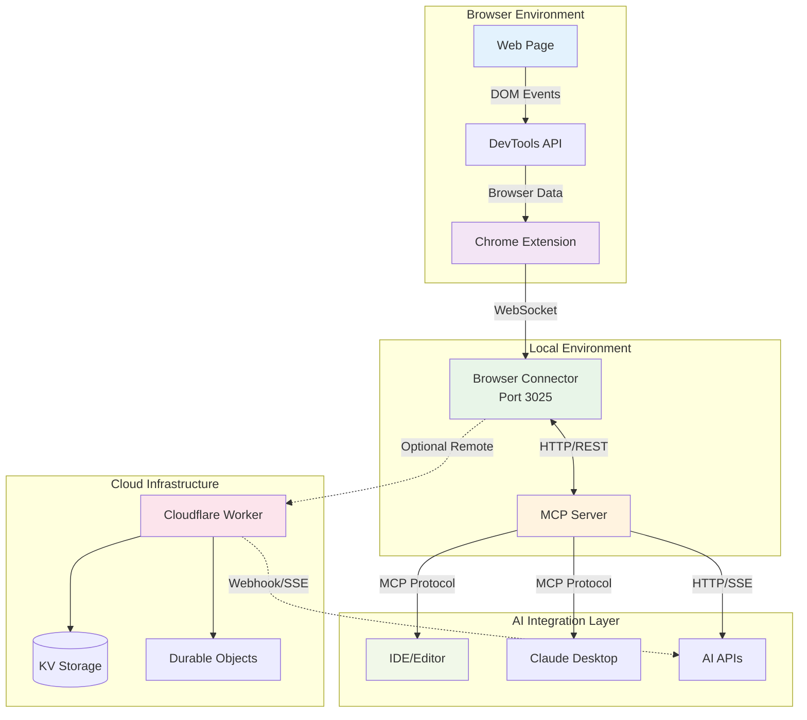

## Core Design Principles

### 1. Modularity
Each component has a single, well-defined responsibility:
- **Chrome Extension** - Browser data capture only
- **Browser Connector** - Data processing and aggregation
- **MCP Server** - AI integration abstraction
- **Cloudflare Worker** - Remote access and scaling

### 2. Loose Coupling
Components communicate through well-defined interfaces:
- WebSocket for real-time browser communication
- REST API for request/response patterns
- MCP protocol for AI assistant integration
- SSE for server-to-client streaming

### 3. Fault Tolerance
The system gracefully handles failures:
- Connection loss auto-recovery
- Data persistence during disconnections
- Fallback mechanisms for cloud services
- Graceful degradation of features

### 4. Extensibility
New features can be added without major changes:
- Plugin system for custom tools
- Configurable audit categories
- Custom MCP tool definitions
- Webhook integration points

## Component Architecture

### Chrome Extension Layer

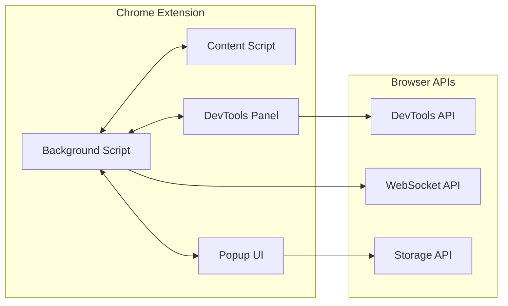

**Key Components:**
- **Background Script** - Manages WebSocket connections and data flow
- **DevTools Panel** - User interface within Chrome DevTools
- **Content Script** - Injects monitoring code into web pages
- **Popup UI** - Extension configuration and status interface

### Local Server Layer

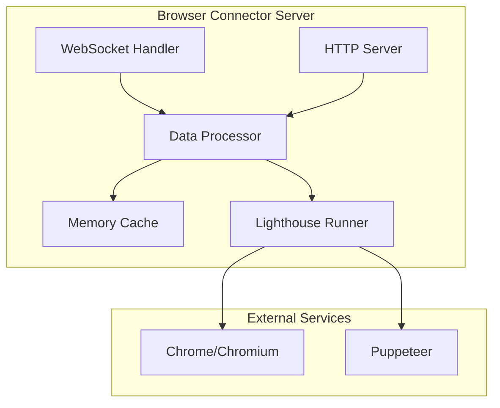

**Key Features:**
- **Real-time Processing** - Immediate data transformation and filtering
- **Caching** - In-memory storage for recent browser data
- **Lighthouse Integration** - Performance and accessibility audits
- **Multi-session Support** - Handle multiple browser connections

### MCP Integration Layer

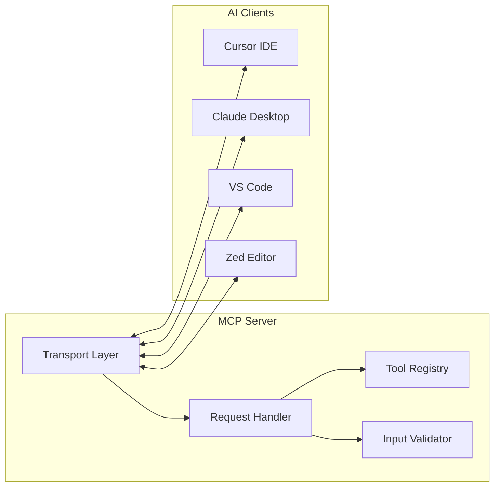

**Tool Categories:**
- **Browser Control** - Navigation, screenshot capture
- **Data Retrieval** - Console logs, network requests
- **Analysis Tools** - Performance audits, accessibility checks
- **Debugging Utilities** - Element inspection, JavaScript execution

## Data Flow Architecture

### Request Flow Patterns

#### 1. Synchronous Tool Execution

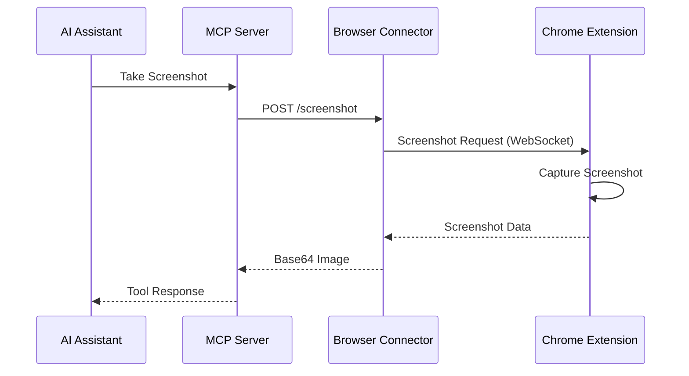

#### 2. Asynchronous Data Streaming

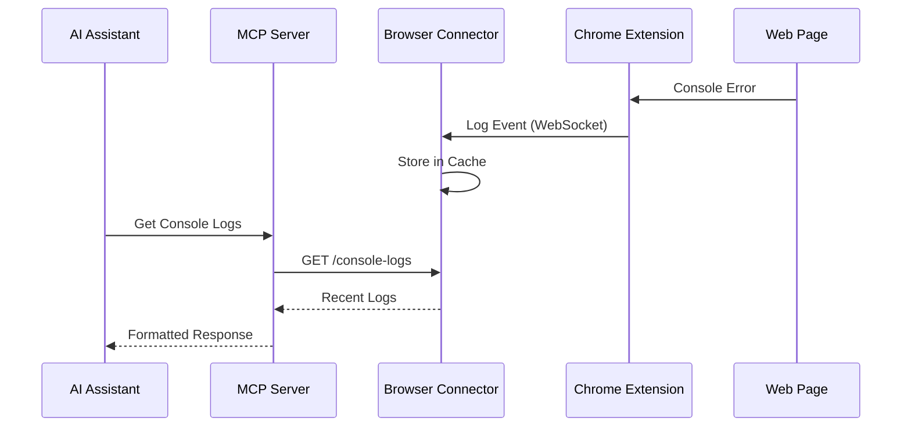

### Data Transformation Pipeline

```mermaid
graph LR
    RAW[Raw Browser Data] --> FILTER[Filter & Sanitize]
    FILTER --> TRANSFORM[Transform Structure]
    TRANSFORM --> ENRICH[Enrich Metadata]
    ENRICH --> CACHE[Cache Storage]
    CACHE --> FORMAT[Format for MCP]
    FORMAT --> RESPONSE[Tool Response]
    
    style RAW fill:#ffebee
    style FILTER fill:#e8f5e8
    style TRANSFORM fill:#e3f2fd
    style ENRICH fill:#fff3e0
    style CACHE fill:#f3e5f5
    style FORMAT fill:#e1f5fe
    style RESPONSE fill:#f1f8e9
```

## Deployment Architectures

### Local Development Architecture

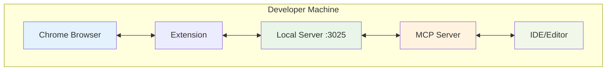

**Benefits:**
- Ultra-low latency
- Complete privacy
- No internet dependency
- Simple debugging

### Hybrid Architecture

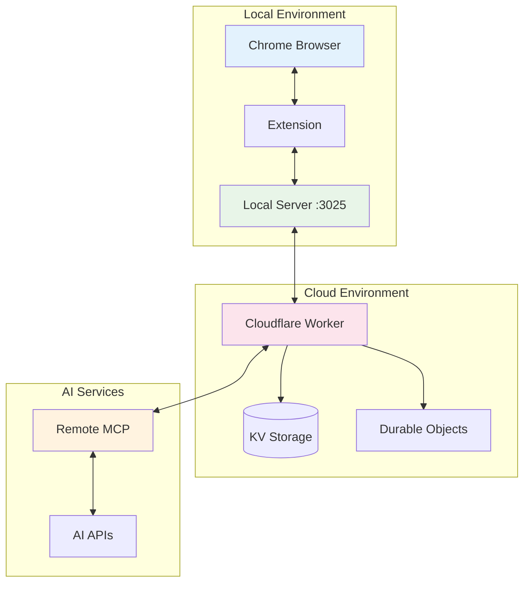

**Benefits:**
- Local data capture
- Remote processing power
- Global accessibility
- Team collaboration

### Full Cloud Architecture

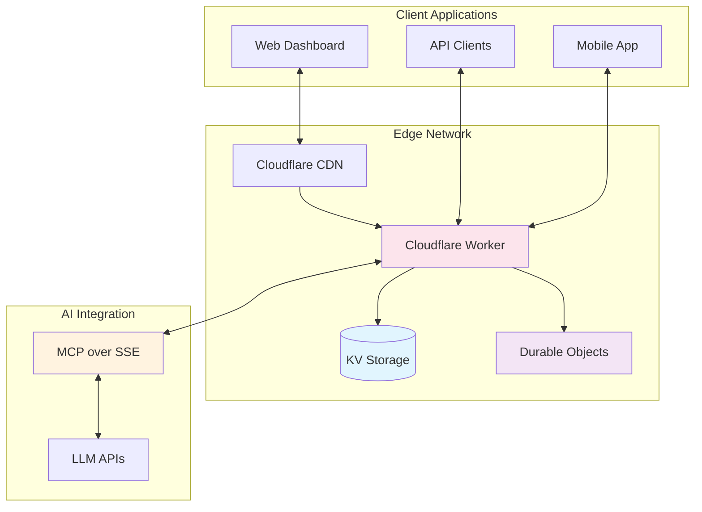

**Benefits:**
- Global scale
- High availability
- Managed infrastructure
- Auto-scaling

## Security Architecture

### Authentication & Authorization

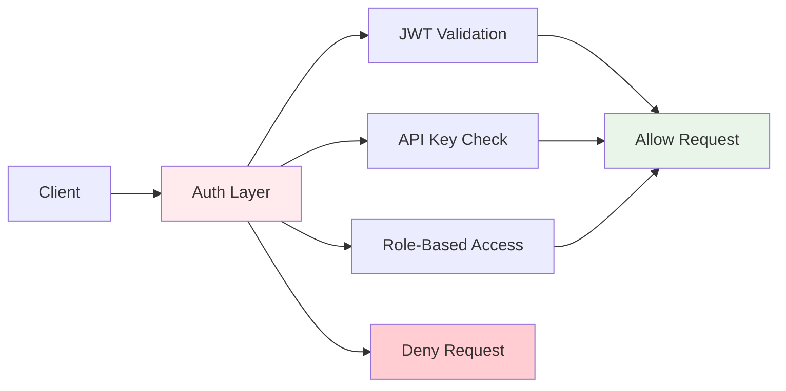

### Data Protection

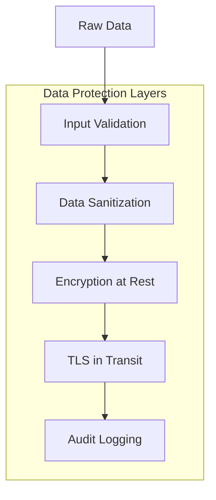

## Performance Architecture

### Caching Strategy

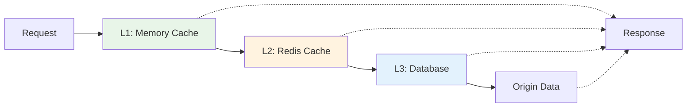

### Load Balancing

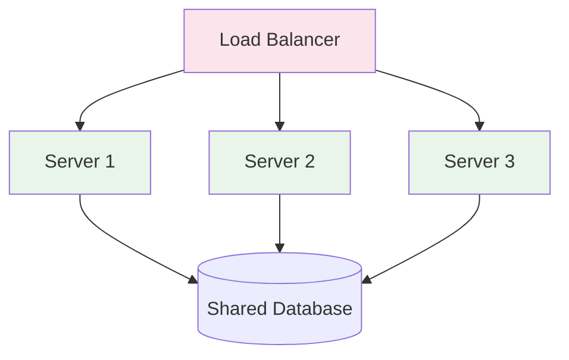

## Monitoring & Observability

### System Monitoring

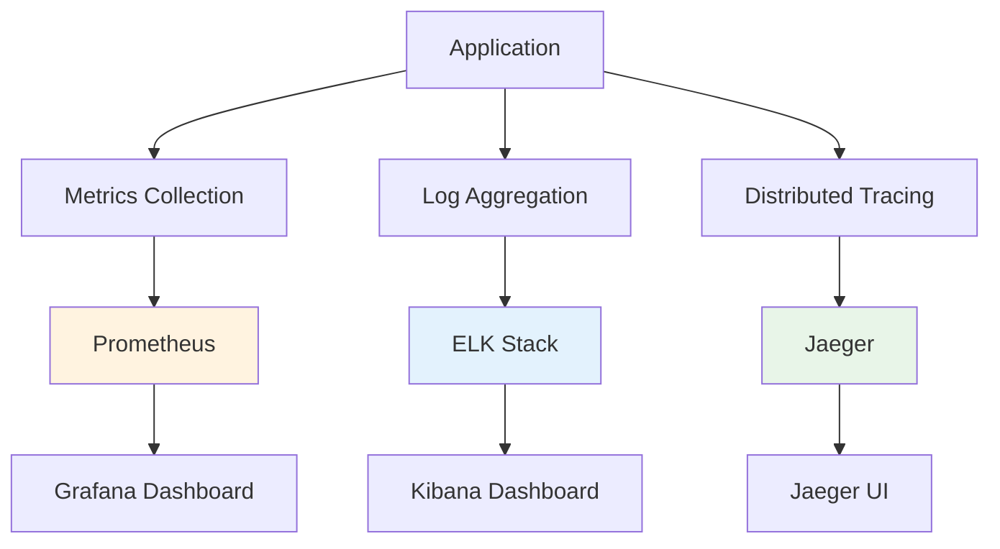

## Technology Stack

### Core Technologies

| Layer | Technology | Purpose | Alternatives |
|-------|------------|---------|--------------|
| **Browser** | Chrome Extensions API | Browser integration | Firefox WebExtensions |
| **Runtime** | Node.js 18+ | Server runtime | Deno, Bun |
| **Protocol** | WebSocket | Real-time communication | Server-Sent Events |
| **Web Server** | Express.js | HTTP server framework | Fastify, Hapi |
| **AI Integration** | MCP SDK | AI assistant protocol | Custom protocols |
| **Cloud** | Cloudflare Workers | Edge computing | AWS Lambda, Vercel |
| **Storage** | KV + Durable Objects | Distributed storage | Redis, PostgreSQL |

### Development Tools

| Category | Tool | Purpose |
|----------|------|---------|
| **Language** | TypeScript | Type safety and developer experience |
| **Build** | esbuild | Fast bundling and compilation |
| **Testing** | Jest + Playwright | Unit and integration testing |
| **Linting** | ESLint + Prettier | Code quality and formatting |
| **Documentation** | MkDocs Material | Documentation generation |

## Architectural Decisions

### Why Chrome Extensions?
- **Native Integration** - Direct access to DevTools API
- **Security Model** - Sandboxed execution environment
- **Cross-Platform** - Works on all desktop platforms
- **Established Ecosystem** - Well-documented APIs and tooling

### Why MCP Protocol?
- **Standardization** - Industry-standard protocol for AI integration
- **Flexibility** - Works with multiple AI assistants
- **Future-Proof** - Evolving standard with broad adoption
- **Tool Discovery** - Self-describing capabilities

### Why Cloudflare Workers?
- **Global Edge Network** - Low latency worldwide
- **Serverless Architecture** - Automatic scaling and cost efficiency
- **Modern Runtime** - V8 isolates with fast cold starts
- **Integrated Services** - KV storage, Durable Objects, R2

## Scalability Considerations

### Horizontal Scaling
- Stateless server design
- Session affinity via Durable Objects
- Database read replicas
- CDN for static assets

### Vertical Scaling
- Memory optimization
- Connection pooling
- Efficient data structures
- CPU-intensive task offloading

### Auto-Scaling Triggers
- Request volume
- Response time thresholds
- Error rate limits
- Resource utilization

## Future Architecture Evolution

### Planned Enhancements
1. **Multi-Browser Support** - Firefox, Safari integration
2. **Plugin System** - Custom tool development
3. **Distributed Caching** - Redis cluster integration
4. **Real-time Collaboration** - Multiple users on same session
5. **Advanced Analytics** - Machine learning insights

### Migration Paths
- **Kubernetes Deployment** - Container orchestration
- **Microservices Architecture** - Service decomposition
- **Event-Driven Architecture** - Message queue integration
- **GraphQL API** - Unified data access layer

## Next Steps

- **[Component Details](components.md)** - Deep dive into each component
- **[Data Flow](data-flow.md)** - Detailed interaction patterns
- **[System Overview](overview.md)** - Technical implementation details

---

This architecture enables RapidTriageME to provide fast, reliable, and scalable AI-powered browser debugging across multiple platforms and deployment scenarios.