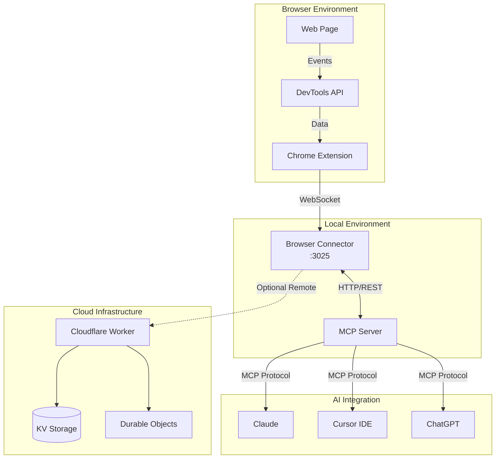
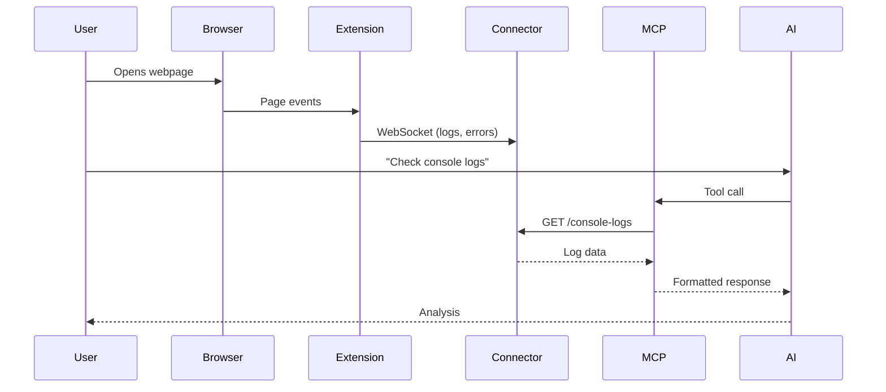
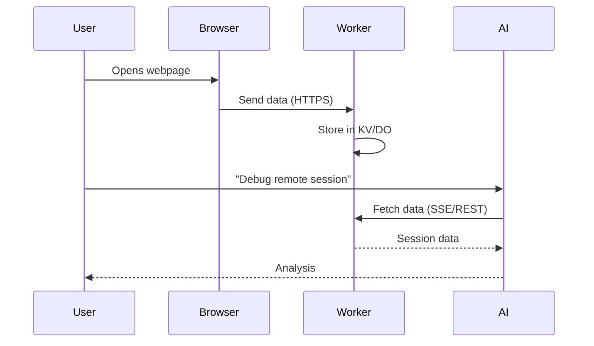

# Architecture Overview

RapidTriageME is built with a modular, distributed architecture that enables real-time browser debugging through AI assistants.

## System Architecture



## Core Components

### 1. Chrome Extension
- **Purpose**: Captures browser data through Chrome DevTools API
- **Technology**: Vanilla JavaScript, Chrome Extensions Manifest V3
- **Key Features**:
  - Console log capture
  - Network request monitoring
  - Error tracking
  - Screenshot capture
  - Element inspection

### 2. Browser Connector Server
- **Purpose**: Local server that aggregates and processes browser data
- **Port**: `3025` (configurable)
- **Technology**: Node.js, Express, WebSocket
- **Key Features**:
  - WebSocket connection management
  - Data aggregation
  - Lighthouse audit integration
  - REST API endpoints

### 3. MCP Server
- **Purpose**: Bridges browser data to AI assistants
- **Protocol**: Model Context Protocol (MCP)
- **Technology**: TypeScript, MCP SDK
- **Tools Provided**:
  - `getConsoleLogs`
  - `getNetworkErrors`
  - `takeScreenshot`
  - `runAccessibilityAudit`
  - `runPerformanceAudit`

### 4. Cloudflare Worker
- **Purpose**: Optional remote access and edge computing
- **Technology**: Cloudflare Workers, Durable Objects
- **Features**:
  - Global edge deployment
  - WebSocket support
  - KV storage for sessions
  - JWT authentication

## Data Flow

### Local Debugging Flow



### Remote Debugging Flow



## Communication Protocols

### WebSocket Protocol
- **Extension ↔ Connector**: Real-time bidirectional communication
- **Message Types**:
  - `console-log`
  - `console-error`
  - `network-request`
  - `screenshot-data`
  - `heartbeat`

### REST API
- **Connector Endpoints**:
  - `GET /console-logs` - Retrieve console logs
  - `GET /network-errors` - Get network errors
  - `POST /capture-screenshot` - Take screenshot
  - `POST /wipelogs` - Clear logs
  - `GET /.identity` - Server identity

### MCP Protocol
- **Tool Definitions**: Declarative tool specifications
- **Request/Response**: JSON-RPC style communication
- **Error Handling**: Structured error responses

## Security Architecture

### Authentication Layers

1. **Local Access**: No auth required (localhost only)
2. **Remote Access**: JWT tokens for Cloudflare Worker
3. **MCP Access**: Controlled by AI platform

### Data Protection

- **Encryption**: TLS for all remote connections
- **Isolation**: Durable Objects for session isolation
- **Sanitization**: Input validation and output encoding
- **Rate Limiting**: Request throttling at edge

## Scalability Design

### Horizontal Scaling
- Stateless connector servers
- Edge deployment via Cloudflare
- Session affinity via Durable Objects

### Performance Optimizations
- Data compression
- Lazy loading
- Caching strategies
- Connection pooling

## Deployment Models

### Local Development
```
Browser → Extension → Connector(:3025) → MCP → AI
```

### Production (Edge)
```
Browser → Extension → Cloudflare Worker → AI
```

### Hybrid
```
Browser → Extension → Connector → Worker (backup) → AI
```

## Technology Stack

| Layer | Technology | Purpose |
|-------|------------|---------|
| **Frontend** | Chrome Extension API | Browser integration |
| **Backend** | Node.js, Express | Local server |
| **Protocol** | MCP, WebSocket | Communication |
| **Edge** | Cloudflare Workers | Global deployment |
| **Storage** | KV, Durable Objects | Session management |
| **AI** | MCP SDK | AI integration |

## Design Principles

1. **Modularity**: Each component is independent
2. **Extensibility**: Easy to add new tools/features
3. **Resilience**: Graceful degradation
4. **Security**: Defense in depth
5. **Performance**: Minimal overhead
6. **Simplicity**: Easy to understand and maintain

## Next Steps

- [Component Details](components.md) - Deep dive into each component
- [Data Flow](data-flow.md) - Detailed data flow diagrams
- [Security Guide](../guides/security.md) - Security best practices