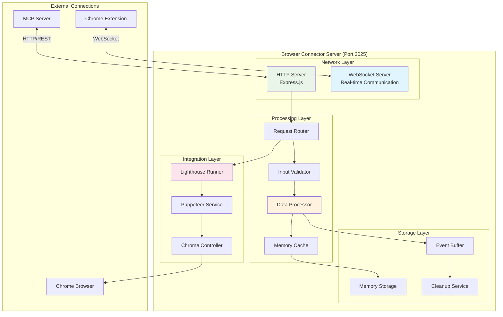

# Browser Connector Server

The Browser Connector Server is the heart of RapidTriageME's local operation, running on port 3025. It serves as the central hub that processes browser data, provides HTTP APIs, and integrates with external services like Lighthouse.

## Architecture Overview



## Core Functionality

### HTTP Server (Express.js)

The HTTP server provides RESTful API endpoints for data access and tool execution:

```typescript
// Core server setup
import express, { Express, Request, Response, NextFunction } from 'express';
import cors from 'cors';
import rateLimit from 'express-rate-limit';

class BrowserConnectorServer {
  private app: Express;
  private config: ServerConfig;
  
  constructor(config: ServerConfig) {
    this.config = config;
    this.app = express();
    this.initializeMiddleware();
    this.setupRoutes();
  }

  private initializeMiddleware(): void {
    // Request parsing
    this.app.use(express.json({ limit: '10mb' }));
    this.app.use(express.urlencoded({ extended: true, limit: '10mb' }));
    
    // CORS configuration
    this.app.use(cors({
      origin: this.config.corsOrigin || '*',
      credentials: true,
      methods: ['GET', 'POST', 'PUT', 'DELETE', 'OPTIONS'],
      allowedHeaders: ['Content-Type', 'Authorization', 'X-Request-ID']
    }));
    
    // Rate limiting for production
    if (this.config.environment === 'production') {
      const limiter = rateLimit({
        windowMs: 60 * 1000, // 1 minute
        max: this.config.rateLimitMax || 100,
        message: {
          error: 'Too many requests',
          retryAfter: 60
        },
        standardHeaders: true,
        legacyHeaders: false
      });
      this.app.use(limiter);
    }
    
    // Request logging
    this.app.use(this.requestLogger);
    
    // Error handling
    this.app.use(this.errorHandler);
  }

  private requestLogger(req: Request, res: Response, next: NextFunction): void {
    const start = Date.now();
    const requestId = req.headers['x-request-id'] || generateRequestId();
    
    req.requestId = requestId;
    
    res.on('finish', () => {
      const duration = Date.now() - start;
      logger.info({
        requestId,
        method: req.method,
        path: req.path,
        statusCode: res.statusCode,
        duration,
        userAgent: req.headers['user-agent']
      });
    });
    
    next();
  }
}
```

### API Endpoints

#### System Information

```typescript
// GET /.identity - Server identity and status
this.app.get('/.identity', (req: Request, res: Response) => {
  const identity = {
    name: 'RapidTriageME Browser Connector',
    version: packageJson.version,
    status: 'healthy',
    uptime: process.uptime() * 1000,
    timestamp: new Date().toISOString(),
    connections: this.getActiveConnections(),
    features: {
      screenshots: this.config.features.screenshots.enabled,
      lighthouse: this.config.features.lighthouse.enabled,
      websocket: true,
      cors: this.config.corsOrigin !== undefined
    },
    environment: this.config.environment,
    nodeVersion: process.version,
    platform: process.platform
  };
  
  res.json(identity);
});

// GET /health - Detailed health check
this.app.get('/health', async (req: Request, res: Response) => {
  const healthChecks = await this.runHealthChecks();
  const overallStatus = healthChecks.every(check => check.status === 'ok') ? 'healthy' : 'unhealthy';
  
  res.status(overallStatus === 'healthy' ? 200 : 503).json({
    status: overallStatus,
    timestamp: new Date().toISOString(),
    checks: healthChecks,
    metrics: await this.getSystemMetrics()
  });
});

private async runHealthChecks(): Promise<HealthCheck[]> {
  const checks: HealthCheck[] = [];
  
  // WebSocket server health
  checks.push({
    name: 'websocket',
    status: this.wsServer?.listening ? 'ok' : 'error',
    message: this.wsServer?.listening ? 'WebSocket server is listening' : 'WebSocket server not available'
  });
  
  // Chrome/Chromium availability
  try {
    const chromeVersion = await this.getChromeVersion();
    checks.push({
      name: 'chrome',
      status: 'ok',
      message: `Chrome ${chromeVersion} available`
    });
  } catch (error) {
    checks.push({
      name: 'chrome',
      status: 'error',
      message: 'Chrome/Chromium not available'
    });
  }
  
  // Memory usage check
  const memUsage = process.memoryUsage();
  const memStatus = memUsage.heapUsed < 500 * 1024 * 1024 ? 'ok' : 'warning'; // 500MB threshold
  checks.push({
    name: 'memory',
    status: memStatus,
    message: `Heap used: ${Math.round(memUsage.heapUsed / 1024 / 1024)}MB`
  });
  
  return checks;
}
```

#### Data Access Endpoints

```typescript
// GET /console-logs - Retrieve console logs with filtering
this.app.get('/console-logs', (req: Request, res: Response) => {
  try {
    const options = this.parseLogOptions(req.query);
    const logs = this.dataCache.getConsoleLogs(options);
    
    res.json({
      logs,
      total: logs.length,
      filtered: logs.length, // After filtering
      options,
      timestamp: new Date().toISOString(),
      requestId: req.requestId
    });
  } catch (error) {
    this.handleError(res, error, 'Failed to retrieve console logs');
  }
});

// GET /network-requests - Retrieve network requests
this.app.get('/network-requests', (req: Request, res: Response) => {
  try {
    const options = this.parseNetworkOptions(req.query);
    const requests = this.dataCache.getNetworkRequests(options);
    
    res.json({
      requests,
      total: requests.length,
      options,
      timestamp: new Date().toISOString(),
      requestId: req.requestId
    });
  } catch (error) {
    this.handleError(res, error, 'Failed to retrieve network requests');
  }
});

// POST /capture-screenshot - Capture browser screenshot
this.app.post('/capture-screenshot', async (req: Request, res: Response) => {
  try {
    const options = req.body.options || {};
    
    // Validate screenshot options
    const validatedOptions = this.validateScreenshotOptions(options);
    
    // Request screenshot from browser
    const screenshot = await this.requestScreenshot(validatedOptions);
    
    res.json({
      screenshot: screenshot.dataUrl,
      format: screenshot.format,
      dimensions: screenshot.dimensions,
      options: validatedOptions,
      timestamp: new Date().toISOString(),
      requestId: req.requestId
    });
  } catch (error) {
    this.handleError(res, error, 'Screenshot capture failed');
  }
});

// POST /wipelogs - Clear all cached data
this.app.post('/wipelogs', (req: Request, res: Response) => {
  try {
    this.dataCache.clearAll();
    
    res.json({
      message: 'All logs and cached data cleared',
      timestamp: new Date().toISOString(),
      requestId: req.requestId
    });
  } catch (error) {
    this.handleError(res, error, 'Failed to clear logs');
  }
});
```

### WebSocket Server

Handles real-time communication with the Chrome extension:

```typescript
import { WebSocketServer, WebSocket } from 'ws';
import { createServer, Server as HTTPServer } from 'http';

class WebSocketManager {
  private wss: WebSocketServer;
  private connections: Map<string, WebSocketConnection> = new Map();
  private heartbeatInterval: NodeJS.Timeout;
  
  constructor(server: HTTPServer) {
    this.wss = new WebSocketServer({ server, path: '/ws' });
    this.initializeWebSocket();
    this.startHeartbeat();
  }
  
  private initializeWebSocket(): void {
    this.wss.on('connection', (ws: WebSocket, request) => {
      const connectionId = this.generateConnectionId();
      const clientIP = request.socket.remoteAddress;
      const userAgent = request.headers['user-agent'];
      
      logger.info(`New WebSocket connection: ${connectionId} from ${clientIP}`);
      
      const connection = new WebSocketConnection(ws, {
        id: connectionId,
        ip: clientIP,
        userAgent,
        connectedAt: Date.now()
      });
      
      this.connections.set(connectionId, connection);
      
      // Set up message handling
      ws.on('message', (data: Buffer) => {
        this.handleMessage(connectionId, data);
      });
      
      // Handle connection close
      ws.on('close', (code: number, reason: Buffer) => {
        logger.info(`WebSocket connection closed: ${connectionId} (code: ${code})`);
        this.connections.delete(connectionId);
      });
      
      // Handle errors
      ws.on('error', (error: Error) => {
        logger.error(`WebSocket error on connection ${connectionId}:`, error);
        this.connections.delete(connectionId);
      });
      
      // Send welcome message
      this.sendMessage(connectionId, {
        type: 'connection-established',
        connectionId,
        timestamp: Date.now(),
        serverVersion: packageJson.version
      });
    });
  }
  
  private handleMessage(connectionId: string, data: Buffer): void {
    try {
      const message = JSON.parse(data.toString());
      
      // Validate message structure
      if (!message.type || !message.timestamp) {
        throw new Error('Invalid message format');
      }
      
      // Process different message types
      switch (message.type) {
        case 'console-log':
          this.handleConsoleLog(connectionId, message);
          break;
          
        case 'console-error':
          this.handleConsoleError(connectionId, message);
          break;
          
        case 'network-request':
          this.handleNetworkRequest(connectionId, message);
          break;
          
        case 'screenshot-data':
          this.handleScreenshotData(connectionId, message);
          break;
          
        case 'heartbeat':
          this.handleHeartbeat(connectionId, message);
          break;
          
        default:
          logger.warn(`Unknown message type: ${message.type} from ${connectionId}`);
      }
    } catch (error) {
      logger.error(`Error processing message from ${connectionId}:`, error);
      this.sendError(connectionId, 'Invalid message format');
    }
  }
  
  private handleConsoleLog(connectionId: string, message: any): void {
    const logEntry: ConsoleLogEntry = {
      id: this.generateLogId(),
      level: message.level || 'info',
      message: message.message,
      timestamp: message.timestamp,
      url: message.url,
      source: message.source,
      stack: message.stack,
      connectionId
    };
    
    // Apply data sanitization
    const sanitizedEntry = this.dataSanitizer.sanitizeConsoleLog(logEntry);
    
    // Store in cache
    this.dataCache.addConsoleLog(sanitizedEntry);
    
    // Emit to any listeners (for real-time monitoring)
    this.eventEmitter.emit('console-log', sanitizedEntry);
  }
  
  private handleNetworkRequest(connectionId: string, message: any): void {
    const requestEntry: NetworkRequestEntry = {
      id: this.generateRequestId(),
      url: message.url,
      method: message.method,
      status: message.status,
      statusText: message.statusText,
      timestamp: message.timestamp,
      duration: message.duration,
      size: message.size,
      timing: message.timing,
      headers: this.dataSanitizer.sanitizeHeaders(message.headers),
      connectionId
    };
    
    // Store in cache
    this.dataCache.addNetworkRequest(requestEntry);
    
    // Emit to listeners
    this.eventEmitter.emit('network-request', requestEntry);
  }
}
```

### Data Cache System

```typescript
class DataCache {
  private consoleLogs: ConsoleLogEntry[] = [];
  private networkRequests: NetworkRequestEntry[] = [];
  private screenshots: Map<string, ScreenshotEntry> = new Map();
  private config: CacheConfig;
  private cleanupInterval: NodeJS.Timeout;
  
  constructor(config: CacheConfig) {
    this.config = config;
    this.startCleanupProcess();
  }
  
  addConsoleLog(entry: ConsoleLogEntry): void {
    // Add unique ID and timestamp validation
    if (!entry.timestamp) entry.timestamp = Date.now();
    if (!entry.id) entry.id = this.generateEntryId('log');
    
    this.consoleLogs.push(entry);
    
    // Maintain size limits
    if (this.consoleLogs.length > this.config.maxConsoleEntries) {
      const excessCount = this.consoleLogs.length - this.config.maxConsoleEntries;
      this.consoleLogs.splice(0, excessCount);
    }
    
    // Update metrics
    this.updateMetrics('console_logs_added', 1);
  }
  
  getConsoleLogs(options: GetLogsOptions = {}): ConsoleLogEntry[] {
    let logs = [...this.consoleLogs];
    
    // Apply level filter
    if (options.level) {
      logs = logs.filter(log => log.level === options.level);
    }
    
    // Apply time filter
    if (options.since) {
      const sinceTimestamp = new Date(options.since).getTime();
      logs = logs.filter(log => log.timestamp >= sinceTimestamp);
    }
    
    // Apply search filter
    if (options.search) {
      const searchLower = options.search.toLowerCase();
      logs = logs.filter(log => 
        log.message.toLowerCase().includes(searchLower) ||
        (log.source && log.source.toLowerCase().includes(searchLower))
      );
    }
    
    // Sort by timestamp (newest first)
    logs.sort((a, b) => b.timestamp - a.timestamp);
    
    // Apply limit
    if (options.limit && options.limit > 0) {
      logs = logs.slice(0, options.limit);
    }
    
    this.updateMetrics('console_logs_retrieved', logs.length);
    return logs;
  }
  
  private startCleanupProcess(): void {
    this.cleanupInterval = setInterval(() => {
      const now = Date.now();
      const ttl = this.config.entryTTL;
      
      // Clean up expired console logs
      const initialLogsCount = this.consoleLogs.length;
      this.consoleLogs = this.consoleLogs.filter(log => (now - log.timestamp) < ttl);
      const logsRemoved = initialLogsCount - this.consoleLogs.length;
      
      // Clean up expired network requests
      const initialRequestsCount = this.networkRequests.length;
      this.networkRequests = this.networkRequests.filter(req => (now - req.timestamp) < ttl);
      const requestsRemoved = initialRequestsCount - this.networkRequests.length;
      
      // Clean up expired screenshots
      const initialScreenshotsCount = this.screenshots.size;
      for (const [id, screenshot] of this.screenshots.entries()) {
        if ((now - screenshot.timestamp) > ttl) {
          this.screenshots.delete(id);
        }
      }
      const screenshotsRemoved = initialScreenshotsCount - this.screenshots.size;
      
      // Log cleanup statistics
      if (logsRemoved > 0 || requestsRemoved > 0 || screenshotsRemoved > 0) {
        logger.debug(`Cleanup completed: ${logsRemoved} logs, ${requestsRemoved} requests, ${screenshotsRemoved} screenshots removed`);
      }
      
      // Update metrics
      this.updateMetrics('cleanup_logs_removed', logsRemoved);
      this.updateMetrics('cleanup_requests_removed', requestsRemoved);
      this.updateMetrics('cleanup_screenshots_removed', screenshotsRemoved);
      
    }, this.config.cleanupInterval);
  }
}
```

### Lighthouse Integration

```typescript
import lighthouse from 'lighthouse';
import * as chromeLauncher from 'chrome-launcher';

class LighthouseService {
  private defaultConfig: LighthouseConfig;
  
  constructor() {
    this.defaultConfig = {
      extends: 'lighthouse:default',
      settings: {
        onlyCategories: ['performance', 'accessibility', 'best-practices', 'seo'],
        skipAudits: ['screenshot-thumbnails'],
        throttling: {
          rttMs: 40,
          throughputKbps: 10240,
          cpuSlowdownMultiplier: 1,
          requestLatencyMs: 0
        },
        formFactor: 'desktop',
        screenEmulation: {
          mobile: false,
          width: 1350,
          height: 940,
          deviceScaleFactor: 1,
          disabled: false
        }
      }
    };
  }
  
  async runAudit(url: string, options: LighthouseOptions = {}): Promise<LighthouseResult> {
    const chrome = await chromeLauncher.launch({
      chromeFlags: [
        '--headless=new',
        '--disable-gpu',
        '--no-sandbox',
        '--disable-setuid-sandbox',
        '--disable-dev-shm-usage',
        '--disable-extensions',
        '--disable-background-timer-throttling',
        '--disable-backgrounding-occluded-windows',
        '--disable-renderer-backgrounding'
      ],
      port: options.chromePort
    });
    
    try {
      const config = this.mergeConfigs(this.defaultConfig, options.config);
      
      const runnerResult = await lighthouse(url, {
        port: chrome.port,
        output: 'json',
        logLevel: options.logLevel || 'info',
        ...options.lighthouseOptions
      }, config);
      
      if (!runnerResult?.lhr) {
        throw new Error('Lighthouse audit failed to produce results');
      }
      
      return this.processLighthouseResult(runnerResult);
      
    } finally {
      await chrome.kill();
    }
  }
  
  private processLighthouseResult(runnerResult: any): LighthouseResult {
    const { lhr } = runnerResult;
    
    const result: LighthouseResult = {
      url: lhr.finalUrl,
      timestamp: new Date(lhr.fetchTime).getTime(),
      
      // Category scores (0-100)
      scores: {
        performance: this.scoreToNumber(lhr.categories.performance?.score),
        accessibility: this.scoreToNumber(lhr.categories.accessibility?.score),
        bestPractices: this.scoreToNumber(lhr.categories['best-practices']?.score),
        seo: this.scoreToNumber(lhr.categories.seo?.score)
      },
      
      // Core Web Vitals and key metrics
      metrics: {
        firstContentfulPaint: lhr.audits['first-contentful-paint']?.numericValue,
        largestContentfulPaint: lhr.audits['largest-contentful-paint']?.numericValue,
        cumulativeLayoutShift: lhr.audits['cumulative-layout-shift']?.numericValue,
        totalBlockingTime: lhr.audits['total-blocking-time']?.numericValue,
        speedIndex: lhr.audits['speed-index']?.numericValue,
        timeToInteractive: lhr.audits['interactive']?.numericValue
      },
      
      // Performance opportunities
      opportunities: this.extractOpportunities(lhr.audits),
      
      // Diagnostic information
      diagnostics: this.extractDiagnostics(lhr.audits),
      
      // Raw Lighthouse report (optional)
      reportHtml: runnerResult.report
    };
    
    return result;
  }
  
  private extractOpportunities(audits: any): LighthouseOpportunity[] {
    const opportunities: LighthouseOpportunity[] = [];
    
    const opportunityAudits = [
      'unused-css-rules',
      'unused-javascript',
      'modern-image-formats',
      'offscreen-images',
      'render-blocking-resources',
      'unminified-css',
      'unminified-javascript',
      'efficient-animated-content',
      'duplicated-javascript',
      'legacy-javascript'
    ];
    
    for (const auditId of opportunityAudits) {
      const audit = audits[auditId];
      if (audit && audit.details && audit.details.overallSavingsMs > 0) {
        opportunities.push({
          id: auditId,
          title: audit.title,
          description: audit.description,
          score: audit.score,
          numericValue: audit.numericValue,
          displayValue: audit.displayValue,
          potentialSavings: audit.details.overallSavingsMs
        });
      }
    }
    
    return opportunities.sort((a, b) => b.potentialSavings - a.potentialSavings);
  }
}
```

## Configuration Options

```typescript
interface ServerConfig {
  // Server settings
  port: number;
  host: string;
  environment: 'development' | 'production' | 'test';
  
  // CORS settings
  corsOrigin: string | string[];
  
  // Rate limiting
  rateLimitMax: number;
  rateLimitWindowMs: number;
  
  // Feature toggles
  features: {
    screenshots: {
      enabled: boolean;
      maxWidth: number;
      maxHeight: number;
      quality: number;
      formats: string[];
    };
    lighthouse: {
      enabled: boolean;
      timeout: number;
      categories: string[];
    };
    websocket: {
      enabled: boolean;
      heartbeatInterval: number;
      connectionTimeout: number;
    };
  };
  
  // Cache settings
  cache: {
    maxConsoleEntries: number;
    maxNetworkEntries: number;
    entryTTL: number;
    cleanupInterval: number;
  };
  
  // Logging settings
  logging: {
    level: string;
    format: string;
    enableColors: boolean;
  };
}
```

## Performance Optimization

### Memory Management

```typescript
class MemoryManager {
  private memoryThreshold = 500 * 1024 * 1024; // 500MB
  private checkInterval = 60000; // 1 minute
  
  startMonitoring(): void {
    setInterval(() => {
      const memUsage = process.memoryUsage();
      
      if (memUsage.heapUsed > this.memoryThreshold) {
        logger.warn(`High memory usage detected: ${Math.round(memUsage.heapUsed / 1024 / 1024)}MB`);
        this.performCleanup();
      }
      
      // Force garbage collection if available
      if (global.gc) {
        global.gc();
      }
    }, this.checkInterval);
  }
  
  private performCleanup(): void {
    // Clear old cache entries
    this.dataCache.forceCleanup();
    
    // Close inactive WebSocket connections
    this.webSocketManager.closeInactiveConnections();
    
    // Clear screenshot cache
    this.screenshotCache.clear();
  }
}
```

### Connection Pooling

```typescript
class ConnectionPool {
  private chromeInstances: Map<string, ChromeInstance> = new Map();
  private maxInstances = 3;
  
  async getChrome(): Promise<ChromeInstance> {
    // Reuse existing instance if available
    for (const [id, instance] of this.chromeInstances) {
      if (!instance.busy) {
        instance.busy = true;
        return instance;
      }
    }
    
    // Create new instance if under limit
    if (this.chromeInstances.size < this.maxInstances) {
      const chrome = await chromeLauncher.launch({
        chromeFlags: ['--headless=new', '--disable-gpu']
      });
      
      const instance = {
        id: generateId(),
        chrome,
        busy: true,
        createdAt: Date.now()
      };
      
      this.chromeInstances.set(instance.id, instance);
      return instance;
    }
    
    // Wait for available instance
    return this.waitForAvailableInstance();
  }
  
  releaseChrome(instance: ChromeInstance): void {
    instance.busy = false;
    instance.lastUsed = Date.now();
  }
}
```

## Monitoring and Metrics

```typescript
class MetricsCollector {
  private metrics = new Map<string, number>();
  private counters = new Map<string, number>();
  
  increment(metric: string, value = 1): void {
    const current = this.counters.get(metric) || 0;
    this.counters.set(metric, current + value);
  }
  
  gauge(metric: string, value: number): void {
    this.metrics.set(metric, value);
  }
  
  getMetrics(): Record<string, any> {
    return {
      counters: Object.fromEntries(this.counters),
      gauges: Object.fromEntries(this.metrics),
      timestamp: Date.now(),
      uptime: process.uptime() * 1000,
      memory: process.memoryUsage(),
      cpu: process.cpuUsage()
    };
  }
}
```

The Browser Connector Server is designed for reliability, performance, and extensibility, making it the robust foundation for RapidTriageME's browser debugging capabilities.

## Next Steps

- **[MCP Server](mcp-server.md)** - Learn about AI integration
- **[Chrome Extension](chrome-extension.md)** - Understand browser integration
- **[API Reference](../api/index.md)** - Complete API documentation