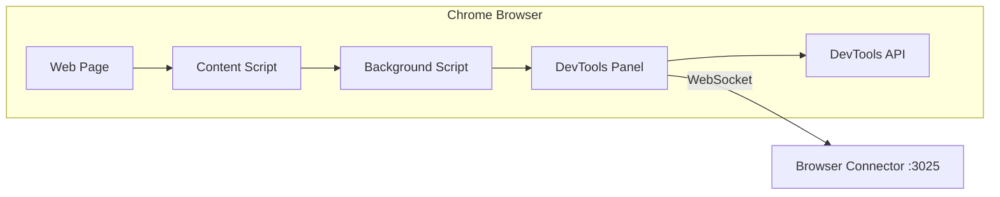

# Chrome Extension

The RapidTriageME Chrome Extension is the data collection layer that captures browser events, console logs, network requests, and errors.

## Overview

The extension operates in the browser's privileged context, using Chrome's DevTools API to capture comprehensive debugging information.

## Architecture



## Features

### 🔍 Data Capture

- **Console Logs** - All console.* methods
- **Errors** - JavaScript exceptions and runtime errors
- **Network Requests** - XHR and Fetch API calls
- **DOM Events** - User interactions and mutations
- **Performance Metrics** - Resource timing, paint events
- **Screenshots** - On-demand viewport capture

### 🎛️ DevTools Panel

Custom panel in Chrome DevTools providing:
- Connection status indicator
- Real-time log viewer
- Settings configuration
- Server discovery
- Manual screenshot trigger

### 🔗 Auto-Discovery

Automatic server discovery on ports 3025-1431:
1. Checks default port (3025)
2. Scans alternate ports
3. Validates server identity
4. Establishes WebSocket connection

## Installation

### From Source

1. Clone the repository:
```bash
git clone .git
cd rapidtriage/rapidtriage-extension
```

2. Load in Chrome:
   - Navigate to `chrome://extensions/`
   - Enable "Developer mode"
   - Click "Load unpacked"
   - Select the extension directory

### From Chrome Web Store

Coming soon!

## Configuration

### Settings Panel

Access via the DevTools panel:

| Setting | Description | Default |
|---------|-------------|---------|
| **Server Host** | Connector server address | `localhost` |
| **Server Port** | Connector server port | `3025` |
| **Log Limit** | Maximum logs to store | `50` |
| **String Size Limit** | Max string length | `500` |
| **Screenshot Path** | Save location | `~/Downloads` |

### Manifest Configuration

`manifest.json` key permissions:

```json
{
  "permissions": [
    "debugger",
    "storage",
    "tabs",
    "activeTab"
  ],
  "host_permissions": [
    "http://localhost/*",
    "http://127.0.0.1/*"
  ]
}
```

## Usage

### Basic Usage

1. **Open any website** in Chrome
2. **Open DevTools** (F12)
3. **Navigate to "BrowserToolsMCP" tab**
4. **Verify connection** status is green
5. **Start debugging** - data flows automatically

### Manual Controls

- **Capture Screenshot** - Click button in panel
- **Wipe Logs** - Clear all captured data
- **Test Connection** - Verify server connectivity
- **Auto-Discovery** - Scan for server

## API Integration

### Message Protocol

The extension communicates via WebSocket with these message types:

```javascript
// Console log message
{
  type: "console-log",
  level: "info",
  message: "Application started",
  timestamp: 1704067200000
}

// Network request
{
  type: "network-request", 
  url: "https://api.example.com",
  method: "GET",
  status: 200,
  duration: 145
}

// Error message
{
  type: "console-error",
  message: "Uncaught TypeError",
  stack: "at app.js:42",
  timestamp: 1704067200000
}
```

### WebSocket Events

```javascript
// Connection established
ws.onopen = () => {
  console.log('Connected to server');
};

// Message received
ws.onmessage = (event) => {
  const message = JSON.parse(event.data);
  handleServerMessage(message);
};

// Connection closed
ws.onclose = () => {
  console.log('Disconnected from server');
  attemptReconnect();
};
```

## Development

### Building from Source

```bash
# Install dependencies
npm install

# Build extension
npm run build

# Watch mode
npm run watch
```

### Testing

```bash
# Run tests
npm test

# Manual testing
1. Load extension in Chrome
2. Run test server: npm run test-server
3. Open test page: http://localhost:3000/test
```

### Debugging

Enable verbose logging:

1. Open extension background page
2. Open console
3. Set debug flag:
```javascript
localStorage.setItem('DEBUG', 'true');
```

## Performance

### Optimization Strategies

- **Throttling** - Limits message frequency
- **Batching** - Groups multiple events
- **Compression** - Reduces payload size
- **Filtering** - Excludes noise
- **Sampling** - Statistical sampling for high-volume

### Resource Usage

Typical resource consumption:

| Metric | Value |
|--------|-------|
| Memory | ~10-20 MB |
| CPU | <1% idle, 2-5% active |
| Network | ~1-10 KB/s |
| Storage | <1 MB |

## Security

### Permissions Model

- **Host Permissions** - Limited to localhost
- **Content Security Policy** - Strict CSP
- **Data Sanitization** - XSS prevention
- **No External Requests** - Local only

### Data Privacy

- No data leaves localhost by default
- No analytics or tracking
- No persistent storage of sensitive data
- User-controlled data clearing

## Troubleshooting

### Common Issues

??? bug "Extension not loading"
    - Check Developer mode is enabled
    - Verify manifest.json is valid
    - Check for console errors

??? bug "Not connecting to server"
    - Verify server is running on port 3025
    - Check firewall settings
    - Try manual connection test

??? bug "No data captured"
    - Refresh the page after loading extension
    - Check DevTools is open
    - Verify debugger is attached

### Debug Commands

Run in extension console:

```javascript
// Check connection status
chrome.runtime.sendMessage({type: 'GET_STATUS'});

// Force reconnect
chrome.runtime.sendMessage({type: 'RECONNECT'});

// Clear all data
chrome.runtime.sendMessage({type: 'CLEAR_DATA'});
```

## API Reference

### Chrome Extension APIs Used

- `chrome.debugger` - Attach to tabs
- `chrome.devtools` - Create panel
- `chrome.runtime` - Message passing
- `chrome.storage` - Settings persistence
- `chrome.tabs` - Tab management

### Custom Events

The extension emits these events:

```javascript
// Server connected
window.dispatchEvent(new CustomEvent('rapidtriage:connected'));

// Data captured
window.dispatchEvent(new CustomEvent('rapidtriage:data', {
  detail: { type: 'console-log', data: {...} }
}));

// Error occurred
window.dispatchEvent(new CustomEvent('rapidtriage:error', {
  detail: { message: 'Connection failed' }
}));
```

## Next Steps

- [Browser Connector](browser-connector.md) - Server component
- [MCP Integration](mcp-server.md) - AI connection
- [Debugging Guide](../guides/debugging.md) - Usage tips