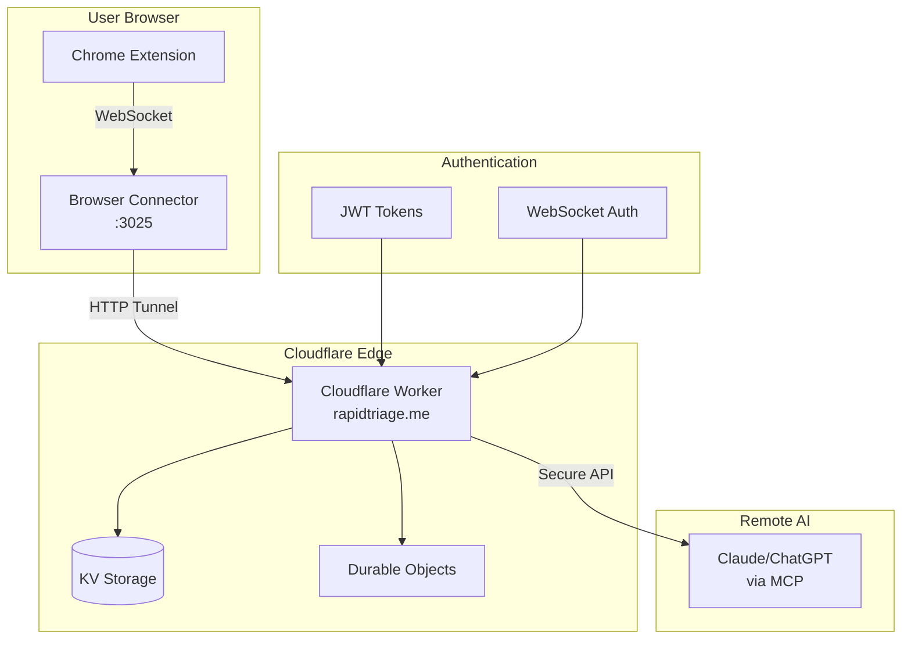

# Cloudflare Worker

The RapidTriageME Cloudflare Worker provides remote access to browser debugging data through Cloudflare's edge computing platform. This enables access to local browser data from anywhere in the world while maintaining security and performance.

## Overview

The Cloudflare Worker acts as a secure relay between remote AI assistants and local browser connector instances, utilizing Cloudflare's global network for low-latency access.

## Architecture



## Features

### 🌐 Global Access
- **Edge Deployment** - Available worldwide via Cloudflare's network
- **Low Latency** - Sub-100ms response times globally
- **High Availability** - 99.99% uptime SLA
- **Auto-scaling** - Handles traffic spikes automatically

### 🔒 Security
- **JWT Authentication** - Secure token-based access
- **WebSocket Tunneling** - Encrypted real-time connections
- **Origin Validation** - Prevents unauthorized access
- **Rate Limiting** - Protects against abuse

### 📊 Data Management
- **KV Storage** - Persistent session data
- **Durable Objects** - Stateful WebSocket connections  
- **Edge Caching** - Optimized response times
- **Data Retention** - Configurable cleanup policies

## Deployment

### Prerequisites

1. **Cloudflare Account** with Workers plan
2. **Domain Setup** (rapidtriage.me)
3. **Wrangler CLI** installed
4. **Local Development** environment

### Initial Setup

1. **Clone and Configure**:
```bash
# Navigate to worker directory
cd cloudflare-worker

# Install dependencies
npm install

# Configure wrangler
wrangler login
```

2. **Environment Variables**:
```bash
# Set production secrets
wrangler secret put JWT_SECRET
wrangler secret put API_KEY
wrangler secret put WEBHOOK_SECRET
```

3. **Deploy Worker**:
```bash
# Deploy to production
wrangler deploy

# Deploy to staging
wrangler deploy --env staging
```

### Configuration Files

#### `wrangler.toml`
```toml
name = "rapidtriage-worker"
main = "src/index.js"
compatibility_date = "2024-01-01"

[env.production]
name = "rapidtriage-worker-prod"
route = "rapidtriage.me/*"

[env.staging]
name = "rapidtriage-worker-staging"
route = "staging.rapidtriage.me/*"

[[kv_namespaces]]
binding = "SESSIONS"
id = "your-kv-namespace-id"
preview_id = "your-preview-kv-namespace-id"

[durable_objects]
bindings = [
  { name = "WEBSOCKET_CONNECTIONS", class_name = "WebSocketConnection" }
]

[[migrations]]
tag = "v1"
new_classes = ["WebSocketConnection"]
```

## API Endpoints

### Authentication

#### `POST /auth/token`

Generate authentication token for remote access.

**Request:**
```json
{
  "clientId": "browser-connector-uuid",
  "publicKey": "base64-encoded-key",
  "timestamp": 1704067200000
}
```

**Response:**
```json
{
  "token": "eyJhbGciOiJIUzI1NiIsInR5cCI6IkpXVCJ9...",
  "expiresIn": 3600,
  "tunnelUrl": "wss://rapidtriage.me/tunnel/abc123"
}
```

### Tunnel Management

#### `GET /tunnel/{sessionId}`

Establish WebSocket tunnel to local browser connector.

**Headers:**
```http
Authorization: Bearer <jwt_token>
Upgrade: websocket
Connection: Upgrade
```

#### `POST /tunnel/{sessionId}/register`

Register local browser connector with remote tunnel.

**Request:**
```json
{
  "connectorPort": 3025,
  "capabilities": ["console", "network", "screenshots"],
  "version": "1.2.0"
}
```

### Data Relay

#### `GET /api/v1/{endpoint}`

Proxy API calls to local browser connector.

**Supported Endpoints:**
- `/console-logs`
- `/console-errors`  
- `/network-success`
- `/network-errors`
- `/capture-screenshot`
- `/selected-element`

**Headers:**
```http
Authorization: Bearer <jwt_token>
X-Session-ID: <session_id>
```

## WebSocket Protocol

### Connection Flow

1. **Client Authentication**
```javascript
const ws = new WebSocket('wss://rapidtriage.me/tunnel/session123', {
  headers: {
    'Authorization': 'Bearer ' + token
  }
});
```

2. **Handshake Messages**
```javascript
// Client -> Worker
{
  type: "register",
  connectorId: "browser-connector-uuid",
  capabilities: ["console", "network"]
}

// Worker -> Client  
{
  type: "registered",
  sessionId: "session123",
  tunnelReady: true
}
```

3. **Data Streaming**
```javascript
// Browser data -> Worker -> AI
{
  type: "console-log",
  level: "error", 
  message: "Uncaught TypeError",
  timestamp: 1704067200000,
  sessionId: "session123"
}
```

### Message Types

| Type | Direction | Description |
|------|-----------|-------------|
| `register` | Client → Worker | Register connector |
| `registered` | Worker → Client | Registration confirmed |
| `console-log` | Bidirectional | Console output |
| `network-request` | Bidirectional | Network activity |
| `screenshot` | Bidirectional | Screenshot data |
| `heartbeat` | Bidirectional | Keep-alive |
| `error` | Worker → Client | Error notifications |

## Durable Objects

### WebSocketConnection Class

Manages persistent WebSocket connections and session state.

```javascript
export class WebSocketConnection {
  constructor(controller, env) {
    this.controller = controller;
    this.env = env;
    this.sessions = new Map();
  }

  async fetch(request) {
    if (request.headers.get("Upgrade") === "websocket") {
      return this.handleWebSocket(request);
    }
    return new Response("Expected WebSocket", { status: 400 });
  }

  async handleWebSocket(request) {
    const webSocketPair = new WebSocketPair();
    const [client, server] = Object.values(webSocketPair);

    server.accept();
    this.handleSession(server, request);

    return new Response(null, {
      status: 101,
      webSocket: client,
    });
  }

  handleSession(webSocket, request) {
    const sessionId = this.extractSessionId(request);
    const session = {
      webSocket,
      connectorId: null,
      authenticated: false,
      lastActivity: Date.now()
    };

    this.sessions.set(sessionId, session);

    webSocket.addEventListener('message', event => {
      this.handleMessage(sessionId, JSON.parse(event.data));
    });

    webSocket.addEventListener('close', () => {
      this.sessions.delete(sessionId);
    });
  }

  async handleMessage(sessionId, message) {
    const session = this.sessions.get(sessionId);
    if (!session) return;

    switch (message.type) {
      case 'register':
        await this.registerConnector(sessionId, message);
        break;
      case 'console-log':
        await this.relayToAI(sessionId, message);
        break;
      case 'heartbeat':
        session.lastActivity = Date.now();
        break;
    }
  }
}
```

## KV Storage Schema

### Session Data
```javascript
// Key: session:{sessionId}
{
  "sessionId": "session123",
  "connectorId": "browser-connector-uuid", 
  "createdAt": 1704067200000,
  "lastActivity": 1704070800000,
  "authenticated": true,
  "capabilities": ["console", "network"],
  "tunnelActive": true
}
```

### Authentication Tokens
```javascript
// Key: token:{tokenHash}
{
  "connectorId": "browser-connector-uuid",
  "issuedAt": 1704067200000,
  "expiresAt": 1704070800000,
  "scope": ["read", "write"],
  "sessionId": "session123"
}
```

### Analytics Data
```javascript
// Key: analytics:{date}:{connectorId}
{
  "date": "2024-01-01",
  "connectorId": "browser-connector-uuid",
  "requests": 1247,
  "dataTransferred": 2048576,
  "errors": 3,
  "uptime": 0.999
}
```

## Security Implementation

### JWT Authentication

```javascript
async function validateJWT(token, env) {
  try {
    const payload = await jwt.verify(token, env.JWT_SECRET);
    
    // Validate token claims
    if (payload.exp < Date.now() / 1000) {
      throw new Error('Token expired');
    }
    
    if (!payload.connectorId) {
      throw new Error('Invalid connector ID');
    }
    
    return payload;
  } catch (error) {
    throw new Error('Invalid token');
  }
}
```

### Origin Validation

```javascript
function validateOrigin(request) {
  const origin = request.headers.get('Origin');
  const allowedOrigins = [
    'http://localhost:3025',
    'https://rapidtriage.me',
    'chrome-extension://*'
  ];
  
  return allowedOrigins.some(allowed => 
    allowed === '*' || origin === allowed || 
    (allowed.endsWith('*') && origin.startsWith(allowed.slice(0, -1)))
  );
}
```

### Rate Limiting

```javascript
class RateLimiter {
  constructor(env) {
    this.env = env;
  }

  async checkLimit(clientId, limit = 100, window = 60) {
    const key = `ratelimit:${clientId}:${Math.floor(Date.now() / (window * 1000))}`;
    
    const current = await this.env.SESSIONS.get(key);
    const count = current ? parseInt(current) + 1 : 1;
    
    if (count > limit) {
      throw new Error('Rate limit exceeded');
    }
    
    await this.env.SESSIONS.put(key, count.toString(), {
      expirationTtl: window
    });
    
    return { count, limit, remaining: limit - count };
  }
}
```

## Monitoring and Observability

### Custom Metrics

```javascript
// Track key performance indicators
async function recordMetrics(env, metrics) {
  await env.ANALYTICS.put(`metrics:${Date.now()}`, JSON.stringify({
    timestamp: new Date().toISOString(),
    tunnelsActive: metrics.tunnelsActive,
    requestsPerSecond: metrics.requestsPerSecond,
    dataTransferredMB: metrics.dataTransferredMB,
    errorRate: metrics.errorRate,
    responseTimeP95: metrics.responseTimeP95
  }));
}
```

### Error Tracking

```javascript
function handleError(error, context) {
  console.error('Worker Error:', {
    message: error.message,
    stack: error.stack,
    context: context,
    timestamp: new Date().toISOString()
  });
  
  // Send to external error tracking (optional)
  // await sendToSentry(error, context);
}
```

### Health Checks

```javascript
async function healthCheck(env) {
  const checks = {
    kvStorage: await testKVStorage(env),
    durableObjects: await testDurableObjects(env),
    externalAPIs: await testExternalAPIs(env)
  };
  
  const healthy = Object.values(checks).every(check => check.status === 'ok');
  
  return {
    status: healthy ? 'healthy' : 'degraded',
    checks,
    timestamp: new Date().toISOString()
  };
}
```

## Development

### Local Testing

```bash
# Start local development server
wrangler dev --local

# Test with custom port
wrangler dev --local --port 8787

# Enable live reload
wrangler dev --local --live-reload
```

### Debugging

```javascript
// Enable detailed logging in development
const DEBUG = env.ENVIRONMENT === 'development';

function debugLog(message, data) {
  if (DEBUG) {
    console.log(`[DEBUG] ${message}`, data);
  }
}
```

### Testing

```bash
# Run unit tests
npm test

# Run integration tests
npm run test:integration

# Test WebSocket connections
npm run test:websocket
```

## Performance Optimization

### Caching Strategy

```javascript
// Cache frequently accessed data
async function getCachedData(env, key, fetchFn, ttl = 300) {
  let cached = await env.CACHE.get(key);
  
  if (cached) {
    return JSON.parse(cached);
  }
  
  const data = await fetchFn();
  await env.CACHE.put(key, JSON.stringify(data), {
    expirationTtl: ttl
  });
  
  return data;
}
```

### Resource Management

```javascript
// Cleanup inactive sessions
async function cleanupSessions(env) {
  const cutoff = Date.now() - (30 * 60 * 1000); // 30 minutes
  
  const keys = await env.SESSIONS.list({ prefix: 'session:' });
  
  for (const key of keys.keys) {
    const session = await env.SESSIONS.get(key.name);
    if (session && JSON.parse(session).lastActivity < cutoff) {
      await env.SESSIONS.delete(key.name);
    }
  }
}
```

## Troubleshooting

### Common Issues

??? bug "WebSocket connection fails"
    **Symptoms:** Connection refused or timeout errors
    **Solutions:**
    - Check JWT token validity
    - Verify domain configuration
    - Test with curl/postman first
    ```bash
    curl -H "Authorization: Bearer $TOKEN" https://rapidtriage.me/health
    ```

??? bug "High latency responses"
    **Symptoms:** Slow API responses
    **Solutions:**
    - Check Cloudflare analytics dashboard
    - Verify KV storage performance
    - Review Durable Objects usage
    - Enable caching for static data

??? bug "Authentication errors"
    **Symptoms:** 401 Unauthorized responses
    **Solutions:**
    - Verify JWT_SECRET configuration
    - Check token expiration
    - Validate client ID format
    - Review origin headers

### Debug Commands

```javascript
// Test worker health
await fetch('https://rapidtriage.me/health');

// Validate authentication
await fetch('https://rapidtriage.me/auth/validate', {
  headers: { 'Authorization': 'Bearer ' + token }
});

// Check session status
await fetch(`https://rapidtriage.me/tunnel/${sessionId}/status`, {
  headers: { 'Authorization': 'Bearer ' + token }
});
```

## Next Steps

- [Deployment Guide](../deployment/cloudflare.md) - Production deployment
- [Domain Setup](../deployment/domain.md) - Custom domain configuration
- [Browser Connector](browser-connector.md) - Local server component
- [Security Guide](../guides/security.md) - Advanced security configuration