# Components Overview

RapidTriageME is built with a modular architecture consisting of four main components, each designed for specific responsibilities while maintaining clean interfaces and loose coupling.

## Component Architecture

```mermaid
graph TB
    subgraph "Browser Layer"
        CE[Chrome Extension<br/>📱 Data Capture]
    end
    
    subgraph "Local Processing Layer"
        BC[Browser Connector<br/>🔄 Port 1421]
        MCP[MCP Server<br/>🤖 AI Integration]
    end
    
    subgraph "Cloud Layer"
        CW[Cloudflare Worker<br/>☁️ Global Scale]
    end
    
    subgraph "AI Integration"
        AI[AI Assistants<br/>🧠 Analysis]
    end
    
    CE <-->|WebSocket| BC
    BC <-->|HTTP/REST| MCP
    BC -.->|Optional| CW
    MCP <-->|MCP Protocol| AI
    CW <-->|SSE/HTTP| AI
    
    style CE fill:#e1f5fe
    style BC fill:#e8f5e8
    style MCP fill:#fff3e0
    style CW fill:#fce4ec
    style AI fill:#f1f8e9
```



## Component Summary

### Chrome Extension
**Primary Role**: Browser data capture and DevTools integration

- 🔍 **Monitors** console logs, network requests, JavaScript errors
- 📸 **Captures** screenshots and DOM snapshots
- 🔌 **Integrates** with Chrome DevTools API
- 📡 **Streams** real-time data via WebSocket

**Key Files**: `background.js`, `devtools.js`, `panel.js`, `manifest.json`

### Browser Connector Server
**Primary Role**: Data processing and HTTP API

- 🌐 **Serves** HTTP API on port 1421
- 📊 **Processes** and aggregates browser data
- 🚀 **Runs** Lighthouse performance audits
- 💾 **Caches** data for quick AI access

**Key Files**: `browser-connector.ts`, `puppeteer-service.ts`, `lighthouse/`

### MCP Server
**Primary Role**: AI assistant integration

- 🤝 **Bridges** browser data to AI assistants
- 🛠️ **Provides** standardized MCP tools
- 🔄 **Handles** tool execution and responses
- 📝 **Formats** data for AI consumption

**Key Files**: `mcp-server.ts`, `package.json`

### Cloudflare Worker
**Primary Role**: Remote access and scaling

- 🌍 **Deploys** globally on Cloudflare's edge
- 🔐 **Handles** authentication and security
- 📈 **Scales** to handle multiple sessions
- 🔗 **Provides** remote MCP over HTTP/SSE

**Key Files**: `worker.ts`, `handlers/`, `middleware/`

## Component Interactions

### Local Development Flow

```mermaid
sequenceDiagram
    participant User as 👤 User
    participant Browser as 🌐 Chrome
    participant Ext as 📱 Extension
    participant BC as 🔄 Connector
    participant MCP as 🤖 MCP Server
    participant AI as 🧠 AI Assistant
    
    User->>Browser: Opens webpage
    Browser->>Ext: Page events
    Ext->>BC: WebSocket data
    User->>AI: "Take screenshot"
    AI->>MCP: MCP tool call
    MCP->>BC: HTTP request
    BC->>Ext: Screenshot request
    Ext-->>BC: Screenshot data
    BC-->>MCP: Image response
    MCP-->>AI: Tool result
    AI-->>User: Screenshot + analysis
```



### Cloud Deployment Flow


## Component Responsibilities

### Data Collection (Chrome Extension)

| Feature | Description | Implementation |
|---------|-------------|----------------|
| **Console Monitoring** | Capture all console output | DevTools Console API |
| **Network Tracking** | Monitor HTTP requests/responses | DevTools Network API |
| **Error Detection** | Catch JavaScript runtime errors | window.onerror, DevTools |
| **Screenshot Capture** | Full page and element screenshots | html2canvas, DevTools |
| **DOM Inspection** | Track element selection and changes | DevTools Elements API |

### Data Processing (Browser Connector)

| Feature | Description | Implementation |
|---------|-------------|----------------|
| **WebSocket Server** | Real-time communication hub | Node.js WebSocket |
| **HTTP API** | RESTful endpoints for data access | Express.js |
| **Data Caching** | In-memory storage for quick access | Memory cache with TTL |
| **Lighthouse Integration** | Performance and accessibility audits | Lighthouse + Puppeteer |
| **Data Sanitization** | Remove sensitive information | Pattern-based filtering |

### AI Integration (MCP Server)

| Feature | Description | Implementation |
|---------|-------------|----------------|
| **MCP Protocol** | Standard AI assistant communication | MCP SDK |
| **Tool Registry** | Available debugging tools | Dynamic tool definitions |
| **Response Formatting** | Human-readable AI responses | Template-based formatting |
| **Error Handling** | Graceful failure management | Structured error responses |
| **Multi-IDE Support** | Works with various editors | Stdio/SSE transport |

### Global Scaling (Cloudflare Worker)

| Feature | Description | Implementation |
|---------|-------------|----------------|
| **Edge Deployment** | Global content delivery | Cloudflare Workers |
| **Session Management** | Multi-user session handling | Durable Objects |
| **Authentication** | Secure access control | JWT + API keys |
| **Rate Limiting** | Abuse prevention | Token bucket algorithm |
| **Data Persistence** | Reliable data storage | KV storage + DO |

## Communication Protocols

### WebSocket (Real-time)
```javascript
// Extension to Browser Connector
{
  "type": "console-log",
  "level": "error",
  "message": "TypeError: Cannot read property 'foo'",
  "timestamp": 1704067200000,
  "url": "https://example.com",
  "stack": "Error\n    at example.js:15:20"
}
```

### HTTP/REST (Request/Response)
```javascript
// GET /console-logs
{
  "logs": [
    {
      "id": "log_abc123",
      "level": "error",
      "message": "API request failed",
      "timestamp": 1704067200000
    }
  ],
  "total": 1,
  "timestamp": "2024-01-01T00:00:00.000Z"
}
```

### MCP Protocol (AI Integration)
```json
{
  "jsonrpc": "2.0",
  "method": "tools/call",
  "params": {
    "name": "screenshot_capture",
    "arguments": {
      "fullPage": true,
      "quality": 80
    }
  },
  "id": 1
}
```

## Development Workflow

### Local Development Setup

```bash
# 1. Start Browser Connector
npx @/-server
# Running on port 1421

# 2. Configure IDE with MCP Server
# Add to IDE config:
{
  "mcpServers": {
    "rapidtriage": {
      "command": "npx",
      "args": ["@/-mcp"]
    }
  }
}

# 3. Load Chrome Extension
# Open chrome://extensions/
# Load unpacked extension folder

# 4. Test Integration
# Open DevTools, see RapidTriage panel
# Ask AI: "Take a screenshot"
```

### Component Testing

#### Extension Testing
```bash
# Test WebSocket connection
cd rapidtriage-extension
python -m http.server 8000
# Load extension in Chrome
# Check DevTools console for errors
```

#### Server Testing
```bash
# Test API endpoints
curl http://localhost:1421/.identity
curl http://localhost:1421/console-logs

# Test WebSocket
wscat -c ws://localhost:1421/ws
```

#### MCP Testing
```bash
# Test MCP server directly
npx @/-mcp

# Use MCP inspector
npx @modelcontextprotocol/inspector npx @/-mcp
```

## Component Configuration

### Environment Variables

```bash
# Browser Connector
export RAPIDTRIAGE_PORT=1421
export RAPIDTRIAGE_HOST=localhost
export LOG_LEVEL=info

# MCP Server
export BROWSER_TOOLS_PORT=1421
export BROWSER_TOOLS_HOST=localhost

# Cloudflare Worker
export ENVIRONMENT=production
export JWT_SECRET=your-secret
```

### Configuration Files

```json
// rapidtriage.config.json
{
  "server": {
    "port": 1421,
    "cors": { "origin": "*" }
  },
  "features": {
    "screenshots": { "enabled": true, "quality": 80 },
    "lighthouse": { "enabled": true, "timeout": 60000 }
  },
  "logging": {
    "level": "info",
    "format": "json"
  }
}
```

## Monitoring and Debugging

### Health Checks

```bash
# Browser Connector health
curl http://localhost:1421/.identity

# Expected response:
{
  "name": "RapidTriageME Browser Connector",
  "version": "1.0.0",
  "status": "healthy",
  "connections": 1
}
```

### Debug Logging

```bash
# Enable debug logging
export DEBUG=rapidtriage:*
export LOG_LEVEL=debug

# Start components with verbose logging
npx @/-server --verbose
npx @/-mcp --debug
```

### Component Metrics

| Component | Key Metrics | Monitoring |
|-----------|-------------|------------|
| **Extension** | WebSocket connections, Events/sec | Chrome DevTools Console |
| **Connector** | HTTP requests, Memory usage, Cache hit rate | Server logs, Health endpoint |
| **MCP** | Tool calls, Response time, Error rate | MCP protocol logs |
| **Worker** | Edge requests, KV operations, DO usage | Cloudflare Analytics |

## Deployment Strategies

### Local Development
- All components run locally
- Direct WebSocket connections
- Minimal latency
- Complete privacy

### Hybrid Deployment
- Extension + Connector local
- MCP Server in cloud
- Best of both worlds
- Team collaboration

### Full Cloud
- All components on edge
- Global accessibility
- Auto-scaling
- Enterprise features

## Component Details

For detailed information about each component:

<div class="grid cards" markdown>

-   📱 **Chrome Extension**
    
    ---
    
    Browser integration and data capture
    
    [:octicons-arrow-right-24: Chrome Extension](chrome-extension.md)

-   🔄 **Browser Connector**
    
    ---
    
    Local server and data processing
    
    [:octicons-arrow-right-24: Browser Connector](browser-connector.md)

-   🤖 **MCP Server**
    
    ---
    
    AI assistant integration layer
    
    [:octicons-arrow-right-24: MCP Server](mcp-server.md)

-   ☁️ **Cloudflare Worker**
    
    ---
    
    Global edge deployment
    
    [:octicons-arrow-right-24: Cloudflare Worker](cloudflare-worker.md)

</div>

---

This modular architecture enables RapidTriageME to provide fast, reliable, and scalable AI-powered browser debugging across multiple deployment scenarios.