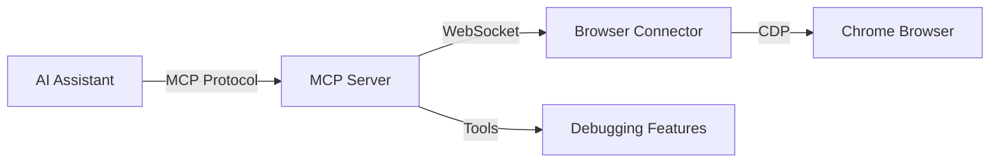

# MCP Server

The Model Context Protocol (MCP) server is the bridge between AI assistants and browser debugging capabilities, enabling seamless interaction with web pages through natural language.

## Overview

The MCP server provides a standardized interface for AI assistants to interact with browser debugging tools. It implements the [Model Context Protocol](https://modelcontextprotocol.io) specification, allowing any MCP-compatible AI assistant to leverage RapidTriageME's capabilities.

## Architecture



## Features

### Core Capabilities

- **Screenshot Capture** - Take full-page or viewport screenshots
- **Console Monitoring** - Retrieve console logs, errors, and warnings
- **Network Analysis** - Monitor network requests and responses
- **Performance Auditing** - Run Lighthouse audits for performance metrics
- **DOM Inspection** - Query and interact with page elements
- **JavaScript Execution** - Execute custom scripts in page context
- **Cookie Management** - Read, write, and delete cookies
- **Storage Access** - Interact with localStorage and sessionStorage

### MCP Tools

The server exposes the following tools through the MCP protocol:

| Tool | Description | Parameters |
|------|-------------|------------|
| `screenshot_capture` | Capture page screenshots | `format`, `fullPage`, `quality` |
| `get_console_logs` | Retrieve console messages | `level`, `limit` |
| `run_lighthouse_audit` | Performance audit | `categories`, `device` |
| `execute_javascript` | Run JS in page | `code`, `awaitPromise` |
| `get_network_data` | Network activity | `filter`, `limit` |
| `inspect_element` | DOM inspection | `selector`, `attributes` |
| `manage_cookies` | Cookie operations | `action`, `domain`, `name` |
| `storage_operation` | Storage access | `type`, `action`, `key` |

## Installation

### NPM Package

```bash
# Install globally
npm install -g @yarlisai/rapidtriage-mcp

# Or use with npx
npx @yarlisai/rapidtriage-mcp
```

### From Source

```bash
# Clone repository
git clone https://github.com/YarlisAISolutions/rapidtriageME.git
cd rapidtriageME/rapidtriage-mcp

# Install dependencies
npm install

# Build
npm run build

# Run
npm start
```

## Configuration

### Environment Variables

```bash
# Port for browser connector (default: 3025)
BROWSER_TOOLS_PORT=3025

# Enable debug logging
DEBUG=true

# Custom browser executable
CHROME_PATH=/path/to/chrome

# Timeout for operations (ms)
OPERATION_TIMEOUT=30000
```

### IDE Integration

#### Cursor IDE

Add to `~/.cursor/mcp_settings.json`:

```json
{
  "mcpServers": {
    "rapidtriage": {
      "command": "npx",
      "args": ["@yarlisai/rapidtriage-mcp"],
      "env": {
        "BROWSER_TOOLS_PORT": "3025",
        "DEBUG": "false"
      }
    }
  }
}
```

#### Claude Desktop

Add to Claude configuration:

=== "macOS"
    ```json
    // ~/Library/Application Support/Claude/config.json
    {
      "mcpServers": {
        "rapidtriage": {
          "command": "npx",
          "args": ["@yarlisai/rapidtriage-mcp"],
          "env": {
            "BROWSER_TOOLS_PORT": "3025"
          }
        }
      }
    }
    ```

=== "Windows"
    ```json
    // %APPDATA%\Claude\config.json
    {
      "mcpServers": {
        "rapidtriage": {
          "command": "npx",
          "args": ["@yarlisai/rapidtriage-mcp"],
          "env": {
            "BROWSER_TOOLS_PORT": "3025"
          }
        }
      }
    }
    ```

#### VS Code with Continue

```json
// ~/.continue/config.json
{
  "models": [...],
  "mcpServers": {
    "rapidtriage": {
      "command": "npx",
      "args": ["@yarlisai/rapidtriage-mcp"],
      "env": {
        "BROWSER_TOOLS_PORT": "3025"
      }
    }
  }
}
```

## Usage

### Starting the Server

1. **Start Browser Connector** (in terminal 1):
```bash
npx @yarlisai/rapidtriage-server
```

2. **Start MCP Server** (automatically started by IDE/Claude)

3. **Open Browser** with DevTools and navigate to target page

4. **Use AI Assistant** to interact with the page

### Example Commands

Ask your AI assistant:

- "Take a screenshot of the current page"
- "Show me any console errors"
- "Run a Lighthouse audit"
- "Check the network requests"
- "Execute `document.title` in the page"
- "Get all cookies for this domain"

### Advanced Usage

#### Custom Port Configuration

```bash
# Use custom port
BROWSER_TOOLS_PORT=3030 npx @yarlisai/rapidtriage-mcp
```

#### Debug Mode

```bash
# Enable verbose logging
DEBUG=true npx @yarlisai/rapidtriage-mcp

# Or with specific namespaces
DEBUG=mcp:* npx @yarlisai/rapidtriage-mcp
```

#### Programmatic Usage

```javascript
import { MCPServer } from '@yarlisai/rapidtriage-mcp';

const server = new MCPServer({
  port: 3025,
  debug: true,
  timeout: 30000
});

// Start server
await server.start();

// Use tools programmatically
const screenshot = await server.tools.screenshot_capture({
  fullPage: true,
  format: 'png'
});
```

## API Reference

### Tool: screenshot_capture

Captures a screenshot of the current page.

**Parameters:**
- `format` (string): Image format - 'png' or 'jpeg' (default: 'png')
- `fullPage` (boolean): Capture full page or viewport (default: false)
- `quality` (number): JPEG quality 0-100 (default: 80)
- `selector` (string): CSS selector to capture specific element

**Returns:**
```json
{
  "success": true,
  "screenshot": "base64_encoded_image_data",
  "dimensions": {
    "width": 1920,
    "height": 1080
  }
}
```

### Tool: get_console_logs

Retrieves console messages from the page.

**Parameters:**
- `level` (string): Filter by level - 'all', 'error', 'warning', 'info' (default: 'all')
- `limit` (number): Maximum messages to return (default: 100)
- `clear` (boolean): Clear console after retrieval (default: false)

**Returns:**
```json
{
  "success": true,
  "messages": [
    {
      "level": "error",
      "text": "Uncaught TypeError: Cannot read property 'foo' of undefined",
      "timestamp": 1234567890,
      "source": "script.js:42"
    }
  ]
}
```

### Tool: run_lighthouse_audit

Runs a Lighthouse performance audit.

**Parameters:**
- `categories` (array): Categories to audit - ['performance', 'accessibility', 'seo', 'best-practices']
- `device` (string): Device type - 'mobile' or 'desktop' (default: 'desktop')
- `throttling` (boolean): Enable network/CPU throttling (default: true)

**Returns:**
```json
{
  "success": true,
  "scores": {
    "performance": 95,
    "accessibility": 98,
    "seo": 100,
    "best-practices": 92
  },
  "metrics": {
    "firstContentfulPaint": 1.2,
    "largestContentfulPaint": 2.5,
    "totalBlockingTime": 150,
    "cumulativeLayoutShift": 0.05
  }
}
```

## Protocol Details

### MCP Communication

The server implements the standard MCP protocol over stdio:

1. **Initialization**: Server sends capabilities
2. **Tool Discovery**: Client requests available tools
3. **Tool Invocation**: Client calls tools with parameters
4. **Response**: Server returns results or errors

### Message Format

```json
{
  "jsonrpc": "2.0",
  "method": "tools/call",
  "params": {
    "name": "screenshot_capture",
    "arguments": {
      "fullPage": true
    }
  },
  "id": "1"
}
```

### Error Handling

```json
{
  "jsonrpc": "2.0",
  "error": {
    "code": -32603,
    "message": "Browser not connected",
    "data": {
      "details": "No active browser connection found"
    }
  },
  "id": "1"
}
```

## Troubleshooting

### Common Issues

#### MCP Server Not Starting

```bash
# Check if port is in use
lsof -i :3025

# Use different port
BROWSER_TOOLS_PORT=3030 npx @yarlisai/rapidtriage-mcp
```

#### Browser Connection Failed

1. Ensure browser connector is running
2. Check Chrome extension is installed
3. Verify DevTools is open
4. Check network connectivity

#### Tool Timeout

```bash
# Increase timeout
OPERATION_TIMEOUT=60000 npx @yarlisai/rapidtriage-mcp
```

### Debug Logging

Enable detailed logging for troubleshooting:

```bash
# All MCP logs
DEBUG=mcp:* npx @yarlisai/rapidtriage-mcp

# Specific components
DEBUG=mcp:server,mcp:tools npx @yarlisai/rapidtriage-mcp

# Save logs to file
DEBUG=mcp:* npx @yarlisai/rapidtriage-mcp 2> debug.log
```

### Testing Connection

```bash
# Test MCP server directly
npx @yarlisai/rapidtriage-mcp --test

# Use MCP inspector
npx @modelcontextprotocol/inspector npx @yarlisai/rapidtriage-mcp
```

## Performance Considerations

### Resource Usage

- **Memory**: ~50-100MB idle, up to 200MB during operations
- **CPU**: Minimal when idle, spikes during screenshot/audit operations
- **Network**: WebSocket connection to browser connector

### Optimization Tips

1. **Reuse Connections**: Keep browser tabs open for multiple operations
2. **Batch Operations**: Group related commands together
3. **Selective Audits**: Only run necessary Lighthouse categories
4. **Limit Console Logs**: Use filters to reduce data transfer

## Security

### Best Practices

1. **Local Only**: Default configuration only accepts local connections
2. **No Credentials**: Never store sensitive data in configuration
3. **Sandbox Execution**: JavaScript runs in browser sandbox
4. **Input Validation**: All tool inputs are validated

### Permissions

The MCP server requires:
- Network access to localhost:3025
- File system access for configuration
- Process spawning for browser operations

## Development

### Building from Source

```bash
# Clone repository
git clone https://github.com/YarlisAISolutions/rapidtriageME.git
cd rapidtriageME/rapidtriage-mcp

# Install dependencies
npm install

# Development mode
npm run dev

# Build for production
npm run build

# Run tests
npm test

# Lint code
npm run lint
```

### Contributing

See [Contributing Guide](../contributing.md) for development setup and guidelines.

## Related Documentation

- [Browser Connector](browser-connector.md) - Server component details
- [Chrome Extension](chrome-extension.md) - Browser integration
- [API Reference](../api/mcp.md) - Complete MCP API documentation
- [IDE Integration](../guides/ide-integration.md) - Setup guides for various IDEs

## Support

- [GitHub Issues](https://github.com/YarlisAISolutions/rapidtriageME/issues)
- [Discord Community](https://discord.gg/rapidtriage)
- [Documentation](https://rapidtriage.me/docs)