# Contributing to RapidTriageME

We welcome contributions to RapidTriageME! This guide will help you get started with contributing to the project, whether you're fixing bugs, adding features, improving documentation, or helping with community support.

## Quick Start for Contributors

```mermaid
flowchart LR
    A[🍽️ Fork Repository] --> B[💻 Clone Locally]
    B --> C[🔧 Make Changes]
    C --> D[🧪 Test Changes]
    D --> E[📤 Submit PR]
    E --> F[👀 Code Review]
    F --> G[✨ Merge & Deploy]
    
    style A fill:#e8f5e8
    style G fill:#c8e6c9
```



## Ways to Contribute

### 🐛 Bug Reports
Report bugs by [creating an issue](/issues/new?template=bug_report.md) with:
- Clear description of the problem
- Steps to reproduce
- Expected vs actual behavior  
- Environment details (OS, Node.js version, browser)
- Screenshots or logs when relevant

### ✨ Feature Requests
Suggest new features by [creating an issue](/issues/new?template=feature_request.md) with:
- Use case description
- Proposed solution
- Alternative approaches considered
- Impact on existing functionality

### 📝 Documentation
Improve documentation by:
- Fixing typos and errors
- Adding examples and tutorials
- Improving API documentation
- Translating content
- Creating video tutorials

### 💻 Code Contributions
Contribute code by:
- Fixing open issues
- Implementing new features
- Improving performance
- Adding tests
- Refactoring code

## Development Setup

### Prerequisites

```bash
# Required
node --version  # v18.0.0 or higher
npm --version   # v9.0.0 or higher
git --version   # v2.0.0 or higher

# Recommended
docker --version  # For containerized testing
```

### Fork and Clone

```bash
# 1. Fork the repository on GitHub
# 2. Clone your fork
git clone https://github.com/YOUR_USERNAME/rapidtriage.git
cd rapidtriage

# 3. Add upstream remote
git remote add upstream .git

# 4. Create a new branch
git checkout -b feature/your-feature-name
```

### Project Structure

```
rapidtriageME/
├── rapidtriage-extension/     # Chrome extension source
│   ├── background.js
│   ├── devtools.js
│   ├── panel.js
│   └── manifest.json
├── rapidtriage-server/        # Browser connector server
│   ├── browser-connector.ts
│   ├── puppeteer-service.ts
│   └── lighthouse/
├── rapidtriage-mcp/           # MCP server implementation
│   ├── mcp-server.ts
│   └── package.json
├── src/                       # Cloudflare Worker source
│   ├── worker.ts
│   ├── handlers/
│   └── middleware/
├── docs-site/                 # MkDocs documentation
└── scripts/                   # Build and deployment scripts
```

### Local Development

```bash
# Install dependencies for all packages
npm run install:all

# Build all components
npm run build:all

# Start development servers
npm run dev

# This starts:
# - Browser connector server on port 1421
# - MCP server in development mode
# - File watchers for auto-rebuilding
```

### Running Tests

```bash
# Run all tests
npm test

# Run specific test suites
npm run test:unit          # Unit tests
npm run test:integration   # Integration tests
npm run test:e2e           # End-to-end tests

# Run tests with coverage
npm run test:coverage

# Run tests in watch mode
npm run test:watch
```

### Code Quality

```bash
# Linting
npm run lint                # Check all files
npm run lint:fix            # Auto-fix issues

# Formatting
npm run format              # Format with Prettier
npm run format:check        # Check formatting

# Type checking
npm run typecheck           # TypeScript type checking
```

## Contribution Guidelines

### Code Style

We use ESLint and Prettier for consistent code formatting:

```javascript
// Good: Use TypeScript for new code
interface ScreenshotOptions {
  fullPage?: boolean;
  quality?: number;
  format?: 'png' | 'jpeg';
}

// Good: Use descriptive function names
async function captureFullPageScreenshot(options: ScreenshotOptions): Promise<string> {
  // Implementation with clear error handling
  try {
    const result = await browser.captureScreenshot(options);
    return result.dataUrl;
  } catch (error) {
    logger.error('Screenshot capture failed:', error);
    throw new Error('Failed to capture screenshot');
  }
}

// Good: Add comprehensive comments for complex logic
/**
 * Processes browser console logs by filtering sensitive data,
 * applying rate limiting, and formatting for AI consumption.
 * 
 * @param rawLogs - Unprocessed console log entries
 * @param filters - Filtering configuration
 * @returns Processed and sanitized log entries
 */
function processConsoleLogs(rawLogs: RawLogEntry[], filters: LogFilters): ProcessedLogEntry[] {
  // Implementation details...
}
```

### Commit Messages

We follow [Conventional Commits](https://www.conventionalcommits.org/):

```bash
# Format: <type>[optional scope]: <description>

# Examples:
feat(extension): add screenshot capture with element selector
fix(server): resolve WebSocket connection timeout issue  
docs(api): update MCP tool documentation with examples
test(integration): add end-to-end screenshot tests
refactor(mcp): improve error handling in tool execution
perf(lighthouse): optimize audit execution performance
style(all): apply prettier formatting updates
ci(github): add automated security scanning
```

### Pull Request Process

1. **Before You Start**
   - Check existing issues and PRs
   - Discuss large changes in an issue first
   - Ensure your fork is up-to-date

2. **Creating Your PR**
   ```bash
   # Update your fork
   git fetch upstream
   git checkout main
   git merge upstream/main
   
   # Push your changes
   git push origin feature/your-feature-name
   ```

3. **PR Requirements**
   - [ ] Clear title and description
   - [ ] Tests pass (`npm test`)
   - [ ] Code linted (`npm run lint`)
   - [ ] Documentation updated
   - [ ] Breaking changes noted
   - [ ] Screenshots for UI changes

4. **PR Template**
   ```markdown
   ## Description
   Brief description of changes and motivation.
   
   ## Type of Change
   - [ ] Bug fix
   - [ ] New feature
   - [ ] Breaking change
   - [ ] Documentation update
   
   ## Testing
   Describe how you tested your changes.
   
   ## Screenshots
   Include screenshots for visual changes.
   
   ## Checklist
   - [ ] Tests pass locally
   - [ ] Code follows style guidelines  
   - [ ] Self-review completed
   - [ ] Documentation updated
   ```

### Testing Guidelines

#### Unit Tests
```javascript
// Example: Testing MCP tool functionality
import { describe, it, expect, beforeEach } from 'jest';
import { MCPServer } from '../src/mcp-server';

describe('MCP Server Tools', () => {
  let server: MCPServer;
  
  beforeEach(() => {
    server = new MCPServer({ port: 1421 });
  });
  
  it('should capture screenshot with default options', async () => {
    const result = await server.executeTool('screenshot_capture', {});
    
    expect(result).toHaveProperty('screenshot');
    expect(result.screenshot).toMatch(/^data:image\/png;base64,/);
    expect(result).toHaveProperty('timestamp');
  });
  
  it('should handle screenshot errors gracefully', async () => {
    // Mock failure scenario
    jest.spyOn(server.browserConnector, 'captureScreenshot')
        .mockRejectedValue(new Error('Browser not connected'));
    
    const result = await server.executeTool('screenshot_capture', {});
    
    expect(result.isError).toBe(true);
    expect(result.content[0].text).toContain('Screenshot capture failed');
  });
});
```

#### Integration Tests
```javascript
// Example: Testing browser connector API
import request from 'supertest';
import { app } from '../src/server';

describe('Browser Connector API', () => {
  it('should return server identity', async () => {
    const response = await request(app)
      .get('/.identity')
      .expect(200);
      
    expect(response.body).toHaveProperty('name', 'RapidTriageME Browser Connector');
    expect(response.body).toHaveProperty('status', 'healthy');
  });
  
  it('should handle console log requests', async () => {
    const response = await request(app)
      .get('/console-logs?limit=10')
      .expect(200);
      
    expect(response.body).toHaveProperty('logs');
    expect(Array.isArray(response.body.logs)).toBe(true);
    expect(response.body.logs.length).toBeLessThanOrEqual(10);
  });
});
```

#### End-to-End Tests
```javascript
// Example: Testing complete workflow
import { test, expect } from '@playwright/test';

test.describe('RapidTriageME E2E', () => {
  test('should capture screenshot through AI assistant', async ({ page }) => {
    // Navigate to test page
    await page.goto('http://localhost:3000/test-page');
    
    // Simulate AI assistant request
    const screenshotResponse = await page.request.post('http://localhost:1421/capture-screenshot', {
      data: { options: { fullPage: true } }
    });
    
    expect(screenshotResponse.status()).toBe(200);
    
    const data = await screenshotResponse.json();
    expect(data).toHaveProperty('screenshot');
    expect(data.screenshot).toMatch(/^data:image/);
  });
});
```

## Component-Specific Guidelines

### Chrome Extension Development

```javascript
// Use Manifest V3 features
// Good: Use chrome.action instead of chrome.browserAction
chrome.action.onClicked.addListener((tab) => {
  // Implementation
});

// Good: Use service workers for background scripts
// background.js
chrome.runtime.onInstalled.addListener(() => {
  console.log('Extension installed');
});

// Good: Handle async operations properly
async function captureScreenshot() {
  try {
    const dataUrl = await chrome.tabs.captureVisibleTab();
    return dataUrl;
  } catch (error) {
    console.error('Screenshot failed:', error);
    throw error;
  }
}
```

### Server Development

```typescript
// Good: Use TypeScript for server code
interface ServerConfig {
  port: number;
  host: string;
  corsOrigin: string | string[];
}

// Good: Implement proper error handling
app.use((error: Error, req: Request, res: Response, next: NextFunction) => {
  logger.error('Server error:', error);
  
  res.status(500).json({
    error: 'Internal server error',
    requestId: req.headers['x-request-id']
  });
});

// Good: Use structured logging
import { createLogger, format, transports } from 'winston';

const logger = createLogger({
  level: process.env.LOG_LEVEL || 'info',
  format: format.combine(
    format.timestamp(),
    format.errors({ stack: true }),
    format.json()
  ),
  transports: [
    new transports.Console(),
    new transports.File({ filename: 'error.log', level: 'error' })
  ]
});
```

### MCP Server Development

```typescript
// Good: Follow MCP protocol specifications
import { Server } from '@modelcontextprotocol/sdk/server';
import { CallToolRequestSchema, ListToolsRequestSchema } from '@modelcontextprotocol/sdk/types';

// Good: Implement comprehensive tool schemas
const SCREENSHOT_TOOL_SCHEMA = {
  name: 'screenshot_capture',
  description: 'Capture a screenshot of the current browser tab with advanced options',
  inputSchema: {
    type: 'object',
    properties: {
      options: {
        type: 'object',
        properties: {
          fullPage: { type: 'boolean', description: 'Capture full page or viewport only' },
          quality: { type: 'number', minimum: 1, maximum: 100 },
          format: { type: 'string', enum: ['png', 'jpeg'] }
        }
      }
    }
  }
};

// Good: Handle errors gracefully in tools
server.setRequestHandler(CallToolRequestSchema, async (request) => {
  try {
    const result = await executeTool(request.params.name, request.params.arguments);
    return { content: [{ type: 'text', text: JSON.stringify(result) }] };
  } catch (error) {
    logger.error(`Tool execution failed: ${error.message}`);
    return {
      content: [{ type: 'text', text: `Error: ${error.message}` }],
      isError: true
    };
  }
});
```

## Documentation Contributions

### Writing Guidelines

1. **Be Clear and Concise**
   - Use simple, direct language
   - Avoid jargon and technical terms without explanation
   - Break up long paragraphs

2. **Include Examples**
   - Provide practical, working examples
   - Show both good and bad practices
   - Include expected outputs

3. **Keep It Current**
   - Update examples when APIs change
   - Remove outdated information
   - Add new features promptly

### Documentation Structure

```markdown
# Page Title

Brief introduction explaining what this page covers.

## Prerequisites

What users need before following this guide.

## Step-by-Step Instructions

### Step 1: Clear Action

Detailed explanation with code examples.

```bash
# Example command
npm install package
```

### Step 2: Next Action

Continue with logical progression.

## Troubleshooting

Common issues and solutions.

## Next Steps

Where to go from here.
```

## Community Guidelines

### Code of Conduct

We are committed to providing a welcoming and inclusive environment. Please:

- **Be respectful** in all interactions
- **Be constructive** in feedback and criticism  
- **Be collaborative** and help others learn
- **Be patient** with newcomers and questions

### Communication Channels

- **GitHub Issues**: Bug reports, feature requests
- **GitHub Discussions**: General questions, ideas
- **Discord**: Real-time chat, community support
- **Email**: Security issues, private matters

### Recognition

We recognize contributors in several ways:

- **Contributors list** in README
- **Changelog mentions** for significant contributions
- **Special roles** in Discord community
- **Swag and merch** for major contributors

## Release Process

### Versioning

We follow [Semantic Versioning](https://semver.org/):

- **MAJOR** version: Breaking changes
- **MINOR** version: New features (backward compatible)
- **PATCH** version: Bug fixes (backward compatible)

### Release Workflow


1. **Feature freeze** for upcoming release
2. **Comprehensive testing** of all components  
3. **Documentation updates** for new features
4. **Version bump** following semantic versioning
5. **Git tag** creation and release notes
6. **Automated deployment** to npm and production
7. **Community announcement** with changelog

## Getting Help

If you need help contributing:

- **Read the docs**: Check existing documentation first
- **Search issues**: Someone might have asked already
- **Ask in Discord**: Get real-time help from maintainers
- **Open an issue**: For persistent problems

### Maintainer Contact

For urgent matters or sensitive issues:

- **Email**: maintainers@rapidtriage.me
- **Discord**: @maintainer role
- **Security**: security@rapidtriage.me

## License

By contributing to RapidTriageME, you agree that your contributions will be licensed under the MIT License. See [LICENSE](../LICENSE) for details.

---

**Thank you for contributing to RapidTriageME!** Every contribution, no matter how small, helps make browser debugging better for developers worldwide.