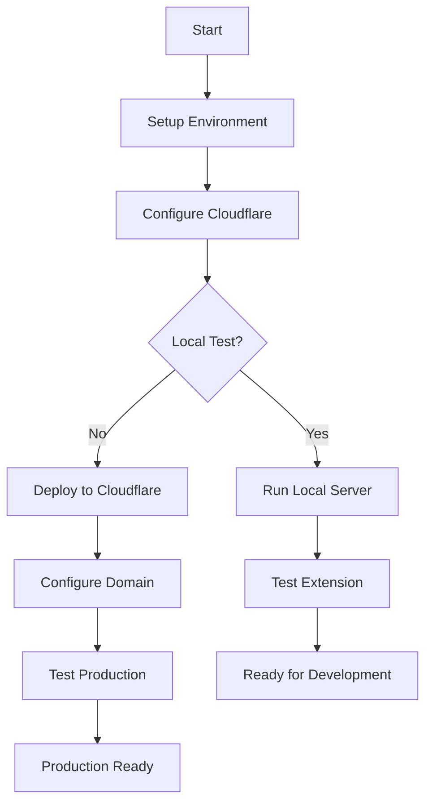

# Deployment Guide

## Overview

RapidTriageME can be deployed in multiple environments. This guide covers all deployment scenarios from local development to production.

## Deployment Options

### 🚀 Quick Deploy

```bash
# Clone repository
git clone https://github.com/YarlisAISolutions/rapidtriageME.git
cd rapidtriageME

# Install dependencies
npm install

# Deploy to production
./scripts/04-deploy.sh production
```

### 📋 Deployment Methods

| Method | Use Case | Time | Complexity |
|--------|----------|------|-----------|
| [Local Testing](local-testing.md) | Development | 1 min | Easy |
| [Cloudflare Workers](cloudflare.md) | Production | 5 min | Medium |
| [Custom Domain](domain.md) | Branded deployment | 10 min | Medium |
| [Full Production](production.md) | Enterprise | 15 min | Advanced |

## Prerequisites

### Required Tools

- **Node.js** >= 18.0.0
- **npm** >= 9.0.0
- **Git** >= 2.0.0
- **Cloudflare Account** (free tier works)
- **Chrome Browser** >= 120

### Required Accounts

1. **Cloudflare Account**
   - Sign up at [cloudflare.com](https://cloudflare.com)
   - Free plan is sufficient
   - Note your Account ID

2. **GitHub Account** (optional)
   - For documentation hosting
   - For version control

## Environment Setup

### 1. Clone Repository

```bash
git clone https://github.com/YarlisAISolutions/rapidtriageME.git
cd rapidtriageME
```

### 2. Install Dependencies

```bash
# Install all dependencies
npm install

# Install Cloudflare CLI globally
npm install -g wrangler
```

### 3. Configure Environment

```bash
# Copy environment template
cp .env.example .env

# Edit with your values
code .env
```

Required environment variables:

```bash
# Cloudflare Configuration
CLOUDFLARE_ACCOUNT_ID=your_account_id
CLOUDFLARE_API_TOKEN=your_api_token  # Optional with OAuth

# Application Settings
BROWSER_TOOLS_PORT=3025
NODE_ENV=production
```

### 4. Authenticate with Cloudflare

```bash
# Use OAuth login (recommended)
./scripts/03-oauth-login.sh

# Or use API token
wrangler login
```

## Deployment Workflow



## Quick Commands

### Development

```bash
# Start local server
./scripts/02-test-local.sh

# Watch for changes
npm run dev

# Run tests
npm test
```

### Deployment

```bash
# Deploy to staging
wrangler deploy --env staging

# Deploy to production
wrangler deploy --env production

# Check deployment status
wrangler tail --env production
```

### Maintenance

```bash
# View logs
wrangler tail

# Check metrics
wrangler analytics

# Update dependencies
npm update
```

## Project Structure

```
rapidtriageME/
├── src/                   # Source code
│   ├── worker.ts         # Main worker
│   └── types/            # TypeScript types
├── rapidtriage-extension/ # Chrome extension
├── rapidtriage-mcp/      # MCP server
├── scripts/              # Deployment scripts
│   ├── 01-load-env.sh    # Environment loader
│   ├── 02-test-local.sh  # Local testing
│   ├── 03-oauth-login.sh # Cloudflare auth
│   ├── 04-deploy.sh      # Deployment
│   └── 05-add-dns.sh     # DNS setup
├── docs-site/            # Documentation
├── wrangler.toml         # Cloudflare config
└── package.json          # Dependencies
```

## Configuration Files

### wrangler.toml

```toml
name = "rapidtriage-me"
main = "src/worker.ts"
compatibility_date = "2024-12-12"

[env.production]
name = "rapidtriage-production"
route = "rapidtriage.me/*"
vars = { BROWSER_TOOLS_PORT = "3025" }
```

### package.json Scripts

```json
{
  "scripts": {
    "dev": "wrangler dev",
    "deploy": "wrangler deploy",
    "test": "vitest",
    "build": "tsc"
  }
}
```

## Troubleshooting

### Common Issues

!!! warning "Authentication Failed"
    ```bash
    # Clear old tokens
    unset CLOUDFLARE_API_TOKEN
    unset CF_API_TOKEN
    
    # Re-authenticate
    wrangler login
    ```

!!! error "Port Already in Use"
    ```bash
    # Find process using port
    lsof -i :3025
    
    # Kill process
    kill -9 <PID>
    ```

!!! info "DNS Not Resolving"
    Wait 5-10 minutes for DNS propagation
    ```bash
    # Check DNS status
    dig rapidtriage.me
    nslookup rapidtriage.me
    ```

## Next Steps

- 📝 [Local Testing Guide](local-testing.md)
- ☁️ [Cloudflare Setup](cloudflare.md)
- 🌐 [Domain Configuration](domain.md)
- 🚀 [Production Deployment](production.md)

## Support

- **Documentation**: [docs.rapidtriage.me](https://docs.rapidtriage.me)
- **GitHub Issues**: [Report bugs](https://github.com/YarlisAISolutions/rapidtriageME/issues)
- **Community**: [Discord Server](https://discord.gg/rapidtriage)