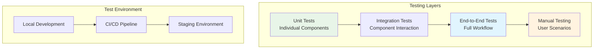

# Local Testing Guide

This guide covers comprehensive testing of RapidTriageME in your local development environment, from basic functionality verification to advanced testing scenarios.

## Testing Overview



## Prerequisites

Before starting local testing, ensure you have:

```bash
# Required software
node --version    # v18.0.0 or higher
npm --version     # v9.0.0 or higher
google-chrome --version  # Latest stable

# Optional but recommended
docker --version  # For containerized testing
pytest --version  # For Python test utilities
```

## Quick Test Setup

### 1. Clone and Install

```bash
# Clone the repository
git clone .git
cd rapidtriage

# Install all dependencies
npm run install:all

# Build all components
npm run build:all
```

### 2. Start Test Environment

```bash
# Start all services for testing
npm run test:setup

# This starts:
# - Browser connector on port 1421
# - Test web server on port 3000
# - Chrome with test extension loaded
```

### 3. Run Basic Tests

```bash
# Run all test suites
npm test

# Run specific test categories
npm run test:unit          # Unit tests only
npm run test:integration   # Integration tests
npm run test:e2e           # End-to-end tests
```

## Unit Testing

### Browser Connector Tests

```typescript
// test/browser-connector.test.ts
import request from 'supertest';
import { BrowserConnectorServer } from '../src/browser-connector';

describe('Browser Connector Server', () => {
  let server: BrowserConnectorServer;
  let app: any;
  
  beforeAll(async () => {
    server = new BrowserConnectorServer({
      port: 0, // Use random port for testing
      host: 'localhost',
      environment: 'test'
    });
    app = server.getApp();
    await server.start();
  });
  
  afterAll(async () => {
    await server.stop();
  });
  
  describe('GET /.identity', () => {
    it('should return server identity', async () => {
      const response = await request(app)
        .get('/.identity')
        .expect(200);
        
      expect(response.body).toMatchObject({
        name: 'RapidTriageME Browser Connector',
        status: 'healthy',
        version: expect.any(String)
      });
    });
  });
  
  describe('GET /console-logs', () => {
    beforeEach(() => {
      // Clear cache before each test
      server.getDataCache().clearAll();
    });
    
    it('should return empty logs initially', async () => {
      const response = await request(app)
        .get('/console-logs')
        .expect(200);
        
      expect(response.body.logs).toEqual([]);
      expect(response.body.total).toBe(0);
    });
    
    it('should filter logs by level', async () => {
      // Add test logs
      server.getDataCache().addConsoleLog({
        id: 'log1',
        level: 'error',
        message: 'Test error',
        timestamp: Date.now()
      });
      
      server.getDataCache().addConsoleLog({
        id: 'log2',
        level: 'info',
        message: 'Test info',
        timestamp: Date.now()
      });
      
      const response = await request(app)
        .get('/console-logs?level=error')
        .expect(200);
        
      expect(response.body.logs).toHaveLength(1);
      expect(response.body.logs[0].level).toBe('error');
    });
  });
  
  describe('POST /capture-screenshot', () => {
    it('should handle screenshot request', async () => {
      const response = await request(app)
        .post('/capture-screenshot')
        .send({ options: { fullPage: true } })
        .expect(200);
        
      expect(response.body).toHaveProperty('screenshot');
      expect(response.body.screenshot).toMatch(/^data:image/);
    });
    
    it('should validate screenshot options', async () => {
      const response = await request(app)
        .post('/capture-screenshot')
        .send({ options: { quality: 150 } }) // Invalid quality
        .expect(400);
        
      expect(response.body.error).toContain('Invalid quality');
    });
  });
});
```

### MCP Server Tests

```typescript
// test/mcp-server.test.ts
import { MCPServer } from '../src/mcp-server';
import { BrowserConnectorMock } from './mocks/browser-connector-mock';

describe('MCP Server', () => {
  let mcpServer: MCPServer;
  let browserMock: BrowserConnectorMock;
  
  beforeEach(() => {
    browserMock = new BrowserConnectorMock();
    mcpServer = new MCPServer({
      browserConnectorUrl: browserMock.getUrl()
    });
  });
  
  describe('Tool Execution', () => {
    it('should execute screenshot_capture tool', async () => {
      browserMock.mockScreenshot('data:image/png;base64,iVBORw0KGgo...');
      
      const result = await mcpServer.executeTool('screenshot_capture', {
        options: { fullPage: true }
      });
      
      expect(result.content).toHaveLength(2);
      expect(result.content[0].type).toBe('image');
      expect(result.content[1].type).toBe('text');
      expect(result.isError).toBe(false);
    });
    
    it('should handle tool execution errors gracefully', async () => {
      browserMock.mockError('Browser not connected');
      
      const result = await mcpServer.executeTool('screenshot_capture', {});
      
      expect(result.isError).toBe(true);
      expect(result.content[0].text).toContain('Screenshot capture failed');
    });
  });
  
  describe('Tool Registry', () => {
    it('should list all available tools', async () => {
      const tools = await mcpServer.listTools();
      
      const toolNames = tools.tools.map(tool => tool.name);
      expect(toolNames).toContain('screenshot_capture');
      expect(toolNames).toContain('get_console_logs');
      expect(toolNames).toContain('run_lighthouse_audit');
    });
  });
});
```

### Chrome Extension Tests

```javascript
// test/extension.test.js
describe('Chrome Extension', () => {
  let mockChrome;
  
  beforeEach(() => {
    mockChrome = {
      runtime: {
        onMessage: {
          addListener: jest.fn()
        },
        sendMessage: jest.fn()
      },
      devtools: {
        panels: {
          create: jest.fn()
        }
      },
      tabs: {
        captureVisibleTab: jest.fn()
      }
    };
    
    global.chrome = mockChrome;
  });
  
  it('should initialize DevTools panel', () => {
    require('../rapidtriage-extension/devtools.js');
    
    expect(mockChrome.devtools.panels.create).toHaveBeenCalledWith(
      'RapidTriage',
      expect.any(String),
      'panel.html',
      expect.any(Function)
    );
  });
  
  it('should capture screenshot when requested', async () => {
    mockChrome.tabs.captureVisibleTab.mockResolvedValue('data:image/png;base64,test');
    
    const { captureScreenshot } = require('../rapidtriage-extension/background.js');
    const result = await captureScreenshot({ fullPage: false });
    
    expect(result).toMatch(/^data:image/);
    expect(mockChrome.tabs.captureVisibleTab).toHaveBeenCalled();
  });
});
```

## Integration Testing

### Full Stack Integration

```typescript
// test/integration/full-stack.test.ts
import { spawn, ChildProcess } from 'child_process';
import WebSocket from 'ws';
import puppeteer, { Browser, Page } from 'puppeteer';

describe('Full Stack Integration', () => {
  let browserConnector: ChildProcess;
  let mcpServer: ChildProcess;
  let browser: Browser;
  let page: Page;
  
  beforeAll(async () => {
    // Start browser connector server
    browserConnector = spawn('npm', ['run', 'start:browser-connector'], {
      env: { ...process.env, PORT: '1421' }
    });
    
    // Wait for server to be ready
    await waitForServer('http://localhost:1421');
    
    // Start MCP server
    mcpServer = spawn('npm', ['run', 'start:mcp-server']);
    
    // Launch browser with extension
    browser = await puppeteer.launch({
      headless: false,
      args: [
        '--load-extension=./rapidtriage-extension',
        '--disable-extensions-except=./rapidtriage-extension'
      ]
    });
    
    page = await browser.newPage();
  }, 30000);
  
  afterAll(async () => {
    if (browser) await browser.close();
    if (browserConnector) browserConnector.kill();
    if (mcpServer) mcpServer.kill();
  });
  
  it('should establish WebSocket connection between extension and server', async () => {
    await page.goto('http://localhost:3000/test-page.html');
    
    // Open DevTools to trigger extension
    const client = await page.target().createCDPSession();
    await client.send('Runtime.enable');
    
    // Verify WebSocket connection
    const ws = new WebSocket('ws://localhost:1421/ws');
    await new Promise(resolve => ws.on('open', resolve));
    
    expect(ws.readyState).toBe(WebSocket.OPEN);
    ws.close();
  });
  
  it('should capture and retrieve console logs end-to-end', async () => {
    await page.goto('http://localhost:3000/test-page.html');
    
    // Generate console log
    await page.evaluate(() => {
      console.error('Test integration error');
    });
    
    // Wait for log to be processed
    await new Promise(resolve => setTimeout(resolve, 1000));
    
    // Retrieve logs via API
    const response = await fetch('http://localhost:1421/console-logs');
    const data = await response.json();
    
    expect(data.logs).toHaveLength(1);
    expect(data.logs[0].message).toBe('Test integration error');
    expect(data.logs[0].level).toBe('error');
  });
  
  it('should complete screenshot workflow', async () => {
    await page.goto('http://localhost:3000/test-page.html');
    
    // Request screenshot via API
    const response = await fetch('http://localhost:1421/capture-screenshot', {
      method: 'POST',
      headers: { 'Content-Type': 'application/json' },
      body: JSON.stringify({ options: { fullPage: true } })
    });
    
    const data = await response.json();
    
    expect(response.status).toBe(200);
    expect(data.screenshot).toMatch(/^data:image/);
    expect(data.dimensions).toBeDefined();
  });
});
```

## End-to-End Testing

### Playwright E2E Tests

```typescript
// test/e2e/user-workflows.spec.ts
import { test, expect, chromium } from '@playwright/test';

test.describe('RapidTriageME User Workflows', () => {
  test.beforeAll(async () => {
    // Ensure servers are running
    await fetch('http://localhost:1421/.identity');
  });
  
  test('complete debugging workflow', async () => {
    const browser = await chromium.launch({
      args: ['--load-extension=./rapidtriage-extension']
    });
    
    const context = await browser.newContext();
    const page = await context.newPage();
    
    // Navigate to test page
    await page.goto('http://localhost:3000/problematic-page.html');
    
    // Open DevTools (simulating user action)
    await page.keyboard.press('F12');
    
    // Wait for extension panel to load
    await page.waitForTimeout(2000);
    
    // Simulate AI assistant requesting screenshot
    const screenshotResponse = await fetch('http://localhost:1421/capture-screenshot', {
      method: 'POST',
      headers: { 'Content-Type': 'application/json' },
      body: JSON.stringify({ options: { fullPage: true } })
    });
    
    expect(screenshotResponse.status).toBe(200);
    
    // Simulate AI assistant requesting console logs
    const logsResponse = await fetch('http://localhost:1421/console-logs');
    const logsData = await logsResponse.json();
    
    expect(logsResponse.status).toBe(200);
    expect(logsData.logs).toBeDefined();
    
    await browser.close();
  });
  
  test('Lighthouse audit workflow', async () => {
    const auditResponse = await fetch('http://localhost:1421/lighthouse-audit', {
      method: 'POST',
      headers: { 'Content-Type': 'application/json' },
      body: JSON.stringify({
        url: 'http://localhost:3000/test-page.html',
        categories: ['performance', 'accessibility']
      })
    });
    
    expect(auditResponse.status).toBe(200);
    
    const auditData = await auditResponse.json();
    expect(auditData.audit).toBeDefined();
    expect(auditData.audit.scores).toBeDefined();
    expect(auditData.audit.scores.performance).toBeGreaterThanOrEqual(0);
  });
});
```

## Manual Testing Scenarios

### Test Scenario 1: Basic Functionality

```bash
# 1. Start RapidTriageME
npm run dev

# 2. Open Chrome and load extension
# chrome://extensions/ -> Load unpacked -> select rapidtriage-extension

# 3. Navigate to test page
# http://localhost:3000/test-page.html

# 4. Open DevTools and check RapidTriage panel
# F12 -> RapidTriage tab -> Should show "Connected"

# 5. Test screenshot capture
curl -X POST http://localhost:1421/capture-screenshot \
  -H "Content-Type: application/json" \
  -d '{"options": {"fullPage": true}}'

# Expected: JSON response with base64 screenshot
```

### Test Scenario 2: Error Handling

```javascript
// Navigate to test page and run in console:
console.error('Test error message');
console.warn('Test warning message');
throw new Error('Test exception');

// Then check logs:
// curl http://localhost:1421/console-logs
```

### Test Scenario 3: Network Monitoring

```javascript
// On test page, trigger network requests:
fetch('/api/success').then(r => console.log('Success:', r.status));
fetch('/api/404').catch(e => console.log('Error:', e));
fetch('/api/slow').then(r => console.log('Slow request completed'));

// Check network logs:
// curl http://localhost:1421/network-requests
```

## Performance Testing

### Load Testing Script

```typescript
// test/performance/load-test.ts
import autocannon from 'autocannon';

async function runLoadTest() {
  const result = await autocannon({
    url: 'http://localhost:1421',
    connections: 50,
    duration: 30, // 30 seconds
    requests: [
      {
        method: 'GET',
        path: '/.identity'
      },
      {
        method: 'GET', 
        path: '/console-logs?limit=100'
      },
      {
        method: 'POST',
        path: '/capture-screenshot',
        headers: { 'Content-Type': 'application/json' },
        body: JSON.stringify({ options: { fullPage: false } })
      }
    ]
  });
  
  console.log('Load test results:');
  console.log(`Requests/sec: ${result.requests.average}`);
  console.log(`Latency: ${result.latency.average}ms`);
  console.log(`Errors: ${result.errors}`);
  
  // Performance assertions
  expect(result.requests.average).toBeGreaterThan(100);
  expect(result.latency.average).toBeLessThan(100);
  expect(result.errors).toBe(0);
}

test('should handle load gracefully', runLoadTest, 60000);
```

### Memory Testing

```typescript
// test/performance/memory-test.ts
test('should not leak memory during extended operation', async () => {
  const initialMemory = process.memoryUsage().heapUsed;
  
  // Simulate extended operation
  for (let i = 0; i < 1000; i++) {
    await fetch('http://localhost:1421/console-logs');
    await new Promise(resolve => setTimeout(resolve, 10));
  }
  
  // Force garbage collection
  if (global.gc) global.gc();
  
  const finalMemory = process.memoryUsage().heapUsed;
  const memoryGrowth = finalMemory - initialMemory;
  
  // Memory growth should be reasonable (less than 50MB)
  expect(memoryGrowth).toBeLessThan(50 * 1024 * 1024);
}, 30000);
```

## Test Utilities

### Server Test Helper

```typescript
// test/utils/server-helper.ts
export class ServerTestHelper {
  static async waitForServer(url: string, timeout = 30000): Promise<void> {
    const start = Date.now();
    
    while (Date.now() - start < timeout) {
      try {
        const response = await fetch(url);
        if (response.ok) return;
      } catch (error) {
        // Server not ready yet
      }
      
      await new Promise(resolve => setTimeout(resolve, 500));
    }
    
    throw new Error(`Server at ${url} not ready within ${timeout}ms`);
  }
  
  static async createTestData(count = 10): Promise<void> {
    for (let i = 0; i < count; i++) {
      await fetch('http://localhost:1421/test/add-log', {
        method: 'POST',
        headers: { 'Content-Type': 'application/json' },
        body: JSON.stringify({
          level: i % 2 === 0 ? 'error' : 'info',
          message: `Test log ${i}`,
          timestamp: Date.now() - (i * 1000)
        })
      });
    }
  }
}
```

### Extension Test Helper

```javascript
// test/utils/extension-helper.js
class ExtensionTestHelper {
  static mockChromeAPI() {
    global.chrome = {
      runtime: {
        onMessage: { addListener: jest.fn() },
        sendMessage: jest.fn(),
        getURL: jest.fn(path => `chrome-extension://test-id/${path}`)
      },
      devtools: {
        panels: {
          create: jest.fn((name, icon, page, callback) => {
            callback({ onShown: { addListener: jest.fn() } });
          })
        },
        inspectedWindow: {
          eval: jest.fn((code, callback) => callback('result', false))
        }
      },
      tabs: {
        captureVisibleTab: jest.fn(() => Promise.resolve('data:image/png;base64,test'))
      },
      storage: {
        local: {
          get: jest.fn(() => Promise.resolve({})),
          set: jest.fn(() => Promise.resolve())
        }
      }
    };
  }
  
  static async simulateExtensionInstall() {
    // Simulate extension installation process
    const installEvent = { reason: 'install' };
    chrome.runtime.onInstalled.addListener.mock.calls[0][0](installEvent);
  }
}

module.exports = ExtensionTestHelper;
```

## Continuous Integration

### GitHub Actions Workflow

```yaml
# .github/workflows/test.yml
name: Test Suite

on:
  push:
    branches: [main, develop]
  pull_request:
    branches: [main]

jobs:
  test:
    runs-on: ubuntu-latest
    
    strategy:
      matrix:
        node-version: [18, 20]
    
    steps:
    - uses: actions/checkout@v4
    
    - name: Setup Node.js ${{ matrix.node-version }}
      uses: actions/setup-node@v4
      with:
        node-version: ${{ matrix.node-version }}
        cache: 'npm'
    
    - name: Install dependencies
      run: npm ci
    
    - name: Build all packages
      run: npm run build:all
    
    - name: Run unit tests
      run: npm run test:unit
    
    - name: Run integration tests
      run: npm run test:integration
    
    - name: Install Chrome
      run: |
        wget -q -O - https://dl.google.com/linux/linux_signing_key.pub | sudo apt-key add -
        sudo sh -c 'echo "deb [arch=amd64] http://dl.google.com/linux/chrome/deb/ stable main" >> /etc/apt/sources.list.d/google.list'
        sudo apt-get update
        sudo apt-get install google-chrome-stable
    
    - name: Run E2E tests
      run: npm run test:e2e
    
    - name: Upload coverage reports
      uses: codecov/codecov-action@v3
      with:
        files: ./coverage/lcov.info
```

## Test Data Management

### Test Fixtures

```typescript
// test/fixtures/console-logs.ts
export const mockConsoleLogs = [
  {
    id: 'log_001',
    level: 'error',
    message: 'TypeError: Cannot read property \'foo\' of undefined',
    timestamp: 1704067200000,
    url: 'https://example.com/app.js',
    source: 'app.js:42:15',
    stack: [
      "TypeError: Cannot read property 'foo' of undefined",
      '    at app.js:42:15',
      '    at HTMLButtonElement.onclick (app.js:38:9)'
    ]
  },
  {
    id: 'log_002',
    level: 'warn',
    message: 'Deprecated API usage detected',
    timestamp: 1704067260000,
    url: 'https://example.com/legacy.js',
    source: 'legacy.js:123:20'
  }
];

export const mockNetworkRequests = [
  {
    id: 'req_001',
    url: 'https://api.example.com/users',
    method: 'GET',
    status: 200,
    statusText: 'OK',
    timestamp: 1704067200000,
    duration: 245,
    size: { request: 0, response: 1024 }
  },
  {
    id: 'req_002',
    url: 'https://api.example.com/posts',
    method: 'POST',
    status: 500,
    statusText: 'Internal Server Error',
    timestamp: 1704067300000,
    duration: 1500,
    size: { request: 512, response: 256 }
  }
];
```

## Troubleshooting Tests

### Common Test Issues

```bash
# Test server port conflicts
echo "Checking for port conflicts..."
lsof -i :1421 | grep LISTEN

# Clear test data
echo "Cleaning test environment..."
rm -rf ./test-data/*
npm run test:clean

# Reset test database
echo "Resetting test database..."
npm run test:db:reset

# Check Chrome processes
echo "Checking Chrome processes..."
ps aux | grep chrome | grep -v grep
```

### Debug Test Failures

```bash
# Run tests with debug output
DEBUG=rapidtriage:* npm test

# Run specific test file
npm test -- --testPathPattern=browser-connector

# Run tests in watch mode
npm run test:watch

# Generate detailed coverage report
npm run test:coverage -- --coverage-reporters=html
open coverage/lcov-report/index.html
```

This comprehensive local testing guide ensures RapidTriageME works correctly across all scenarios before deployment to production.

## Next Steps

- **[Deployment to Cloudflare](cloudflare.md)** - Deploy to production
- **[Production Deployment](production.md)** - Complete production setup  
- **[Troubleshooting](../troubleshooting/index.md)** - Debug common issues