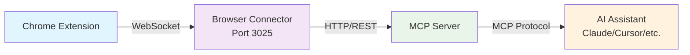

# Getting Started with RapidTriageME

Welcome to **RapidTriageME** - the AI-powered browser debugging platform that revolutionizes how you debug, analyze, and optimize web applications. This guide will walk you through everything you need to know to get started.

## What is RapidTriageME?

RapidTriageME is a comprehensive browser debugging platform that enables AI assistants to interact with web browsers through the Model Context Protocol (MCP). It captures real-time browser data including console logs, network requests, errors, and performance metrics, making them available to your favorite AI coding assistants.

### Key Benefits

- **AI-Powered Debugging** - Let AI assistants analyze browser issues for you
- **Real-time Data Capture** - Monitor console logs, network requests, and errors as they happen  
- **Cross-Platform** - Works with 10+ IDEs and AI assistants
- **Remote Debugging** - Debug browsers anywhere with cloud deployment
- **Comprehensive Audits** - Built-in Lighthouse integration for performance, accessibility, SEO
- **Zero Configuration** - Works out of the box with sensible defaults

## How It Works

RapidTriageME consists of three main components working together:



1. **Chrome Extension** - Captures browser data through DevTools API
2. **Browser Connector** - Local server (port 3025) that processes and aggregates data
3. **MCP Server** - Bridges data to AI assistants using Model Context Protocol

## Installation Overview

Getting started requires three simple steps:

!!! tip "Quick Setup (5 minutes)"
    1. **Install Chrome Extension** - Load the unpacked extension
    2. **Start Browser Server** - Run `npx @yarlisai/rapidtriage-server`
    3. **Configure AI Assistant** - Add MCP configuration to your IDE

## Supported Platforms

### AI Assistants & IDEs
- **Cursor** - AI-first code editor with native MCP support
- **Claude Desktop** - Anthropic's official desktop application
- **VS Code** - With Continue extension for AI assistance
- **Zed** - High-performance multiplayer code editor
- **JetBrains IDEs** - IntelliJ, WebStorm, PyCharm with AI Assistant
- **And 10+ more** - Any MCP-compatible client

### Operating Systems
- **macOS** - Full support (Intel and Apple Silicon)
- **Windows** - Complete Windows 10/11 support
- **Linux** - Ubuntu, Debian, CentOS, and other distributions

### Browsers
- **Chrome** - Primary supported browser (recommended)
- **Microsoft Edge** - Chromium-based browsers
- **Chromium** - Open-source browser support

## Use Cases

### Web Development
- Debug JavaScript errors in real-time
- Monitor API calls and network performance
- Analyze bundle sizes and loading performance
- Test responsive design across viewports

### Quality Assurance
- Automated accessibility testing
- Performance regression detection
- Cross-browser compatibility testing
- Security vulnerability scanning

### SEO Optimization
- Meta tag validation and optimization
- Core Web Vitals monitoring
- Structured data validation
- Mobile-friendliness assessment

### DevOps & Monitoring
- Production error monitoring
- Performance baseline establishment
- User experience optimization
- Third-party service monitoring

## Architecture Benefits

### Local Development
```
Browser → Extension → Connector(:3025) → MCP → AI
```
- **Ultra-low latency** - Direct local communication
- **Complete privacy** - All data stays on your machine
- **No internet required** - Works completely offline
- **Simple setup** - Just run one command

### Cloud Deployment
```
Browser → Extension → Cloudflare Worker → AI
```
- **Global reach** - Debug from anywhere in the world
- **Team collaboration** - Share debugging sessions
- **Scalable** - Handles multiple concurrent sessions
- **Secure** - JWT authentication and encryption

## What's Next?

Choose your path based on your needs:

<div class="grid cards" markdown>

-   :material-rocket-launch:{ .lg .middle } **Quick Start**

    ---

    Get up and running in under 5 minutes

    [:octicons-arrow-right-24: Quickstart Guide](quickstart.md)

-   :material-download:{ .lg .middle } **Detailed Installation**

    ---

    Step-by-step installation with troubleshooting

    [:octicons-arrow-right-24: Installation Guide](installation.md)

-   :material-cog:{ .lg .middle } **Configuration**

    ---

    Advanced configuration options and customization

    [:octicons-arrow-right-24: Configuration Guide](configuration.md)

-   :material-book-open-variant:{ .lg .middle } **Architecture**

    ---

    Understand how RapidTriageME works under the hood

    [:octicons-arrow-right-24: Architecture Overview](../architecture/index.md)

</div>

## Prerequisites

Before you begin, ensure you have:

### Required
- **Node.js 18+** - Download from [nodejs.org](https://nodejs.org/)
- **Chrome Browser** - Download from [chrome.google.com](https://chrome.google.com/)
- **Terminal Access** - Command line interface

### Recommended
- **AI Assistant** - Cursor, Claude Desktop, VS Code with Continue
- **Git** - For cloning repositories and version control
- **Package Manager** - npm (comes with Node.js) or yarn

## Verification Checklist

After installation, verify everything is working:

- [ ] Chrome extension loaded and visible in extensions page
- [ ] Browser connector server running on port 3025
- [ ] DevTools panel shows "RapidTriage" tab
- [ ] AI assistant recognizes MCP tools
- [ ] Screenshot capture works
- [ ] Console logs are accessible

## Support & Community

- **Documentation** - Comprehensive guides and API reference
- **GitHub Issues** - Bug reports and feature requests
- **Discord Community** - Real-time support and discussions
- **Example Projects** - Sample implementations and use cases

## Getting Help

If you encounter issues:

1. Check our [troubleshooting guide](../troubleshooting/common-issues.md)
2. Review [frequently asked questions](../troubleshooting/faq.md)
3. Search [existing issues](/issues)
4. Join our [Discord community](https://discord.gg/rapidtriage)

---

Ready to transform your browser debugging experience? Let's get started!

[:octicons-arrow-right-24: Quick Start Guide](quickstart.md){ .md-button .md-button--primary }