# User Guides

Welcome to the RapidTriageME user guides! This section provides comprehensive tutorials, best practices, and advanced techniques for getting the most out of your AI-powered browser debugging platform.

## Guide Categories

```mermaid
graph TB
    subgraph "Getting Started"
        SETUP[🚀 IDE Integration]
        CONFIG[⚙️ Configuration]
    end
    
    subgraph "Core Skills"
        DEBUG[🔍 Debugging Techniques]
        PERF[📈 Performance Optimization]
    end
    
    subgraph "Advanced Topics"
        SECURITY[🔒 Security & Privacy]
        AUTOMATION[🤖 AI Automation]
    end
    
    subgraph "Best Practices"
        WORKFLOWS[📋 Workflows]
        TIPS[💡 Pro Tips]
    end
    
    SETUP --> DEBUG
    CONFIG --> PERF
    DEBUG --> SECURITY
    PERF --> AUTOMATION
    SECURITY --> WORKFLOWS
    AUTOMATION --> TIPS
    
    style SETUP fill:#e8f5e8
    style DEBUG fill:#e1f5fe
    style SECURITY fill:#fce4ec
    style WORKFLOWS fill:#fff3e0
```



## Available Guides

<div class="grid cards" markdown>

-   🚀 **IDE Integration**
    
    ---
    
    Set up RapidTriageME with your favorite IDE or AI assistant
    
    [:octicons-arrow-right-24: IDE Integration Guide](ide-integration.md)

-   🔍 **Debugging Techniques**
    
    ---
    
    Master browser debugging with AI assistance
    
    [:octicons-arrow-right-24: Debugging Guide](debugging.md)

-   📈 **Performance Optimization**
    
    ---
    
    Optimize web performance using Lighthouse and AI insights
    
    [:octicons-arrow-right-24: Performance Guide](performance.md)

-   🔒 **Security & Privacy**
    
    ---
    
    Secure your debugging setup and protect sensitive data
    
    [:octicons-arrow-right-24: Security Guide](security.md)

</div>

## Quick Start Workflows

### 1. Basic Debugging Workflow

```mermaid
flowchart LR
    A[🌐 Open Website] --> B[🔍 Encounter Issue]
    B --> C[🤖 Ask AI Assistant]
    C --> D[📸 Take Screenshot]
    D --> E[📋 Check Console Logs]
    E --> F[🌐 Analyze Network]
    F --> G[✅ Identify Solution]
    
    style A fill:#e3f2fd
    style G fill:#c8e6c9
```



**Example Commands:**
```
1. "Take a screenshot of this page"
2. "Show me all console errors"
3. "What network requests are failing?"
4. "Run a performance audit"
```

### 2. Performance Analysis Workflow

```mermaid
flowchart TD
    START[📈 Performance Issue] --> LIGHTHOUSE[🚀 Run Lighthouse Audit]
    LIGHTHOUSE --> METRICS[📊 Analyze Core Web Vitals]
    METRICS --> OPPORTUNITIES[🔍 Identify Opportunities]
    OPPORTUNITIES --> IMPLEMENT[⚙️ Implement Fixes]
    IMPLEMENT --> VERIFY[✅ Verify Improvements]
    
    style START fill:#ffecb3
    style VERIFY fill:#c8e6c9
```



**AI Prompts:**
```
1. "Run a comprehensive Lighthouse audit"
2. "Analyze the Core Web Vitals scores"
3. "What are the biggest performance opportunities?"
4. "Help me optimize the largest contentful paint"
```

### 3. Error Investigation Workflow

```mermaid
sequenceDiagram
    participant Dev as 👨‍💻 Developer
    participant AI as 🤖 AI Assistant
    participant RT as 🔧 RapidTriageME
    participant Browser as 🌐 Browser
    
    Dev->>AI: "Something is broken on this page"
    AI->>RT: Check console logs
    RT->>Browser: Fetch console data
    Browser-->>RT: Error logs
    RT-->>AI: Formatted errors
    AI->>RT: Take screenshot
    RT->>Browser: Capture screen
    Browser-->>RT: Screenshot data
    RT-->>AI: Visual context
    AI-->>Dev: Analysis + recommendations
```



## Common Use Cases

### Frontend Development

| Task | AI Command | Expected Outcome |
|------|------------|------------------|
| **Debug layout issues** | "Take a screenshot and analyze the layout" | Visual debugging with recommendations |
| **Fix JavaScript errors** | "Show me all console errors and their stack traces" | Detailed error analysis |
| **Optimize loading** | "Run performance audit and suggest improvements" | Performance optimization plan |
| **Test responsiveness** | "Capture mobile and desktop views" | Cross-device comparison |

### QA Testing

| Task | AI Command | Expected Outcome |
|------|------------|------------------|
| **Accessibility testing** | "Run accessibility audit and check WCAG compliance" | Accessibility report |
| **Cross-browser testing** | "Document any browser-specific issues" | Compatibility analysis |
| **Performance regression** | "Compare current performance with baseline" | Performance comparison |
| **Error monitoring** | "Monitor for errors during test scenarios" | Real-time error tracking |

### DevOps & Monitoring

| Task | AI Command | Expected Outcome |
|------|------------|------------------|
| **Production debugging** | "Analyze production errors and suggest fixes" | Root cause analysis |
| **Performance monitoring** | "Track Core Web Vitals over time" | Performance trends |
| **Security scanning** | "Check for security best practices" | Security audit |
| **SEO optimization** | "Analyze SEO factors and suggest improvements" | SEO recommendations |

## Best Practices

### 📝 Documentation Practices

1. **Screenshot Everything Important**
   ```
   "Take a screenshot before and after the fix"
   "Document the current state visually"
   ```

2. **Capture Context**
   ```
   "Show console logs from the last 5 minutes"
   "Include network requests in the analysis"
   ```

3. **Save Audit Results**
   ```
   "Run full audit and save results for comparison"
   "Track performance metrics over time"
   ```

### 🤖 AI Interaction Tips

1. **Be Specific**
   - Good: "Show errors from the checkout process"
   - Better: "Show JavaScript errors that occurred in the last 2 minutes during checkout"

2. **Provide Context**
   - "I'm seeing a blank page after login"
   - "The mobile navigation isn't working on iOS"
   - "Performance degraded after latest deployment"

3. **Ask Follow-up Questions**
   - "What could be causing this error?"
   - "How can I fix this performance issue?"
   - "Are there any security concerns here?"

### 🔄 Workflow Optimization

1. **Create Custom Commands**
   ```json
   // VS Code settings.json
   {
     "rapidtriage.customCommands": {
       "full-debug": "Take screenshot, get console logs, run performance audit",
       "error-check": "Show all errors from the last 10 minutes",
       "mobile-test": "Capture mobile screenshot and check responsive design"
     }
   }
   ```

2. **Set Up Monitoring Dashboards**
   - Configure regular performance audits
   - Set up error alerts
   - Track key metrics automatically

3. **Integrate with CI/CD**
   - Run automated audits on deployments
   - Compare performance before/after changes
   - Block deployments with critical issues

## Advanced Techniques

### Automated Testing with AI

```javascript
// Example: Automated accessibility testing
const auditResults = await rapidtriage.runAccessibilityAudit({
  url: 'https://myapp.com',
  standards: ['WCAG2A', 'WCAG2AA'],
  includeScreenshot: true
});

// AI analysis
const analysis = await ai.analyze(`
  Please review this accessibility audit and prioritize the issues:
  ${JSON.stringify(auditResults, null, 2)}
`);
```

### Performance Regression Detection

```javascript
// Track performance over time
const currentMetrics = await rapidtriage.runPerformanceAudit();
const baselineMetrics = loadBaseline('v1.2.0');

// AI comparison
const regression = await ai.compare(`
  Compare these performance metrics and identify any regressions:
  Current: ${JSON.stringify(currentMetrics)}
  Baseline: ${JSON.stringify(baselineMetrics)}
`);
```

### Custom Debugging Workflows

```javascript
// Create custom debugging sequence
class CustomDebugger {
  async fullAnalysis(url) {
    const results = {};
    
    // Capture initial state
    results.screenshot = await rapidtriage.captureScreenshot();
    results.console = await rapidtriage.getConsoleLogs();
    results.network = await rapidtriage.getNetworkRequests();
    
    // Run audits
    results.performance = await rapidtriage.runPerformanceAudit();
    results.accessibility = await rapidtriage.runAccessibilityAudit();
    results.seo = await rapidtriage.runSEOAudit();
    
    // AI analysis
    const analysis = await ai.analyze(`
      Perform comprehensive analysis of this web page:
      ${JSON.stringify(results, null, 2)}
    `);
    
    return { raw: results, analysis };
  }
}
```

## Integration Examples

### With Testing Frameworks

#### Jest Integration
```javascript
// test/debug.helper.js
const { RapidTriageClient } = require('@yarlisai/rapidtriage-client');

class DebugHelper {
  constructor() {
    this.client = new RapidTriageClient();
  }
  
  async debugOnFailure(testName, error) {
    console.log(`🔍 Debugging failed test: ${testName}`);
    
    const screenshot = await this.client.captureScreenshot();
    const logs = await this.client.getConsoleLogs({ level: 'error' });
    
    // Save debug artifacts
    fs.writeFileSync(`debug/${testName}-screenshot.png`, screenshot);
    fs.writeFileSync(`debug/${testName}-logs.json`, JSON.stringify(logs));
    
    return { screenshot, logs };
  }
}

// Usage in tests
afterEach(async () => {
  if (this.currentTest.state === 'failed') {
    await debugHelper.debugOnFailure(this.currentTest.title, this.currentTest.err);
  }
});
```

#### Cypress Integration
```javascript
// cypress/support/commands.js
Cypress.Commands.add('debugWithAI', (prompt) => {
  cy.window().then(async (win) => {
    // Capture state
    const screenshot = await rapidtriage.captureScreenshot();
    const logs = await rapidtriage.getConsoleLogs();
    
    // Send to AI
    const analysis = await ai.analyze(`
      ${prompt}
      
      Screenshot and console logs are attached.
    `);
    
    cy.log('AI Analysis:', analysis);
  });
});

// Usage
it('should debug login failure', () => {
  cy.visit('/login');
  cy.get('[data-testid=login-btn]').click();
  cy.debugWithAI('Why did the login fail?');
});
```

## Troubleshooting Integration

If you encounter issues while following these guides:

1. **Check Prerequisites**
   - Ensure RapidTriageME is properly installed
   - Verify browser extension is loaded
   - Confirm server is running on port 3025

2. **Review Configuration**
   - Double-check IDE settings
   - Verify environment variables
   - Test MCP connection

3. **Get Help**
   - Check [troubleshooting guide](../troubleshooting/index.md)
   - Join our [Discord community](https://discord.gg/rapidtriage)
   - Open an [issue on GitHub](/issues)

## What's Next?

Choose the guide that matches your current needs:

- **New to RapidTriageME?** Start with [IDE Integration](ide-integration.md)
- **Want to debug better?** Check out [Debugging Techniques](debugging.md)  
- **Performance issues?** Read [Performance Guide](performance.md)
- **Security concerns?** Review [Security Guide](security.md)

---

These guides will help you master RapidTriageME and become more efficient at browser debugging with AI assistance.