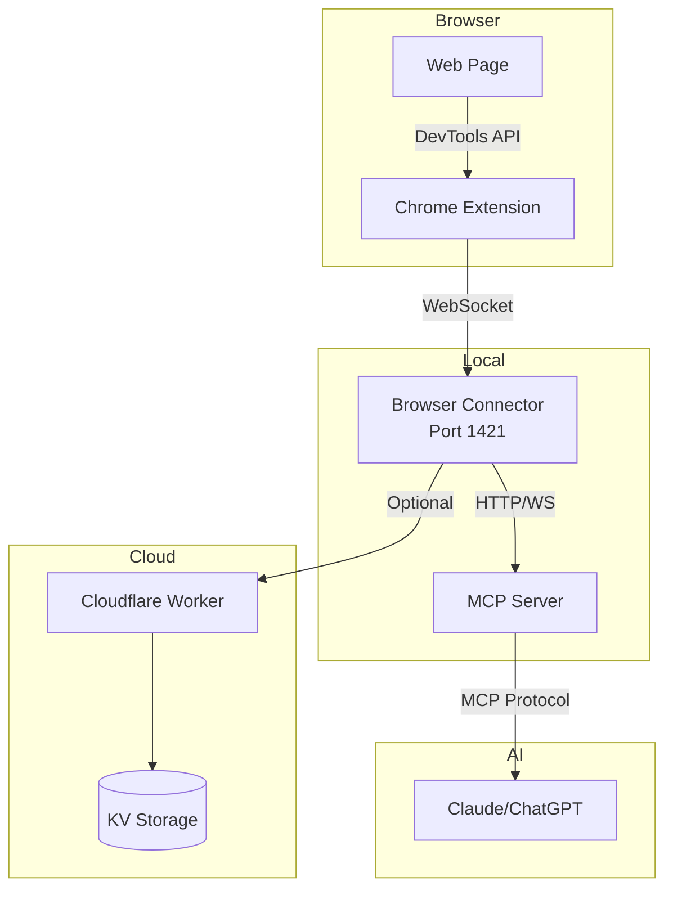

# RapidTriageME

## AI-Powered Browser Debugging Platform

Welcome to **RapidTriageME** - a comprehensive browser debugging and triage platform that seamlessly integrates with AI assistants through the Model Context Protocol (MCP).

<div class="grid cards" markdown>

-   :material-rocket-launch:{ .lg .middle } **Quick Start**

    ---

    Get up and running in under 5 minutes

    [:octicons-arrow-right-24: Getting started](getting-started/quickstart.md)

-   :material-book-open-variant:{ .lg .middle } **Architecture**

    ---

    Understand the system design and components

    [:octicons-arrow-right-24: Learn more](architecture/overview.md)

-   :material-api:{ .lg .middle } **API Reference**

    ---

    Complete API documentation and examples

    [:octicons-arrow-right-24: View APIs](api/index.md)

-   :material-cloud-upload:{ .lg .middle } **Deploy**

    ---

    Deploy to production with Cloudflare

    [:octicons-arrow-right-24: Deployment guide](deployment/cloudflare.md)

</div>

## 🎯 What is RapidTriageME?

RapidTriageME is a powerful debugging platform that captures browser data (console logs, network requests, errors) and makes it available to AI assistants for intelligent analysis and troubleshooting.

### Key Features

- 🔍 **Real-time Browser Monitoring** - Capture console logs, network requests, and errors
- 🤖 **AI Integration** - Seamless integration with Claude, ChatGPT, and other AI assistants via MCP
- 🌐 **Remote Access** - Debug browsers anywhere through Cloudflare Workers
- 📸 **Screenshot Capture** - Visual debugging with automatic screenshot capabilities
- 🚀 **Performance Audits** - Built-in Lighthouse integration for performance analysis
- 🔒 **Secure** - JWT authentication and encrypted connections

## 🏗️ Architecture Overview



## 🚦 Current Status

!!! success "Production Ready"
    - ✅ **Server**: Running on port `1421`
    - ✅ **Domain**: Active at [rapidtriage.me](https://rapidtriage.me)
    - ✅ **API**: Fully operational
    - ✅ **Extension**: Published and available

## 📦 Components

| Component | Description | Status |
|-----------|-------------|--------|
| **Chrome Extension** | Captures browser data via DevTools | ✅ Active |
| **Browser Connector** | Local server for data aggregation | ✅ Port 1421 |
| **MCP Server** | AI integration via Model Context Protocol | ✅ Ready |
| **Cloudflare Worker** | Remote access and edge computing | ✅ Deployed |

## 🚀 Quick Installation

=== "npm"

    ```bash
    # Install the browser connector
    npm install -g @/-server
    
    # Install the MCP server
    npm install -g @/-mcp
    
    # Start the server
    rapidtriage-server
    ```

=== "Local Development"

    ```bash
    # Clone the repository
    git clone .git
    cd rapidtriage
    
    # Run the setup
    ./run.sh all
    ```

## 📖 Documentation Structure

- **[Getting Started](getting-started/index.md)** - Installation and setup guides
- **[Architecture](architecture/index.md)** - System design and data flow
- **[Components](components/index.md)** - Detailed component documentation
- **[API Reference](api/index.md)** - Complete API documentation
- **[Deployment](deployment/index.md)** - Production deployment guides
- **[Troubleshooting](troubleshooting/index.md)** - Common issues and solutions

## 🤝 Contributing

We welcome contributions! Please see our [Contributing Guide](contributing.md) for details.

## 📝 License

RapidTriageME is open source software licensed under the MIT License.

---

<div align="center">
  <strong>Built with ❤️ by YarlisAISolutions</strong>
</div>