# Troubleshooting Guide

This comprehensive troubleshooting guide helps you diagnose and resolve common issues with RapidTriageME. Follow the systematic approach below to quickly identify and fix problems.

## Quick Diagnosis

Start with this quick checklist to identify the issue category:

```mermaid
flowchart TD
    START["🔍 Issue with RapidTriageME?"] --> CHECK1{"Can you access<br/>http://localhost:3025?"}
    CHECK1 -->|Yes| CHECK2{"Extension visible<br/>in DevTools?"}
    CHECK1 -->|No| SERVER["🔧 Server Issues"]
    CHECK2 -->|Yes| CHECK3{"AI assistant<br/>recognizes tools?"}
    CHECK2 -->|No| EXT["📱 Extension Issues"]
    CHECK3 -->|Yes| CHECK4{"Tools working<br/>correctly?"}
    CHECK3 -->|No| MCP["🤖 MCP Issues"]
    CHECK4 -->|Yes| SUCCESS["✅ System Working"]
    CHECK4 -->|No| TOOLS["🛠️ Tool Issues"]
    
    style SERVER fill:#ffcdd2
    style EXT fill:#ffe0b2
    style MCP fill:#f3e5f5
    style TOOLS fill:#e8f5e8
    style SUCCESS fill:#c8e6c9
```



## Issue Categories

### 🔧 Server Issues
**Symptoms**: Cannot access localhost:3025, server won't start  
**Common causes**: Port conflicts, permission issues, Node.js problems

### 📱 Extension Issues
**Symptoms**: No DevTools panel, extension not loading  
**Common causes**: Chrome extension problems, manifest issues

### 🤖 MCP Issues
**Symptoms**: AI doesn't see tools, MCP connection fails  
**Common causes**: IDE configuration, MCP server problems

### 🛠️ Tool Issues
**Symptoms**: Screenshots fail, no console logs, Lighthouse errors  
**Common causes**: Browser permissions, service failures

## Common Issues and Solutions

### Server Won't Start (Port 3025)

#### Symptom
```bash
$ npx @yarlisai/rapidtriage-server
Error: listen EADDRINUSE :::3025
```

#### Diagnosis
```bash
# Check what's using port 3025
lsof -i :3025

# Example output:
COMMAND   PID USER   FD   TYPE DEVICE SIZE/OFF NODE NAME
node    12345 user   18u  IPv6  0x1234      0t0  TCP *:3025 (LISTEN)
```

#### Solutions

=== "Kill existing process"
    ```bash
    # Kill the process using port 3025
    kill -9 12345
    
    # Or kill all Node.js processes
    pkill -f node
    
    # Then restart
    npx @yarlisai/rapidtriage-server
    ```

=== "Use different port"
    ```bash
    # Set custom port
    export RAPIDTRIAGE_PORT=3030
    npx @yarlisai/rapidtriage-server
    
    # Update MCP configuration
    {
      "mcpServers": {
        "rapidtriage": {
          "env": {
            "BROWSER_TOOLS_PORT": "3030"
          }
        }
      }
    }
    ```

=== "Check system permissions"
    ```bash
    # On macOS/Linux, check if port requires sudo
    # Ports < 1024 require root privileges
    
    # Use unprivileged port instead
    export RAPIDTRIAGE_PORT=8080
    npx @yarlisai/rapidtriage-server
    ```

### Chrome Extension Not Loading

#### Symptoms
- Extension not visible in `chrome://extensions/`
- No RapidTriage panel in DevTools
- Extension loads but shows errors

#### Diagnosis Steps

1. **Check Extension Status**
   ```
   1. Open chrome://extensions/
   2. Ensure "Developer mode" is enabled
   3. Look for RapidTriage extension
   4. Check if there are any error messages
   ```

2. **Check Chrome Console**
   ```
   1. Right-click extension icon → "Inspect popup"
   2. Open DevTools → Console tab
   3. Look for JavaScript errors
   ```

#### Solutions

=== "Reload Extension"
    ```
    1. Go to chrome://extensions/
    2. Find RapidTriage extension
    3. Click the reload button (🔄)
    4. Refresh your webpage
    5. Open DevTools to see RapidTriage panel
    ```

=== "Reinstall Extension"
    ```
    1. Remove the extension completely
    2. Restart Chrome completely (not just close window)
    3. Download fresh extension files
    4. Load unpacked extension again
    ```

=== "Check Manifest Version"
    ```json
    // Ensure manifest.json has correct structure
    {
      "manifest_version": 3,
      "name": "RapidTriage",
      "version": "1.0.0",
      "permissions": [
        "activeTab",
        "scripting",
        "storage"
      ],
      "host_permissions": [
        "<all_urls>"
      ]
    }
    ```

### MCP Server Not Recognized

#### Symptoms
- AI assistant doesn't show RapidTriage tools
- "Command not found" errors
- MCP connection timeout

#### Diagnosis

```bash
# Test MCP server directly
npx @yarlisai/rapidtriage-mcp

# Expected output:
Connected to browser tools server at http://localhost:3025
MCP Server running...
Available tools: screenshot_capture, get_console_logs, ...
```

#### Solutions

=== "Fix IDE Configuration"
    ```json
    // Cursor: ~/.cursor/mcp_settings.json
    {
      "mcpServers": {
        "rapidtriage": {
          "command": "npx",
          "args": ["@yarlisai/rapidtriage-mcp"],
          "env": {
            "BROWSER_TOOLS_PORT": "3025",
            "BROWSER_TOOLS_HOST": "localhost"
          }
        }
      }
    }
    ```

=== "Check Node.js Path"
    ```bash
    # Find Node.js installation
    which node
    which npx
    
    # Use absolute paths if needed
    {
      "command": "/usr/local/bin/npx",
      "args": ["@yarlisai/rapidtriage-mcp"]
    }
    ```

=== "Install Global Package"
    ```bash
    # Install globally first
    npm install -g @yarlisai/rapidtriage-mcp
    
    # Then use direct command
    {
      "command": "rapidtriage-mcp",
      "args": []
    }
    ```

### Screenshot Capture Fails

#### Symptoms
- "Screenshot capture failed" errors
- Blank or corrupted images
- Timeout errors

#### Solutions

=== "Check Browser State"
    ```bash
    # Ensure:
    # 1. Browser tab is active and visible
    # 2. Page has finished loading
    # 3. No popup dialogs blocking capture
    # 4. DevTools panel is open
    ```

=== "Adjust Screenshot Options"
    ```json
    {
      "options": {
        "fullPage": false,
        "quality": 60,
        "waitFor": 2000,
        "removeElements": [".popup", ".overlay"]
      }
    }
    ```

=== "Check Chrome Permissions"
    ```
    1. Open chrome://settings/content/all
    2. Find your website
    3. Ensure JavaScript and images are allowed
    4. Reset permissions if needed
    ```

## Diagnostic Commands

### System Health Check

```bash
#!/bin/bash
# rapidtriage-health-check.sh

echo "🔍 RapidTriageME Health Check"
echo "============================"

# Check Node.js
echo "📦 Node.js version:"
node --version || echo "❌ Node.js not found"

# Check npm packages
echo "\n📦 Package versions:"
npm list -g @yarlisai/rapidtriage-server @yarlisai/rapidtriage-mcp 2>/dev/null || echo "❌ Packages not installed globally"

# Check server port
echo "\n🔌 Port 3025 status:"
if lsof -i :3025 >/dev/null 2>&1; then
    echo "✅ Port 3025 is in use"
    lsof -i :3025
else
    echo "❌ Port 3025 is free - server not running"
fi

# Check Chrome processes
echo "\n🌐 Chrome processes:"
ps aux | grep -i chrome | grep -v grep | wc -l | xargs echo "Chrome processes:"

# Test server endpoint
echo "\n🏥 Server health:"
curl -s http://localhost:3025/.identity | jq '.status' 2>/dev/null || echo "❌ Server not responding"

echo "\n✅ Health check complete"
```

### Extension Diagnostics

```javascript
// Run in Chrome DevTools console
// Check extension status
console.group('🔍 RapidTriage Extension Diagnostics');

// Check if extension is loaded
const extensionId = chrome.runtime.id;
console.log('Extension ID:', extensionId);

// Check WebSocket connection
if (window.rapidTriageWS) {
  console.log('WebSocket state:', window.rapidTriageWS.readyState);
  console.log('WebSocket URL:', window.rapidTriageWS.url);
} else {
  console.warn('WebSocket not found');
}

// Check DevTools panel
const panel = document.querySelector('#rapidtriage-panel');
console.log('DevTools panel:', panel ? 'Found' : 'Not found');

// Check local storage
console.log('Extension settings:', localStorage.getItem('rapidtriage-settings'));

console.groupEnd();
```

### Network Debugging

```bash
# Test all endpoints
echo "Testing RapidTriageME endpoints:"
echo "================================="

# Identity endpoint
echo "Identity:"
curl -w "Status: %{http_code}\n" -s http://localhost:3025/.identity | jq .

# Console logs
echo "\nConsole logs:"
curl -w "Status: %{http_code}\n" -s "http://localhost:3025/console-logs?limit=5" | jq .

# Network requests
echo "\nNetwork requests:"
curl -w "Status: %{http_code}\n" -s "http://localhost:3025/network-requests?limit=5" | jq .

# Health check
echo "\nHealth:"
curl -w "Status: %{http_code}\n" -s http://localhost:3025/health | jq .
```

## Performance Issues

### High Memory Usage

#### Symptoms
- Browser becomes slow
- System memory usage increases
- Extension becomes unresponsive

#### Solutions

=== "Adjust Cache Settings"
    ```json
    // rapidtriage.config.json
    {
      "features": {
        "networking": {
          "maxLogEntries": 500,
          "maxNetworkEntries": 250
        }
      },
      "server": {
        "cleanupInterval": 60000
      }
    }
    ```

=== "Monitor Memory Usage"
    ```bash
    # Monitor server memory
    ps aux | grep rapidtriage
    
    # Check Chrome memory usage
    # Open chrome://memory-internals/
    ```

### Slow Screenshot Capture

#### Solutions

=== "Optimize Screenshot Settings"
    ```json
    {
      "options": {
        "fullPage": false,
        "quality": 60,
        "format": "jpeg",
        "optimizeForSpeed": true
      }
    }
    ```

=== "Check Page Complexity"
    ```javascript
    // Check DOM size in browser console
    console.log('DOM elements:', document.querySelectorAll('*').length);
    console.log('Images:', document.querySelectorAll('img').length);
    console.log('Scripts:', document.querySelectorAll('script').length);
    ```

## Advanced Debugging

### Enable Debug Logging

```bash
# Server debugging
export DEBUG=rapidtriage:*
export LOG_LEVEL=debug
npx @yarlisai/rapidtriage-server --verbose

# MCP debugging  
export DEBUG=mcp:*
npx @yarlisai/rapidtriage-mcp --debug
```

### Capture Network Traffic

```bash
# Use netstat to monitor connections
netstat -an | grep 3025

# Monitor WebSocket traffic
wscat -c ws://localhost:3025/ws
```

### Debug Extension Background Script

```
1. Open chrome://extensions/
2. Click "Inspect views: background script"
3. Check Console, Network, Sources tabs
4. Set breakpoints in background.js
```

## Getting Help

If these troubleshooting steps don't resolve your issue:

### Before Reporting Issues

1. **Run diagnostic commands** above
2. **Check logs** for error messages  
3. **Try minimal reproduction** case
4. **Update to latest versions**

### Information to Include

```bash
# System information
echo "OS: $(uname -a)"
echo "Node: $(node --version)"
echo "Chrome: $(google-chrome --version 2>/dev/null || echo 'Not found')"

# Package versions
npm list @yarlisai/rapidtriage-server @yarlisai/rapidtriage-mcp

# Error logs
tail -n 50 ~/.rapidtriage/logs/error.log
```

### Support Channels

<div class="grid cards" markdown>

-   🐛 **GitHub Issues**
    
    ---
    
    Bug reports and feature requests
    
    [Open Issue](/issues/new)

-   💬 **Discord Community**
    
    ---
    
    Real-time help and discussions
    
    [Join Discord](https://discord.gg/rapidtriage)

-   📚 **Documentation**
    
    ---
    
    Common issues and FAQ
    
    [:octicons-arrow-right-24: FAQ](faq.md)

-   🔧 **Common Issues**
    
    ---
    
    Detailed troubleshooting guide
    
    [:octicons-arrow-right-24: Common Issues](common-issues.md)

</div>

---

Most issues can be resolved quickly by following this systematic troubleshooting approach. Don't hesitate to reach out to the community for help!